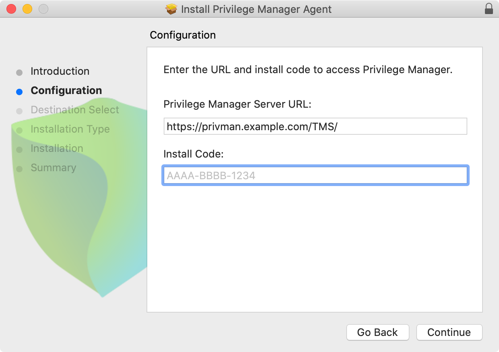
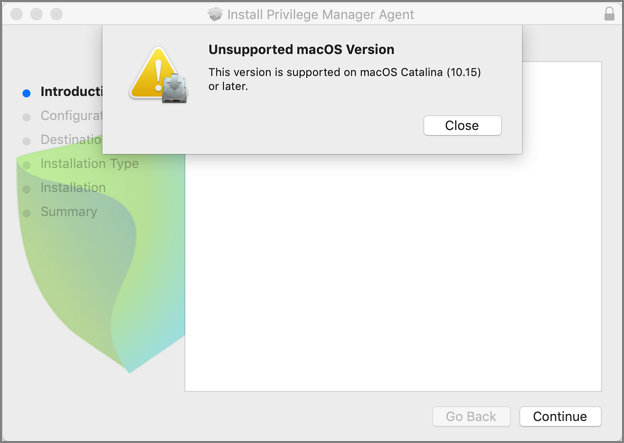
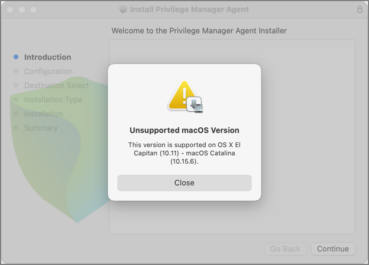

[title]: # (macOS Agents)
[tags]: # (endpoint,installation,registration)
[priority]: # (2)

# macOS Privilege Manager Agent

The macOS agent is available as a DMG which contains the pkg installer and Uninstall.sh script. You can use the installer directly on individual endpoints for testing or for production environments.

Starting with Privilege Manager version 11, Thycotic provides the macOS agent only for __SYSEX__ enabled macOS versions (Catalina and higher). Refer to the [10.8.2 documentation for installation instruction](https://docs.thycotic.com/privman/10.8.2/install/agents/agent-inst-mac.md) for the __KEXT__ based agent.

For details about differences regarding KEXT and SYSEX versions, refer to [macOS Extensions](../../../platforms/macOS/mac-kexts.md).

Refer to the [Software Downloads](../../sw-downloads.md) for the current versions available.

>**Note**: Examples below are using version placeholders instead of the actual install package versions. If you copy the example, make sure to switch n.n.nnnn with the actual version numbers as listed on the Software Downloads page.

## Installing macOS Agents

>**Note**:
>If you enter the wrong install code or you need to update an install code for whatever reason, rerun the package installer to provide the correct/new install code.
>The Install Code field can be left blank when using versions lower than 10.5.

### Directly

You can use the macOS agent installer directly on individual endpoints for testing or production environments.

To install the agent software on a single endpoint, follow these steps:

1. Go to [Software Downloads - macOS Endpoints](../../sw-downloads.md#macos_endpoints) to download the Privilege Manager macOS Agent.
1. Mount the DMG and run the pkg installer on the computer you want to manage.
1. During the setup process,
   1. enter the base URL and
   1. the Install Code when prompted.​

   

>**Note**: The installer does require a restart in order to ensure the agent is ready to use.

#### Unsupported Version Messages

If you attempt to install the __SYSEX__ agent on an unsupported OS version, the following message is displayed:



If you attempt to install the __KEXT__ agent on an unsupported OS version, the following message is displayed:



### Using an Unattended Install Method

After downloading the [latest bundled macOS Agent](../../sw-downloads.md#macos_endpoints) package onto one of your macOS endpoints, extract the ThycoticManagementAgent-n-n-nnnn.pkg installer from inside the DMG and upload it to your MDM’s distribution point.

Create a policy to include the newly uploaded pkg and include the below script to run before the pkg installation replacing the tmsBaseUrl and installCode as required. 

>**Note**: Replace the version placeholders with the real package file version numbers.

```shell
#!/bin/bash
# Privilege Manager macOS configuration script to be used with a "vanilla" download of the agent.
# This script should be used as a pre-install payload following the installation of the PKG.
# Replace the tmsBaseUrl with your own server url i.e "https://your.privman.com/TMS"
# Replace installCode with your own details.

/bin/mkdir -p /Library/Application\ Support/Thycotic/Agent/

/bin/cat << EOF > /Library/Application\ Support/Thycotic/Agent/agentconfig.json
{
      "tmsBaseUrl": "",
      "installCode": "",
      "loginProcessingDelayS": 30
}
EOF
```

>**Note**:
>It will take 15-30 minutes for newly installed agents to register in Privilege Manager. See the agent registration information in the [Terminal Commands](../../../agents/macOS/terminal.md) topic to speed the process up.

## Uninstalling an Agent

When you need to uninstall the macOS agent, use the __Uninstall.sh__ shell command:

```shell
sudo /Volumes/ThycoticManagementAgent-n.n.nnnn/Uninstall.sh
```

Where `n.n.nnnn` needs to be replaced with the actual version number of the agent you wish to uninstall.
