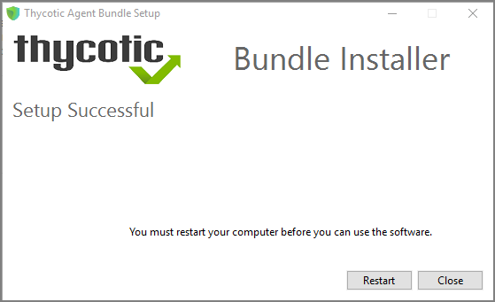

[title]: # (Bundled Install)
[tags]: # (agent,endpoint)
[priority]: # (2)
# Bundled Install

The bundled EXE installer is recommended when installing Privilege Manager on machines one at a time, for deployments through software delivery see the next section. This installer includes all Privilege Manager Agents for Windows machines (Core, ACS, LSS). You can use the bundled installer directly on individual endpoints for testing or for production environments in either 32-bit or 64-bit environments.

>**Important**:
>To ensure you have installed all prerequisite software on your managed computers __before__ you install the Thycotic agents, please see our [System Requirements for Privilege Manager](../../sysreq.md) and [Agent System Requirements](index.md#agent_system_requirements).

To install Thycotic agents __on a single testing machine__, follow these steps:

1. Download the [Bundled Agent Installer - Windows](../../sw-downloads.md).
1. Run the Thycotic Bundled Installer on the computer you want to manage.
1. During the setup process, enter the Privilege Manager Server URL (or AZ Service Bus Queue URL) and the [Install Code](../installcode.md) when prompted.

   >**Note**: The Install Code field can be left blank when using versions lower than 10.5.

   
1. After the installation you will be prompted to restart your endpoint.

   

>**Note**:
>It may take 15-30 minutes for agents to receive new policies, to speed this up navigate to __Admin | Configuration | General__ and click __Run Policy Targeting Update__, then open the Agent Utility on the endpoint and click the __Register__ button.

>**Note**:
>The bundled installer does require a restart in order to ensure the agent is completely ready to use.

## Rollout to Multiple Systems

To install Thycotic agents __on multiple machines__, we recommend the following:

1. Download the [Agent standalone MSI](agent-inst-win.md) files based on specific systems.
1. Push them out through any software delivery system tool (e.g.: SCCM) using the recommended command lines.

>**Note**:
>If you find that you've entered the wrong Privilege Manager Server address or want to change this setting, refer to the information under [Setting the Privilege Manager Server Address](../../../agents/all/agent-set-server-address.md).

## Silent Install

If the Bundled Agent Installer is run with the `/quiet` option for a silent install, the bundled installer will not accept the `installcode` or `baseurl` via the commandline. You have to set those values post install for the agent to be able to register with the server.

* [Agent Install Codes](../installcode.md)
* [Setting the Privilege Manager Server Address](../../../agents/all/agent-set-server-address.md)
