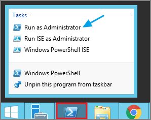
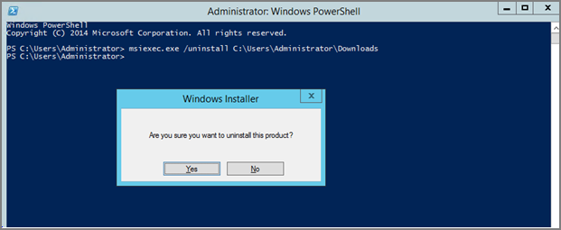

[title]: # (Agent Uninstall)
[tags]: # (software removal)
[priority]: # (10)
# Agent Uninstall via Command Line

This topic explains how to uninstall the Agent through command line. If you're trying to uninstall an old agent in order to install a newer version of the agent, there is no need to do so. The installers will detect a previous version installed and uninstall the old version prior to installing the new agent.

>**Note**: For hardened agents refer to information under [Windows Agents | Hardened Agents](agent-inst-win.md#hardened_agents).

## Manual Uninstall Steps

1. Navigate to the machine(s) where the agent is located.
1. Right-click on Windows Powershell and  select __Run as Administrator__.

   
1. Run the following command:

   ```sh
   msiexec.exe /uninstall <path to the msi installer>\ThycoticAgent_x64_11_1_1103.msi
   ```
1. Select __Yes__ on the Windows Installer prompt.

   
