[title]: # (Advanced Installation)
[tags]: # (manual)
[priority]: # (1504)
# Installation - Advanced

If you need to manually install Privilege Manager on a system and you already have an existing server installation, refer to the installation instructions described under the [High Availability Set-up for Privilege Manager](../../how-to/infrastructure/ha_clustering.md). Thycotic recommends to always use the setup.exe installer to verify that your system meets the pre-requisites.

## Download Privilege Manager Application Files

Make sure you have the prerequisites (IIS, .NET Framework, and SQL Server) installed before following the steps listed below.

After clicking the download link on the [Software Downloads](../sw-downloads.md) page, you will be able to download a .zip file that contains both Secret Server and Privilege Manager files.

### Zip File Extraction Tool

You will also need to install a zip application like winzip or 7-zip to extract files for this install. 7-zip is used in the instructions below and can be downloaded for [free here](https://www.7-zip.org/download.html).

## Manual Installation (no setup.exe)

Clicking the download link above will take you to a portal page where you can choose to download a .zip file that contains the application files.  Use this .zip file for the instructions below.
Privilege Manger can be installed in a few different ways, as a:

* Virtual Directory
* Website

### Installing as a Virtual Directory

1. Extract the contents of the .zip file and select the nugetCache folder. Move the contents of that folder to a temporary location like C:\ProgramData\ (Recommended)
1. Create a folder called TMS in the location `C:\inetpub\wwwroot\`
1. Navigate back to `C:\ProgramData\nugetCache\` and using any zip application (ex: 7-zip, winzip, winrar, etc), open `ThycoticTms.xx.x.xxxx.nupkg`

   To do this with 7-zip: right-click `ThycoticTms.xx.x.xxxx.nupkg` | 7-zip | Open Archive.

   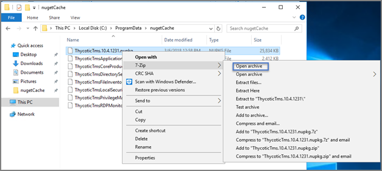
1. Open the Content directory and ctrl-A to select all of its contents. Copy these to the location `C:\inetpub\wwwroot\TMS\`

   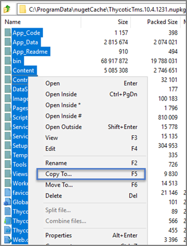

   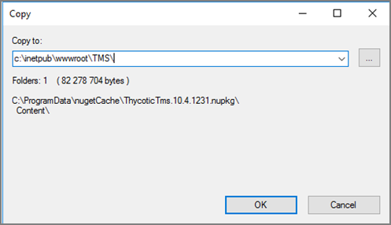
1. In `C:\inetpub\wwwroot\TMS\` where you have extracted the TMS Site files, create a new file (right-click | New | Text Document) called `connectionstrings.config`

   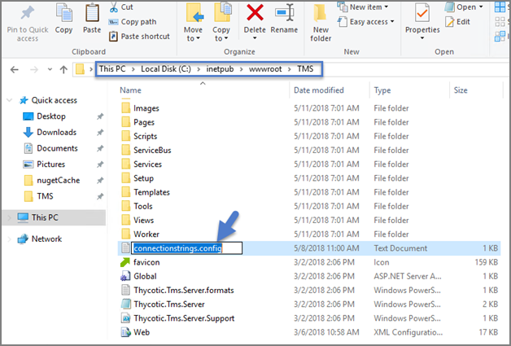

1. Next, decide what mode you want to use to access your SQL database and follow the corresponding steps:
   * __Mixed Mode/"Integrated Security=False"__ (for easiest configuration): Mixed Mode is required if you intend on using a SQL Server account to authenticate Secret Server to your SQL Server instance. If you are doing an evaluation and using the Secret Server setup.exe installer, we recommend using Mixed Mode with a SQL authentication account. This option will also require you to set a password for the SQL Server system administrator (sa) account. See the Integrated Security=False section below to use Mixed Mode.
   * __Windows Authentication Mode/"Integrated Security=True"__ (recommended for best security): This will prevent SQL Server account authentication and requires a Windows Service account to run the Secret Server website.  This will also require additional configuration in IIS once Secret Server is installed. Follow the steps under the Integrated Security=True section below to use Windows Authentication.  

### Integrated Security=False

Open in Notepad the connectionstrings.config file created in step 4 and copy in the following text; replacing the SQL Server Name, Database Name, User Name, and Password (highlighted in bold below) with values for your environment. Save changes.
```xml
<connectionStrings>
			<add name="ApplicationServerWorkflowInstanceStoreConnectionString"
			   connectionString="Data Source=SQLServerAddress;Initial Catalog=DatabaseName;Integrated Security=False;User ID=myUserName;Password=myPassword;Application Name='Arellia Management Server - WF'" />
			<add name="AmsConnectionString"
			    connectionString="Data Source=SQLServerAddress;Initial Catalog=DatabaseName;Integrated Security=False;User ID=myUserName;Password=myPassword;Application Name='Arellia Management Server'" />
			</connectionStrings>
```

### Integrated Security=True

If you choose to set Integrated Security to True, you will need to ensure that the application pool service accounts have access to the database server in a later step.

Open in Notepad the connectionstrings.config file created in step 4 and copy in the following text; replacing the SQL Server Name and Database Name (highlighted in bold below) with values for your environment. Save changes.

```xml
<connectionStrings>
			<add name="ApplicationServerWorkflowInstanceStoreConnectionString"
			   connectionString="Data Source= SQLServerAddress;Initial Catalog= DatabaseName;Integrated Security=True;Application Name='Arellia Management Server - WF'" />
			<add name="AmsConnectionString"
			  connectionString="Data Source= SQLServerAddress;Initial Catalog= DatabaseName;Integrated Security=True;Application Name='Arellia Management Server'" />
			</connectionStrings>
```

## Continue: Installing as a Virtual Directory

1. Open Internet Information Services Manager (InetMgr.exe).
1. Under your local server, right-click Application Pools and select Add Application Pool...
Add three new application pools. Name one TMS, name another TMSAgent, and name the third TMSWorker.

   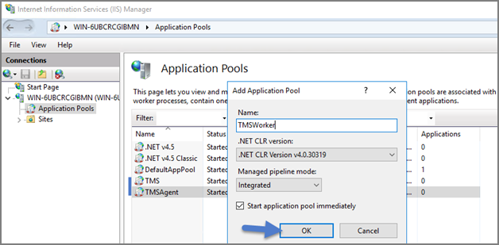
1. When creating your connection string, if you selected Integrated Security=True in step 6, change the Identity for your application pools to a service account that has DBOwner rights on the SQL database & make sure that the Identity for the three app pools have Modify rights to the folder that you put the Privilege Manager files into. To setup the service account correctly and set folder permissions and the Identities for these app pools, follow all of the steps in [Using a Service Account to run the IIS App pool](../../how-to/best-practices/run-iis-app-pool.md) now.
1. Right-click Default Web Site in IIS and select Add Virtual Directory…

   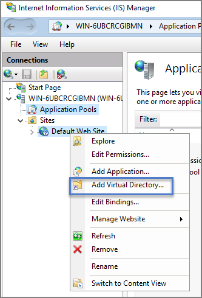
1. Select an alias for your Privilege Manager. The alias is what will be appended to the website. For instance, “TMS” in http://myserver/TMS. 
1. Next, enter the physical directory where you unzipped Privilege Manager `C:\inetpub\wwwroot\TMS\`.
1. Click OK.

   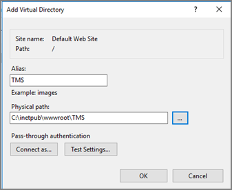
1. In the tree, right-click the new virtual directory and select Convert to Application.
1. Set the Application Pool to the one called TMS. Click OK.

   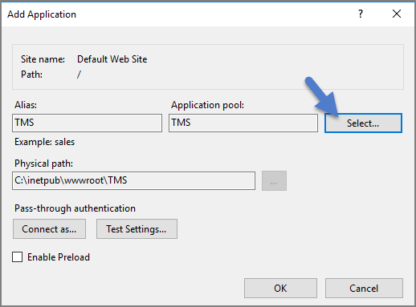
1. In the virtual directory expand the new TMS site, right click the Agent Subfolder and select Convert to Application.
1. Set the Application Pool to the one called TMSAgent and click OK.
1. Next, in the virtual directory navigate to the ServiceBus Subfolder. Right-click and select Convert to Application.
1. Set the Application Pool to the one called TMSWorker. Click OK.

   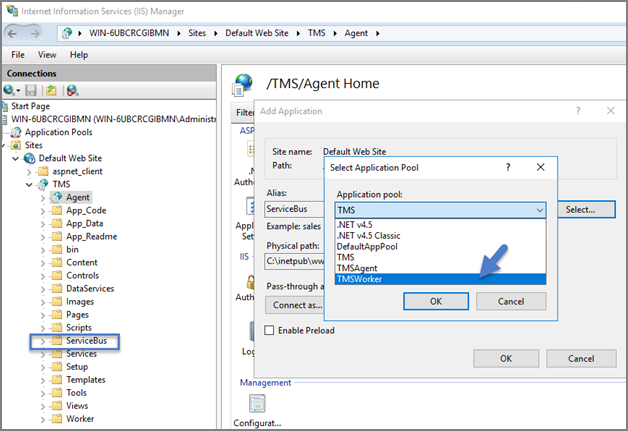
1. In the virtual directory select the Services Subfolder, right-click the new virtual directory and select Convert to Application. Ensure that the Application Pool is set to the one called TMS. Click OK.
1. In the virtual directory select the Setup Subfolder, right-click the new virtual directory and select Convert to Application. Ensure that the Application Pool is set to the one called TMS. Click OK.
1. In the virtual directory select the Worker Subfolder, right-click the new virtual directory and select Convert to Application. Set the Application Pool to the one called TMSWorker. Click OK.
1. Select your TMS virtual directory, double click Authentication in the features pane and make sure that only Anonymous Authentication is set to Enabled. Everything else should be set to disabled.

   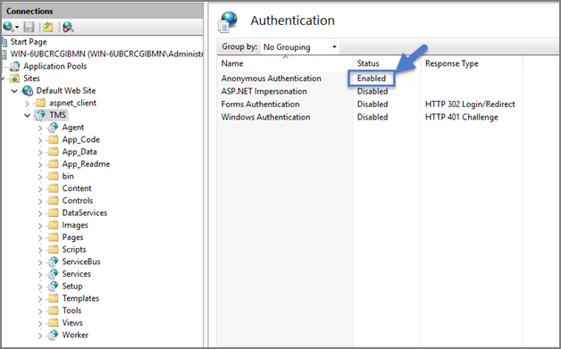
1. Select the Setup directory, double click Authentication in the features pane and make sure that Anonymous Authentication and Windows Authentication are both set to Enabled and everything else is disabled.

   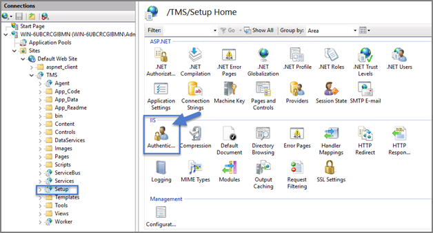
1. Select the Worker, double click Authentication in the features pane and make sure that Anonymous Authentication and Windows Authentication are both set to Enabled and everything else is disabled.
1. In Regedit.exe, Create a new Registry key (HKEY_LOCAL-MACHINE\ right-click on Software | New | Key, name the new key Thycotic. Next right-click on Thycotic | New | Key, name the new key TMS.

   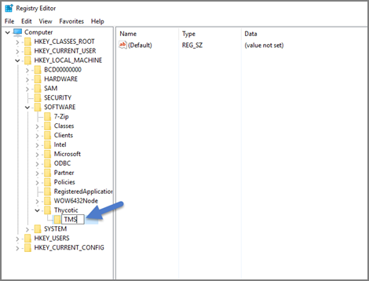
   1. Create a new string value in the TMS folder (right-click TMS | New | String Value) with a name of webapp and a value of TMS (double click to assign value)

      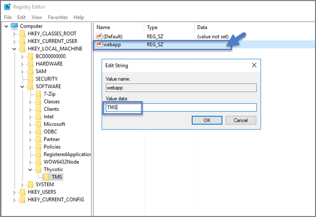
   1. Create a 2nd new string value with a name of website and a value of the url to the root of the site you will be using (ex: “testlab” for a website of https://testlab/TMS)
   1. Create a new string value with a name of Webdir and a value of the path you put your Privilege Manager files in (i.e. C:\inetpub\wwwroot\TMS\)
1. Ensure that the Privilege Manager folder has the proper permissions by checking that the account running the application pool in IIS has Modify permissions on the folder where Privilege Manager is installed. (i.e. C:\inetpub\wwwroot\ right-click TMS | Properties | Security tab, if the service account created in [Using a Service Account to run the IIS App pool](../../how-to/best-practices/run-iis-app-pool.md) is not listed, Edit… | Add… | find account via Check Names | OK. Click on the account, check Modify | Apply.)
1. If your server does not have internet access you will need to ensure that your solutionCenter is configured for the directory that you deposited the nupkg files in step 1.
    1. Go to the directory where you have installed the TMS site (i.e. C:\inetpub\wwwroot\TMS)
    1. Open the web.config file with Notepad and find the line 

       ```xml
       <add key="nuget:source:SolutionCentre" value="http://tmsnuget.thycotic.com"" /
       ```
    1. Replace the value with the directory from step 1 (usually "c:\ProgramData\NugetCache\"). Save changes.

       Example below. **Make sure if using a local path to include the final slash:

       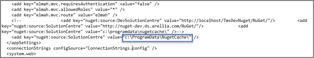

Privilege Manager is now ready to be configured. Continue with Completing Privilege Manager Installation from Website.

### Installing as a Website

1. In IIS, right-click Sites and select Add Website…
1. Enter a Site name.
1. Click Select… and choose the application pool you created in the Manual Installation section, step 3, from the drop-down menu. Click OK.
1. Click the … button beside the Physical path field and select the directory containing the unzipped Privilege Manager files (for example, C:\inetpub\wwwroot\TMS). Click OK.
1. Click OK at the bottom of the Add Website window to save your settings.

## Completing Privilege Manager Installation from Website

Privilege Manager is now ready to complete installation. Open a browser and navigate to where your Privilege Manager Setup is located, for example: https://localhost/TMS/Setup. It will request windows credentials which must be the credentials for a local administrator on the web server.

The site will detect that is does not have the proper database configuration and walk you through installing the initial database objects.

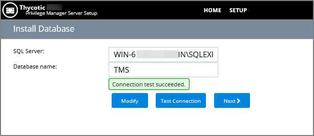

After this initial step you will be presented with a list of privilege manager features you can choose to install.  Select Add/Remove product features​ and select Application Control and Privilege Manager.  This will automatically also select any prerequisites they require.

Each feature is delivered as a NuGet Package, the package will unzip, add files to the Privilege Manger website, and update the database with its required objects. Installing the database and features may take several minutes.

Click Show Install Log​ to reveal installation progress.

Once all features have been installed Privilege Manager is ready to use! Refer to the [Getting Started](../../getting-started/index.md) section for setup and configuration advice.
