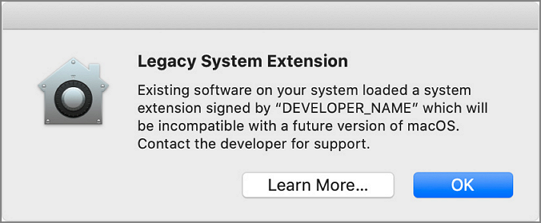

[title]: # (Legacy System Extensions)
[tags]: # (macOS,kexts)
[priority]: # (1720)
# Legacy System Extensions

## Effect on Privilege Manager Customers by Apple Deprecating Kernel Extensions in macOS

In 2019, Apple announced the deprecation of kernel extensions (KEXTS) in a future OS upgrade and that System Extensions should be used instead. Beginning in macOS 10.15.4, the use of kernel extensions will trigger a notification that software using this type of extension includes a deprecated API and an alternative should be provided by the vendor.

You may see this popup:

## How is this Going to Affect Privilege Manager?

Thycotic plans to support Endpoint Security via system extension in Privilege Manager version 10.8 to be delivered this summer. In the meantime, Privilege Manager will continue to function normally and no immediate action is required.

You can read more about legacy system extensions on [Apple's website](https://support.apple.com/en-us/HT210999).

Privilege Manager will continue to support kernel extensions for macOS versions that require them for the product to function.
