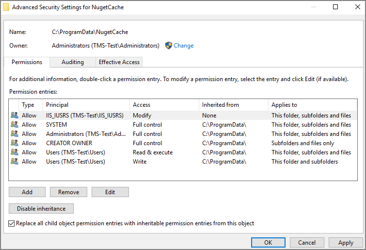

[title]: # (Product Upgrades)
[tags]: # (new version)
[priority]: # (700)
# Product Upgrades

<!-- TODO add missing information
* reference correct SecretServer version for combined installs
* update all version references
* Add info about new/enhanced features and provide links to respective articles/docs
-->

## Offline Upgrade - Combined

Follow these steps to perform an offline upgrade for Privilege Manager and Secret Server. This article is ONLY applicable when upgrading from products that are versions 10.2 and higher.

1. Download the zip files for your offline upgrade [here](http://updates.thycotic.net/secretserver/getlatestversion.aspx?alwayslatest=true). Copy/paste this zip file on your Privilege Manager Web server
1. Make a backup of the Secret Server and TMS web folders (Default path is `C:\inetpub\wwwroot> SecretServer + TMS` folders, copy/paste these into a backup folder)
1. Make a backup of the Database (In Secret Server navigate to Admin | Backup | Backup Now button)
1. On the web server, navigate to `C:\ProgramData\NugetCache\` and delete all the files in the folder (*ProgramData folder may be hidden: View > check the Hidden items box to reveal)
1. Open Secret Server and navigate to: `https://<YourSecretServerURL>/Setup/Upgrade`
1. On the Secret Server Update page:
   1. Select "Advanced (not required)" to open the advanced options
   1. Select "Choose File" and navigate to the location of the Secret Server Update zip package
   1. Select "Upload Upgrade File"
   1. When the new version is available select "Upgrade"

      Check `https://URL/TMS/Setup` to see if an install is already in progress (this is usually seen when the TMS Upgrade portion of SS shows successful)
1. Accept the License. Then allow the Secret Server upgrade to complete.  Note: The Upgrade TMS step may say it was successful, or it may say it wasn't.  Please ignore this message and continue to follow the steps below:
1. Open the C:\ProgramData\ folder:
   1. Right click on the NugetCache folder and select Properties
   1. Click on the Security tab
   1. Click the Advanced button
   1. Check the Replace all child object permission entries with inheritable permission entries from this object checkbox

      
   1. Click the OK button, and Yes.
1. Navigate to `https://<webserver>/TMS/Setup/ProductOptions/ShowProducts`
Note: The TMS setup page requires authentication with a Windows account that is a Local Administrator of the Web Server
1. You may see a page that looks like the image below.  If so, click the Use Local (Cached) Product Options Button
1. IMPORTANT: Do not ignore this step, even if you see the list of products:
   1. Open the web.config file in the TMS web folder (`C:>inetpub>wwwroot>TMS>`"Web" or "Web.config"), right click and open with Notepad, Run as Administrator
   1. Delete the line that says: `<add key="nuget:source:SolutionCentre" value="http://tmsnuget.thycotic.com/nuget/" />`
   1. Replace with your offline nugetCache directory file path. (For example: `<add key="nuget:source:SolutionCentre" value="C:\ProgramData\NugetCache\")`
   1. Save the web.config file
1. Refresh the page at `https://<webserver>/TMS/Setup/ProductOptions/ShowProducts`
1. Click the Install/Upgrade Products button.
1. Select the products you wish to upgrade or install, and follow the steps to finish the installation.

>**Note**:
>If one of the products fails to install, please repeat steps 11 and 12.  You may encounter an issue with an error of "Version Store out of Memory" - this is transient and re-starting the upgrade will fix it.

If you encounter any additional errors or the error from step 13 persists, please contact Thycotic Technical support for assistance by submitting a case here.
