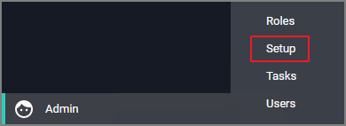
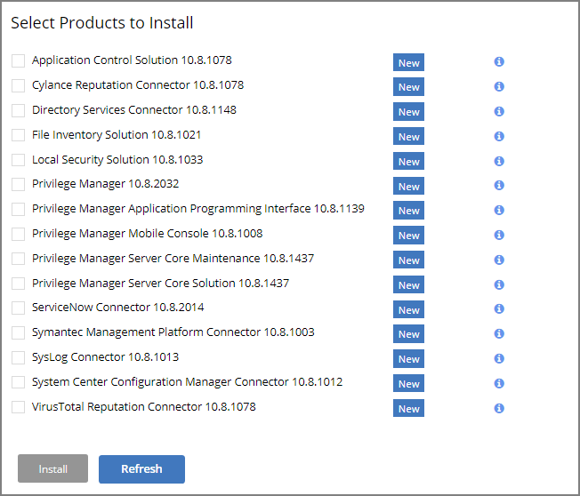

[title]: # (Upgrades)
[tags]: # (new version)
[priority]: # (1701)
# Upgrades

Privilege Manager software updates are made available via NuGet server packages. The upgrade process can be performed via __Add/Upgrade Features__ link in the Privilege Manager Setup page.

>**Note**: Thycotic recommends to create a back-up copy of the Privilege Manager web application folder after installation or upgrades.

## Setting up the NuGet Source

Once Privilege Manager is installed on a server, updates can be performed by pointing the web.config file to the product NuGet source.

1. Navigate to `C:\inetpub\wwwroot\TMS\` and right-click the web.config file.
1. Select Edit from the drop-down.
1. Verify the following line with correct NuGet source is present:

   ```xml
   <add key="nuget:source:SolutionCentre" value="http://tmsnuget.thycotic.com/nuget/" />`
   ```

## Updating Privilege Manager

>**Note**: Always make a backup of the Privilege Manager Database in SQL and the TMS web files before performing upgrades in a production environment. The default location of the web files on the Privilege Manager Server `C:\inetpub\wwwroot\TMS`.
>
>In environments with multiple Privilege Manager Server nodes, __stop__ the TMS application pools on all secondary nodes before starting the upgrade. Restart the applications pools once the upgrade is completed.

### Primary Node

1. Navigate to __Admin | Setup...__.

   

   This starts the process to see if Privilege Manager updates are available.

   
1. When updates are available, Privilege Manager will provide information about the current and available versions.

   

   Click __Start Upgrade__.
1. If you are not a local Administrator on the server, you might see a warning that adding or upgrading features requires administrative access. Based on your account role membership either click __Continue to Add / Upgrade Privilege Manager Features__ or __Cancel__ if your role permissions don't meet the requirement.
1. The Currently Installed Products page displays a table listing all the products by name in alphabetical order.

   

   Use either of the following ways to upgrade your environment to the latest Privilege Manager version:
   1. Click Upgrade next to individual packages, this will require to come back to the Installed Products page after each separate upgrade for most of the packages, or
   1. Click __Install/Upgrade Products__ at the bottom of the page.
      1. Select the products you want to install/upgrade.

         
      1. Select __Install__.

The installation/upgrade process starts and you can view the log while products are being installed.

### Secondary Nodes

1. On the upgraded primary node navigate to TMS web files. The default location is: `C:\inetpub\wwwroot\TMS`.
1. Copy the TMS folder, except for the ConnectionStrings.config file.

   
1. On your secondary node navigate to the same folder location, most likely `C:\inetpub\wwwroot\TMS` and paste the copied files.
1. Repeat this the copy and paste for all other secondary Privilege Manager nodes in your environment.
1. Navigate to the IIS Manager and start all TMS Application pools on the secondary nodes.
