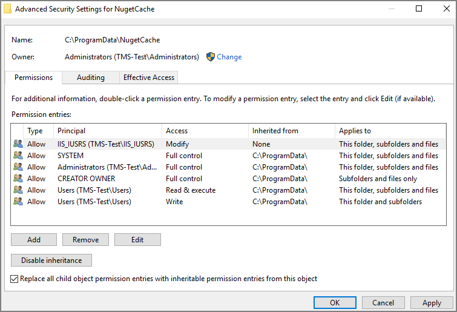

[title]: # (Offline Upgrades - Combined)
[tags]: # (new version)
[priority]: # (711)
# Offline Upgrades - Combined

Follow these steps to perform an offline upgrade for Privilege Manager and Secret Server. This topic is ONLY applicable when upgrading from products that are versions 10.2 and higher.

>**Note**: Offline upgrades on __multiple__ servers will need to be done manually.

1. Download the zip files for your offline upgrade [here](http://updates.thycotic.net/secretserver/getlatestversion.aspx?alwayslatest=true). Copy/paste this zip file on your Privilege Manager Web server
1. Make a backup of the Secret Server and TMS web folders (Default path is `C:\inetpub\wwwroot> SecretServer + TMS` folders, copy/paste these into a backup folder)
1. Make a backup of the Database (In Secret Server navigate to Admin | Backup | Backup Now button)
1. On the web server, navigate to `C:\ProgramData\NugetCache\` and delete all the files in the folder (*ProgramData folder may be hidden: View > check the Hidden items box to reveal)
1. Open Secret Server and navigate to: `https://<YourSecretServerURL>/Setup/Upgrade`
1. On the Secret Server Update page:
   1. Select __Advanced (not required)__ to open the advanced options.
   1. Select __Choose File__ and navigate to the location of the Secret Server Update zip package.
   1. Select __Upload Upgrade File__.
   1. When the new version is available select __Upgrade__.

      Check `https://URL/TMS/Setup` to see if an install is already in progress (this is usually seen when the TMS Upgrade portion of SS shows successful)
1. Accept the License. Then allow the Secret Server upgrade to complete.  Note: The Upgrade TMS step may say it was successful, or it may say it wasn't.  Please ignore this message and continue to follow the steps below:
1. Open the `C:\ProgramData\` folder:
   1. Right-click on the NugetCache folder and select __Properties__.
   1. Click on the __Security__ tab.
   1. Click the __Advanced__ button.
   1. Check the __Replace all child object permission entries with inheritable permission entries from this object__ checkbox

      
   1. Click the __OK__ and __Yes__.
1. Navigate to the TMS web folder (`C:\inetpub\wwwroot\TMS\`), right-click and open with, e.g. __Notepad > Run as Administrator__ the __web.config__ file.
   1. Update the "value" field of this item `<add key="nuget:source:SolutionCentre" value="http://tmsnuget.thycotic.com/nuget/" />` to `C:\ProgramData\NugetCache\`.
   1. Save the __web.config__ file.
   1. Recycle the TMS app pools.
1. Navigate to `https://<webserver>/TMS/Setup/ProductOptions/ShowProducts` The TMS setup page requires authentication with a Windows account that is a Local Administrator of the Web Server.
1. Click the __Install/Upgrade Products__ button.
1. Select the products you wish to upgrade or install, and follow the steps to finish the installation. If one of the products fails to install, please repeat these last two steps. You may encounter an issue with an error of "Version Store out of Memory" - this is transient and re-starting the upgrade will fix it. If you encounter any additional errors, please contact Thycotic Technical Support for assistance.

>**Note**: An upgrade or repair to the product may rewrite the web.config with default settings. Always double-check that the web.config has the correct SolutionCentre path whenever you perform a manual upgrade. Also, the version numbers available should match the highest versions available in the C:\ProgramData\NugetCache\ folder on the web server.
>
>Thycotic recommends to create a back-up copy of the Privilege Manager web application folder after installation or upgrades.
