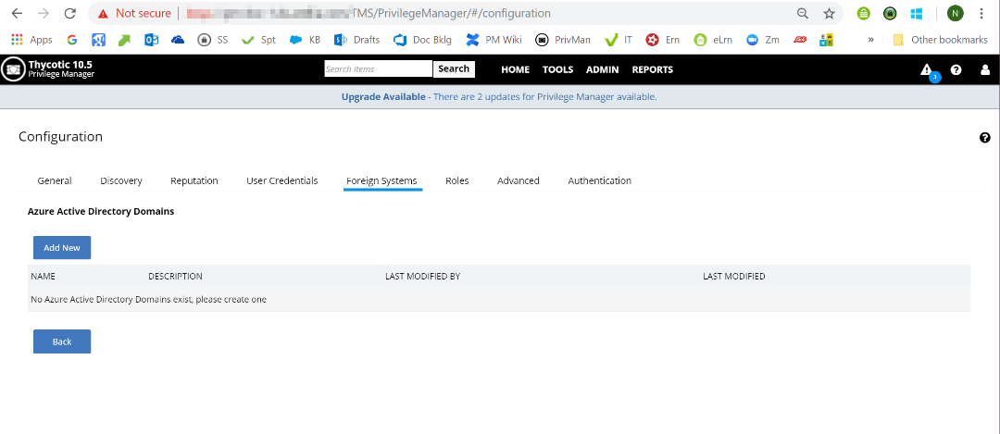
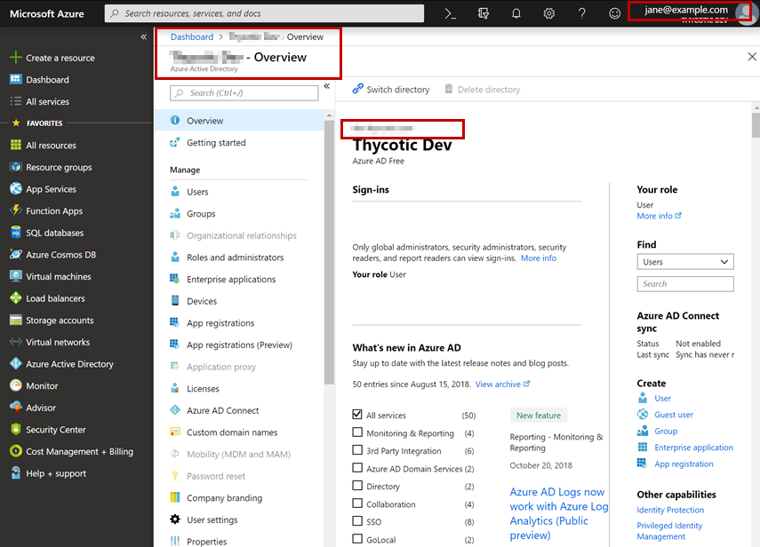
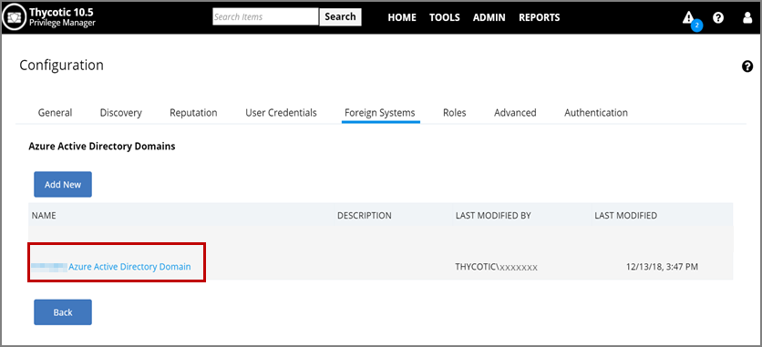
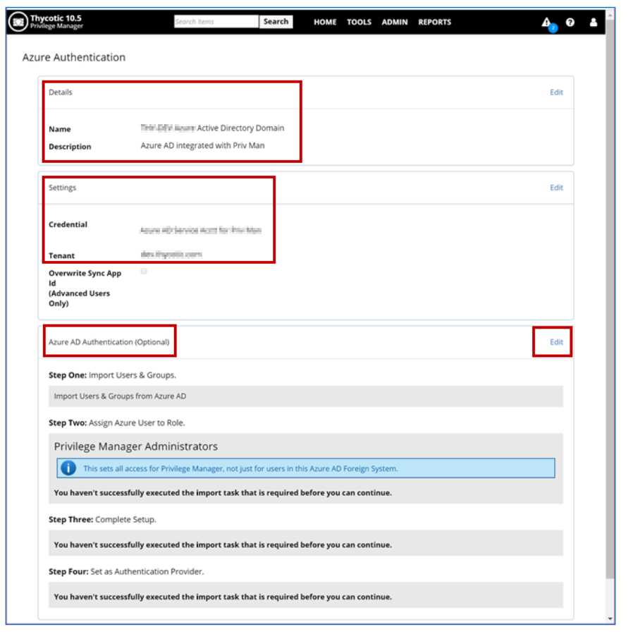
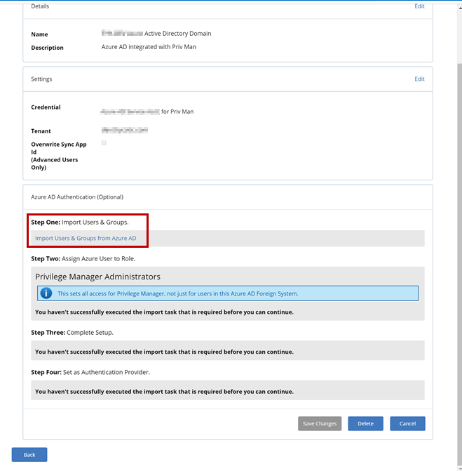
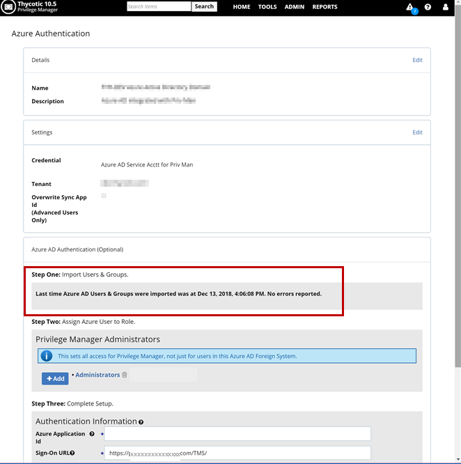
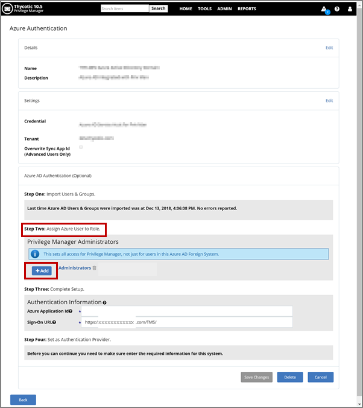
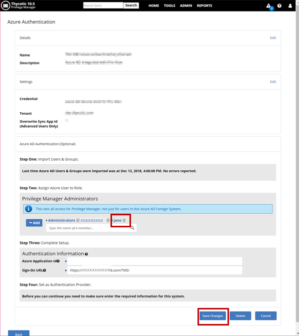
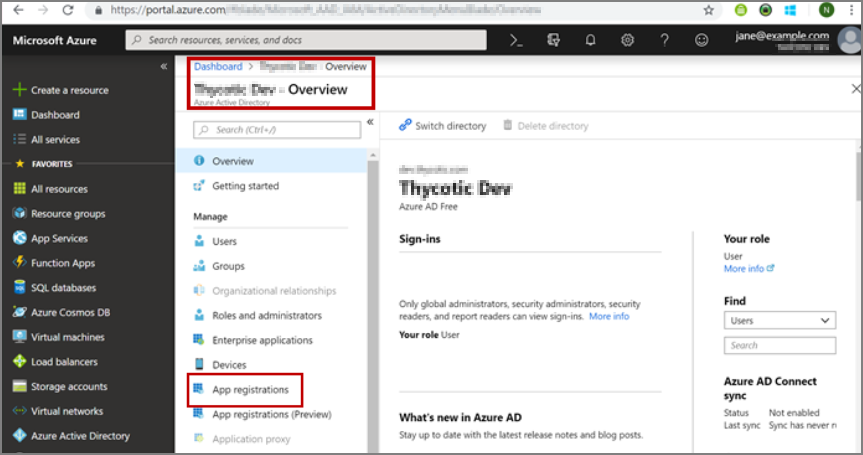
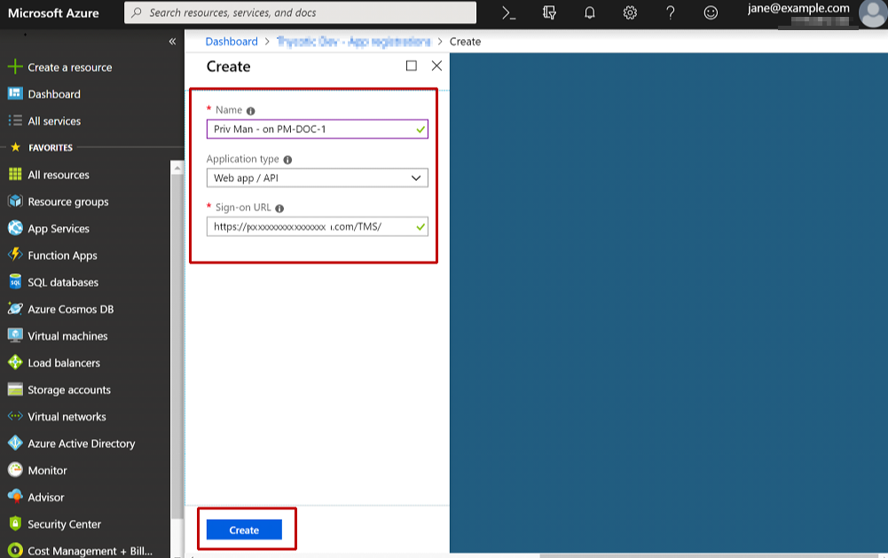

[title]: # (10.5 Azure AD Integration with Privilege Manager)
[tags]: # (Azure AD,integration,Privilege Manager)
[priority]: # (2)
# 10.5 Azure AD Integration with Privilege Manager

## Summary

This article explains how to integrate Azure Active Directory (AD) with
Privilege Manager 10.5. It is divided into the following sections:

-   Introduction

-   Part I: Establish Credentials for Privilege Manager to access Azure AD

-   Part II: Add Azure AD as a Foreign System in Privilege Manager

-   Part III: Complete the Azure AD Integration with Privilege Manager

-   Additional Information

## Introduction

As a Privilege Manager user, you might want to do Azure AD integration for one
or more of the following reasons:

-   Import users and groups into Privilege Manager, via Azure AD. This gives you
    the ability to:

    -   Assign one or more Azure AD users to a Privilege Manager role
        (Administrator or other).

    -   Use a User Context filter, in the definition of an Application Control
        policy, to target applications based on ownership by one of the Azure AD
        imported users.

-   Use Azure AD as an authentication provider, to login into Privilege Manager
    (for any of the Azure users which have been assigned to a Privilege Manager
    role).

The procedure for Azure AD integration is outlined below (providing a summary of
the steps):

*Part I. Establish credentials for Privilege Manager to access your Azure AD*

This is done in Privilege Manager from: Admin | Configuration | User
Credentials

The steps are:

-   Step A: Create a service account in the Azure portal.

-   Step B: Add that service account as a User Credential in Privilege Manager.

*Part II. Add your Azure AD as a “Foreign System” in Privilege Manager*

This is done in Privilege Manager from: Admin | Configuration | Foreign
Systems

You will also need to interact with Azure to enter/obtain some data.

*Part III: Complete the Azure AD Integration with Privilege Manager*

Overall, there are four (sub) steps involved in Part III:

-   Step One: Import Users & Groups.

>   You need to do the following steps, Steps Two to Four, only if you want to
>   use Azure AD as an authentication provider.

-   Step Two: Assign Azure User or Group to Role.

-   Step Three: Complete Setup.

-   Step Four: Set as Authentication Provider.

Part I: Establish Credentials for Privilege Manager to Access Azure AD
======================================================================

The steps for Part I are:

-   Step A: Create a service account in the Azure portal.

-   Step B: Add that service account as a User Credential in Privilege Manager.

Part I, Step A: Create a Service Account in the Azure Portal
------------------------------------------------------------

>**Note**: Please ensure you  have a user account in the Azure portal which has permissions to
create a new user account (which you intend to set up as a user credential in
Privilege Manager for Azure AD access).

-   Log in to the Azure portal: <https://portal.azure.com>. Assume you login as:
<jane@example.com>. Make sure you have selected the domain which you want to
synch with Privilege Manager. Assume the domain is dev.Thycotic.com.

-   Click on Azure Active Directory, in the left pane.

-   Navigate to: Manage | Users | New User

-   Fill in the form to provide data for user name etc. to create the service
    account. (This account must have permissions to read user and group
    information in Azure AD.)

-   Assume you have created the service account as follows:

    -   Name: Azure AD Service Acctt for Privilege Manager

    -   User Name: <AD-synch-user@example.com>

Part I, Step B: Add the Service Account as a User Credential in Privilege Manager
---------------------------------------------------------------------------------

Now you have to add the service account (which you created in the Azure portal)
as a User Credential in Privilege Manager.

-   Login to Privilege Manager (as an Administrator)

-   Navigate to: Admin | Configuration | User Credentials

-   Click on “Add New”

You will see a page with two sections; fill them in as follows:

-   Details section: Enter the name of the service account you created in the
    Azure portal (which you want to be used by Privilege Manager to synch with
    your Azure AD) and, optionally, a description.

-   Setting Section: Enter account name and password for the service account.

Click the __Save__ button.

The name of the service account will now be listed, as a link, in the User
Credentials tab.

Part II: Add Azure AD as a Foreign System in Privilege Manager
==============================================================

Now you will add your Azure AD as a “Foreign System” in Privilege Manager.

Navigate to: Admin | Configuration | Foreign Systems | Azure Active Directory
Domains.

Clicking on Azure Active Directory Domains will take you to a new page. Click the
“Add New” button.

On the page for adding a new domain, the fields are to be filled in as follows:

-   Name: Any name of your choice.

-   DNS Name: The DNS name has to be obtained from the Azure portal;
    instructions are provided further below (after the screenshot of the page
    showing these fields).

Now you have to go to the Azure portal to obtain the DNS name.

-   Login to the Azure portal (selecting the domain which you want to be synched
    with Privilege Manager).

-   The DNS name is the URL found in the Overview pane.

-   Copy this URL to be pasted into the DNS name field in Privilege Manager.

Now back in Privilege Manager, fill in the fields as follows:

-   Name: Enter any descriptive name of your choice.

DNS Name: Enter the URL obtained from the Azure portal.

Clickthe Create button.

The name of the AD domain you just added will now be listed in Azure Active
Directory Domains, in the Foreign Systems tab. (You might need to refresh the
browser to see it displayed.)

Click on the link for the domain you just added. You will be taken to the Azure
Authentication page for Part III of this procedure.

Part III: Complete the Azure AD Integration with Privilege Manager
==================================================================

Overview of the Azure Authentication Page
-----------------------------------------

On the Azure Authentication page, there are several sections for filling in
data:

-   Details

-   Settings

-   Azure AD Authentication; this has the following sections:

    -   Step One: Import Users & Groups.

    -   Step Two: Assign Azure User to Role.

    -   Step Three: Complete Setup.

    -   Step Four: Set as Authentication Provider.

>   NOTE: Steps Two-Four are needed only if you want to use Azure AD
>   authentication.

Details and Setting Sections
----------------------------

Edit the “Details” section; enter data and save changes.

-   Name: will be populated by Privilege Manager.

-   Description: enter a description – optional.

The screenshot in the Overview section above shows this as already done.

Then edit the “Settings” section; enter data and save changes.

-   Credential: Enter the same service account name that you created in Admin |
    Configuration | Credentials

>   (As you start entering the name string, the Search field will start showing
>   results and you can select the name you want.)

-   Tenant: This is the same as the DNS name; will be populated by Privilege
    Manager; if not correctly populated, enter the DNS name.

The screenshot in the Overview section above shows this as already done.

Then click Edit for the “Azure AD Authentication (Optional)” section.

Step One: Import Users & Groups
-------------------------------

After the Credential field has been populated (done in the previous section),
you will see that you have a link to do an import in the “Step One” section.

-   In Step One, click the link to start import.

-   A task will run to import all users and groups that exist in your Azure AD
    domain.

-   Then click Refresh to see results.

Step Two: Assign Azure User to Role
-----------------------------------

To start Step Two, clickthe Add button.

In the text field that opens up, start typing the name of the user account who
you wish to add for the Privilege Manager admin role; from the search results
drop-down, select the user name.

The user name will be added to the list above the search box.

In the screenshot below, we show the user “jane”, whose account name is
jane\@example.com.

Click “Save Changes”.

At this point, you have achieved your goal of being able to assign a user
imported from Azure AD to the Privilege Manager Admin role.

Step Three: Complete Setup
--------------------------

In this step you store the Privilege Manager Azure Application ID which you will
obtain from the Azure portal. The fields to fill are:

-   Azure Application Id: We need to obtain the value from Azure AD.

-   Sign-On URL: Privilege Manager will populate this field. If not, paste here
    the URL you use for launching Privilege Manager in a browser.

To obtain the Azure Application Id, log into <https://portal.azure.com>. Make
sure you are in the correct directory – the one you are trying to synch. You
need to do the following on the Azure portal:

-   Register Privilege Manager as an application.

-   Obtain (copy) the Application ID so we can use it to complete Step Three on
    the Azure Authentication page of Privilege Manager.

Click on “App registrations”.

Click on “New application registration”. On the next page, you need to fill out
the three fields:

-   Name: Enter a name to represent your Privilege Manager instance.

-   Application type: Select “Web app / API”

Sign-on URL: Copy this from the Step Three “Sign-On URL” field in Privilege
Manager

To get the Sign-on URL:

-   Navigate to Privilege Manager: Admin | Configuration | Foreign Systems |
    Azure Active Directory Domains

-   Copy the Sign-on URL from Step Three to paste into the Azure form.

The screenshot below shows all three fields populated.

After filling each of the three fields, clickCreate.

Azure will now provide an Application ID; copy that.

Now back in Privilege Manager:

Paste into the Step Three field, the Application ID you copied from Azure. Save
Changes.

Step Four: Set as Authentication Provider
-----------------------------------------

In this step, you can set Azure AD as your authentication provider for Privilege
Manager.

The informational message in Step Four tells you which provider you are
currently using to authentication.

Check the box in front of “Use as Authentication Provider”. Save Changes.

You will be asked to confirm your changes.

>**Note:** If you do Save, you will then only be able to log back in using the
Azure AD account which you assigned in Step Two.

Click __Save__.

Privilege Manager will log you out since you now need to login using the Azure
AD account which you assigned to the Privilege Manager Admin role, in Step Two.

Logging back into Privilege Manager after completion of Step Four
-----------------------------------------------------------------

These are the steps for logging back into Privilege Manager after completion of
Step Four, “Set as Authentication Provider”.

Privilege Manager will prompt you for Login.

You now need to login using the Azure AD account which you assigned to the
Privilege Manager Admin role, in Step Two. (In our example, we showed this was
<jane@example.com>.) Sign in with that account name and on the next dialog,
accept the permissions requested – to allow Privilege Manager to sign you in and
read your profile. Once in Privilege Manager, you will see that you are logged
in with your Azure AD account name.

You have now fulfilled your goal of using Azure AD as an authentication
provider, to login into Privilege Manager.

Additional Information
======================

Allowing Azure AD Accounts to Login with a Privilege Manager Role
-----------------------------------------------------------------

Assumption: you have completed Step Four, or are planning to do so, on the Azure
Authentication page.

If you want to add Azure AD users so they will be able to access Privilege
Manager, in the Privilege Manager User role, using their Azure credentials:

-   Navigate to: Admin | Configuration | Roles | Privilege Manager Users (or
    whichever role you want)

-   Click __Edit__ | __Add__.

-   Search for and select any Azure AD user to whom you want to give Privilege
    Manager User role access to Privilege Manager.

-   Save changes.

Options for Activating or De-Activating the Azure AD Authentication Integration
-------------------------------------------------------------------------------

### Activating

There are two ways to activate your Azure AD Authentication Integration:

-   You can do this via Step Four on the Azure Authentication page, as shown in
    a previous section of this article.

-   Alternatively, you can Activate this integration as follows:

    -   Admin | Configuration | Authentication

    -   Select your Azure AD Domain from the Authentication Provider dropdown
        list.

    -   Save.

### De-Activating

If you activated Azure AD authentication (by any method) and want to switch back
to a different auth method, you must do the following:

-   Admin | Configuration | Authentication

-   Select from the Authentication Provider dropdown list whichever method you
    prefer.

-   Save.

Note: If you try to simply uncheck the Use as Authentication Provider checkbox
under Step Four on the Azure Authentication page, the reversal authentication
method will NOT take effect.

Deleting Azure AD Domains
-------------------------

To delete an Azure AD Instance:

-   Go to: Admin | Configuration | Foreign Systems | Azure Active Directory
    Domains

-   Click the name of the domain you want to delete.

-   Click Edit under any of the sections on the Azure Authentication page, then
    click Delete, and Confirm Delete when prompted by the pop-up dialog.

Locked Out?
-----------

*Are you accessing Privilege Manager from a Remote Machine?*

If you have issues logging into Privilege Manager from a client machine, first
try logging in with a local account directly on your Privilege Manager web
server.

*Have you recently Reset your Azure Account Password?*

If you’ve recently performed a password reset with the Azure account you are
using for login, sign into the Azure portal with that account and follow the
prompts to create a new password before attempting to access Privilege Manager.
