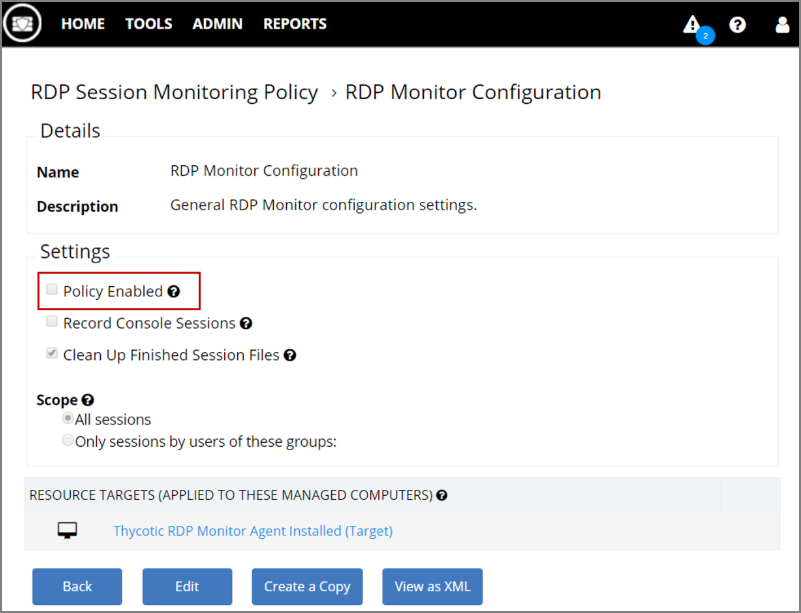

[title]: # (Remove RDP Monitoring from Privilege Manager)
[tags]: # (rdp,remove)
[priority]: # (9400)
# Remove RDP Monitoring from Privilege Manager

The Privilege Manager feature to support RDP session monitoring is being discontinued (with version 10.6 of the product).

If you had previously set up RDP monitoring in Privilege Manager, perform the following steps to remove it:

1. Uninstall the RDP Monitor from all your Privilege Manager agent computers, using the following command line:

```shell
msiexec.exe /x {4249b7f0-2e48-471b-ad53-19b54ca5bedd}
```

1. Disable the RDP Monitor policy by navigating to __Tools | RDP Monitor | RDP Monitor Configuration__.
1. In the Settings section, un-check the __Policy Enabled__ option.

   
