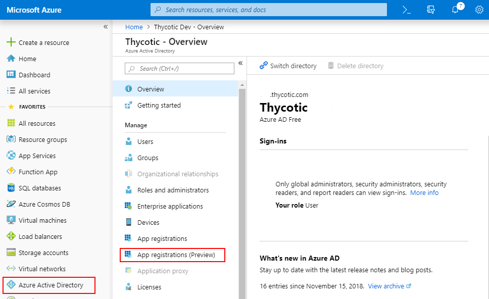
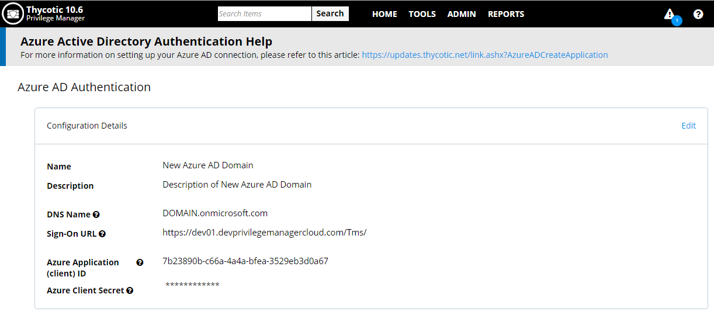
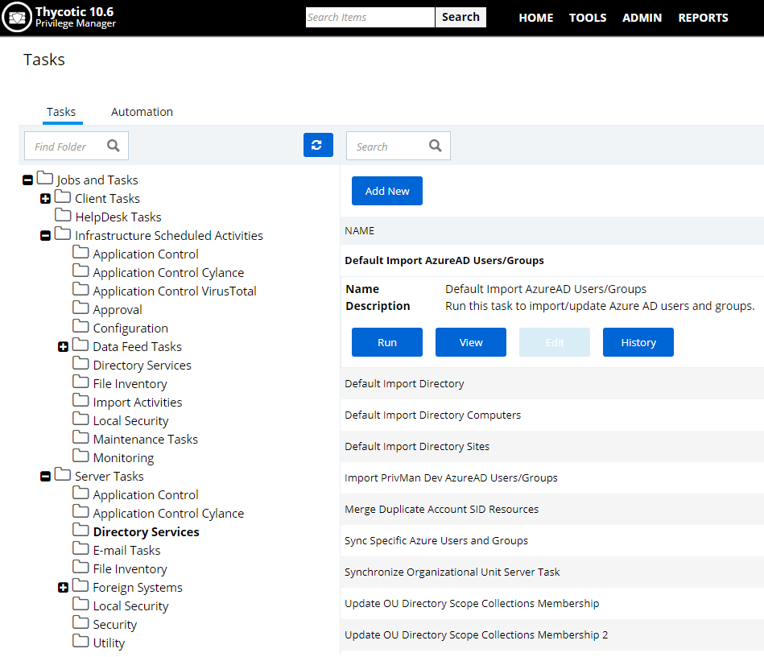

# Setting Up Azure Active Directory Synchronization in Privilege Manager

Setting up Azure AD synchronization with Privilege Manager requires steps in your Azure tenant and in Privilege Manager.

In Privilege Manager the Azure Active Directory Domain Foreign System requires the following from the Azure Portal:

* On-premises and Cloud:
  * Tenant (this is the unique identifier of the Azure Active Directory instance)
  * Application ID (an application in the directory instance (the new Azure portal calls this Application ID)

* Cloud only:
  * Certificates & Secrets (a Secret created on the Azure portal for the previously created application)

Setting up Azure AD Sync in Privilege Manager requires these components independent of On-premises or Cloud:

* User Credential
* An Azure Active Directory Domain Foreign System
* Executing a Privilege Manager Task (Import Users and Groups)
* Creating a Scheduled Task to synchronize the users and groups on a regular basis

## Steps in the Azure Portal

1. Navigate to your https://portal.azure.com
1. In your Azure portal, navigate to and open __Azure Active Directory__.  
1. Verify you are in the right tenant or use the filter to switch.

### Cloud

1. Select __App registrations (Preview)__. 
   
1. Select __+ New registration__.
1. Under Register an application, enter
   1. an application __Name__.
   1. select __Supported account types__ based on your business requirements
   1. specify a __Redirect URI__ base on your business requirements
   1. Click the __Register__ button.
1. Navigate to your newly created application registration.
1. Select the __Certificates & secrets__ option. 
     
1. Click __+ New client secret__.  
1. Add a __Description__ and chose an __Expires__ setting based on your business requirements.
1. Click __Add__ to create the secret.
1. Use the __Click to copy__ icon to copy the newly created secret to the clipboard.

You will need the Application Id and the secret you copied to the clipboard in Privilege Manager to complete the setup.

### On-premises

1. Starting from the tenant screen, click __Enterprise Applications__.
1. Look at the column "Application Id" to find the application id for the correct application (Alternatively, click into the application then click Properties)

## Steps in your Privilege Manager Instance

### Set-Up User Credential

1. Navigate to __Admin | Configuration__ in Privilege Manager
1. Click on the __User Credentials__ tab
1. Click __Add New__
1. Enter a Name and Description for this User Credential, then an Account Name and Password. Confirm the password. Click Save.

### Set-up Foreign Systems

1. Select __Admin | Configuration__.  
1. Select the __Foreign Systems__ tab.
1. Select __Add New__.  
1. Enter a Name and Description. Click the __Create__ button.
1. Select the newly created Azure AD Domain entry and click __Edit__.  
1. Enter the __DNS Name__, __Sign-on URL__, __Azure Application (client) ID__, and __Azure Client Secret__. The Azure Client Secret should still be in your clipboard for paste. Clear your clipboard afterwards. 
   
1. Click __Save Changes__.
1. Continue to the Azure AD Authentication Provider section and click __Edit__.
1. Complete the three steps:
   1. Import Users & Groups from Azure AD.
   1. Assign Azure User to Role.
   1. Set as Authentication Provider.
1. Click __Save Changes__.

You do not need to have an active directory domain before you can sync with an Azure Active Directory 

### Import Users and Groups via Privilege Manager Task

In order to verify a successful sync, search for the users you expect to have brought over from Azure Active Directory. You should be able to find the foreign system id information populated for those users.

* Navigate to Privilege Manager | Admin | Tasks
* Expand "Jobs and Tasks"
* Expand "Server Tasks"
* Click on "Default Import AzureAD Users/Groups"
* Click Run, then Select Resource
* Select the Azure Active Directory Domain you previously created
* Enable Import Groups
* Enable Import Users
* Click Run Task

### Create Scheduled Task for Users/Groups Synchronization

1. Navigate to __Admin | More__ and select __Tasks__ from the options.
1. Under the __Server Tasks__ folder select __Directory Services__ and click __Add New__. 
     
1. Select Default Import AzureAD Users and Groups.
1. Click __View__ and then __Create a Copy__.
1. Name your copy to best represent your scheduled task based on your business requirements. Thycotic recommends to run import for synchronization at least once daily. You can also use __Run Task__ on demand when needed.