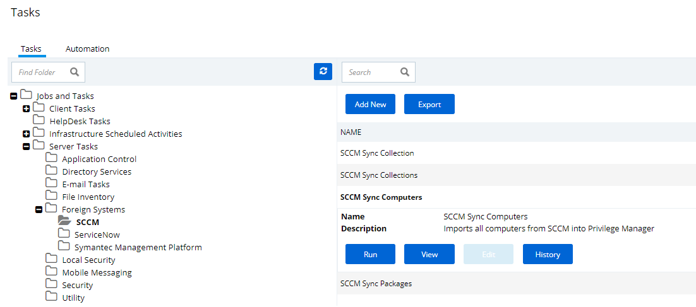
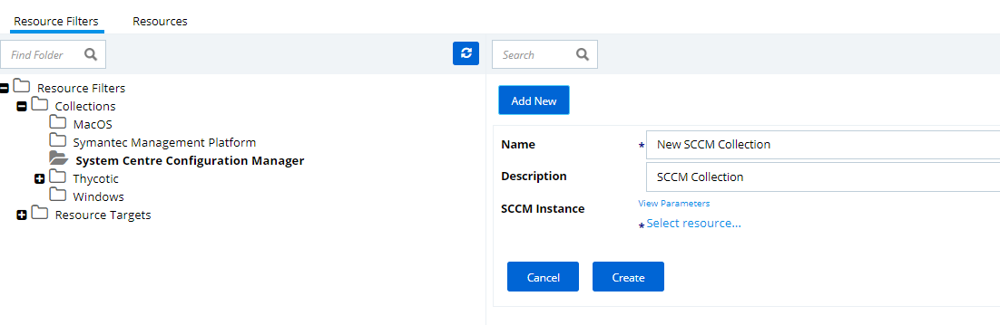
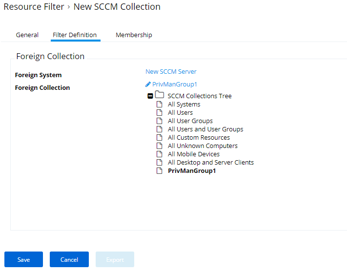

[title]: # (Set-up SCCM Integration)
[tags]: # (integration)
[priority]: # (9101)
# Set-up SCCM Integration

Privilege Manager can import Collections and package data from Microsoft SCCM.  The collections can then be used to target computers in policies, and the package data used to create application filters. This integration allows users to deploy changes in Privilege Manager across large environments quickly and effectively.

## Create a Credential

Privilege Manager needs a username and password to access SCCM.  If you have not already created an appropriate user credential:

1. Navigate to __Admin | Configuration__ and select the __Credentials__ tab.
1. Click Add New.
1. On the New User Credential page under
   1. Details enter a name and description for the SCCM credential.
   1. Settings enter the SCCM Account Name, Password, and confirm the password.

   
1. Click __Save__.

## Connecting to SCCM

Before you can import data from SCCM you need to setup a foreign systems connection in Privilege Manager for the SCCM integration.

1. Navigate to __Admin | Configuration__ and select the __Foreign Systems__ tab.
1. Select __System Centre Configuration Manager__. If this is not listed, make sure the connector is installed by verifying via the Privilege Manager Add/Upgrade Features page.
1. Click __Add New__.

   
1. Enter the name of the SCCM Server and provide the WMI Namespace (URL).
1. Click __Create__.
1. Select the newly created SCCM foreign system and click __Edit__.
1. Under Settings enter the SCCM user credential that you created in the previous procedure.
1. Enter the SCCM URL.
1. Click Save.

## Import Computers from SCCM

Before you can import collection data from SCCM, Privilege Manager needs to know about computers in your SCCM.

1. Navigate to Admin | More and select Tasks.
1. On the Tasks tab open the folder tree and select Server Tasks | Foreign Systems | SCCM.

   
1. Click Synchronize Computers.  

   
1. Click __Run__.
1. Specify Parameters via the __View Parameters__ link and select your SCCM system via the __Select resource...__ option.

   
1. Click __Run Task__.
   > **Note**: You can also right-click on your SCCM from the Foreign Software Systems view and select Synchronize Computers to launch this task.

## Verify the Computers have been Imported

1. Navigate to __Admin | More__ and select __Resources__.
1. Open the __Resources__ tab.
1. In the folder tree open __Organizational Views | Default | All Resources | Asset | Network Resource | Computer__.
1. Verify that the required computers have been imported.

You can also verify that the computer resource you're viewing is connected to SCCM.

1. In the Computer view, right-click on a computer and select Resource Manager.
1. In the Resource Manager view select the Data tab.
1. In the tree under Data Classes | Foreign Systems, you should have the Foreign System Id and SCCM Platform Id data.

## Create a Collection from SCCM

After computers have been imported, you can create a collection to mirror an SCCM collection.

1. Navigate to Resources, open the __Resource Filters__ tab.
1. In the folder tree under __Resource Filters__ open __Collections | Thycotic__.
1. Click __Add New__
1. From the __Template__ drop-down select __SCCM Collection__.

   
1. Enter a Name and Description, Parameters, and specify the SCCM resources to mirror.

   

   
1. Click __Create__.
1. Click __Edit__.
1. Select the Filter Definition tab and under __Foreign Collection__ select the Collection target.

   
1. Click __Save__.

## Updating an SCCM Collection

Privilege Manager needs to pull the list of computers that are part of a collection from SCCM. By default it will only do this on demand.

1. Navigate to Tasks, open the folder tree to __Jobs And Tasks | Server Tasks | Foreign Systems | SCCM__.
1. Select the __Synchronize SCCM Collection__ task.  

   
1. Click __Run__.
1. Specify your collection resource and click __Run Task__.
   > **Note**: You can also run this task by right-clicking the collection in the tree and selecting Synchronize Collection.
   >If you would like this to run automatically, you can setup a schedule to run by clicking the New Schedule button.  Select the collection, set schedule information, and Save.
1. Navigate back to your SCCM Collection in Resources.
1. Click the Update Membership button to view the current members of the collection.

>**Note**:
>It is necessary for the Collection Update task to run, by default the task is scheduled to run every 15 minutes. Clicking Update Membership will immediately perform the same actions as the Collection Update task.
