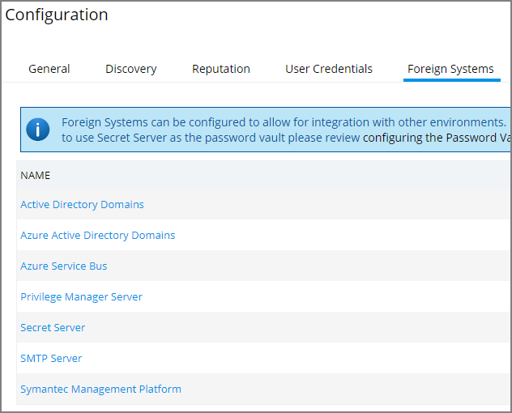
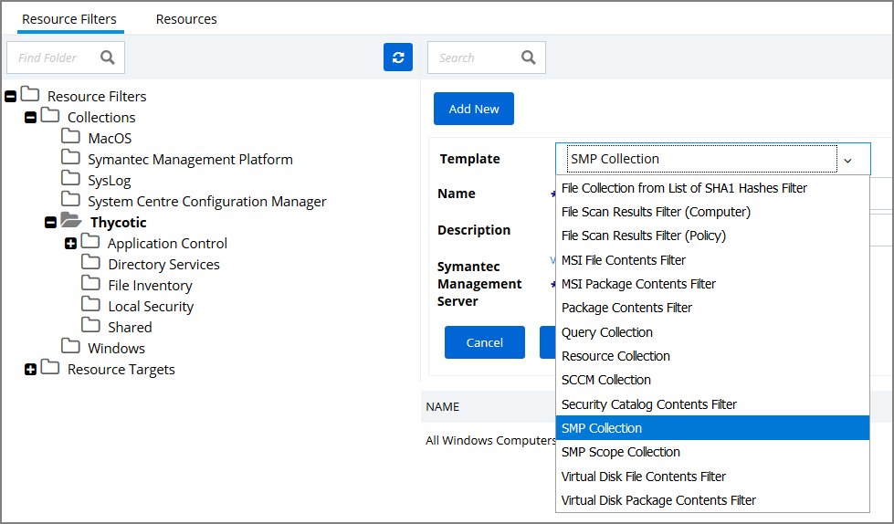
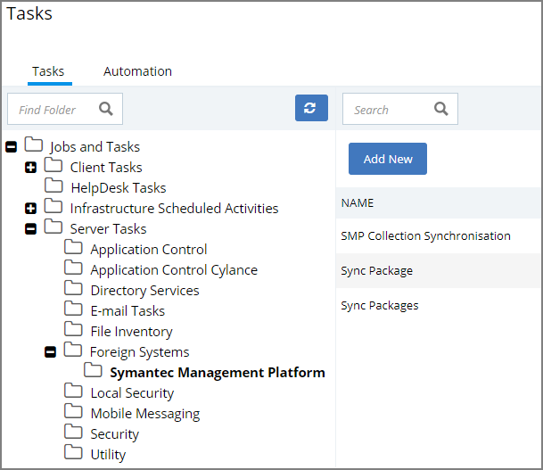
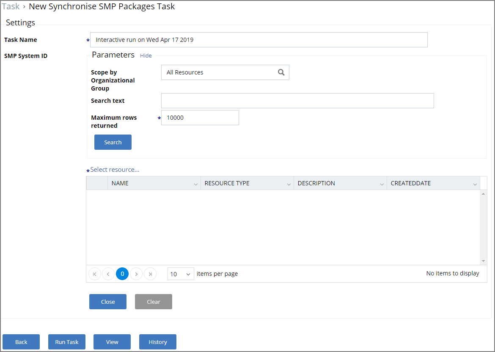
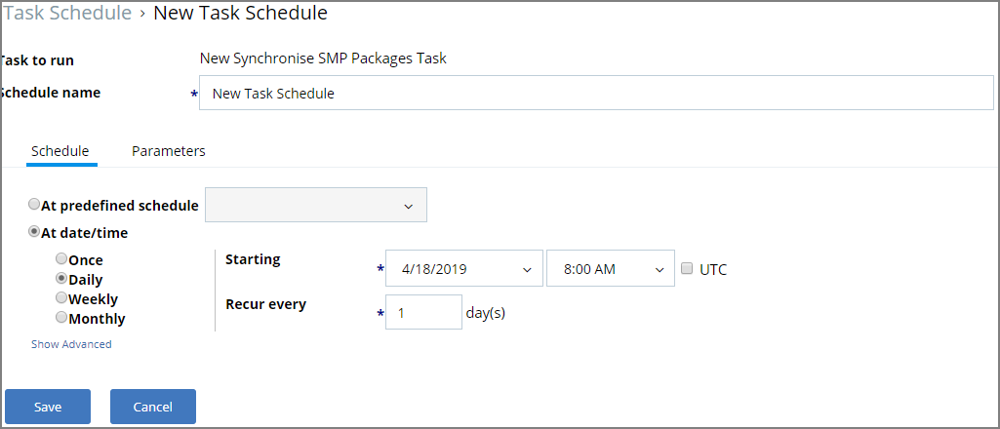
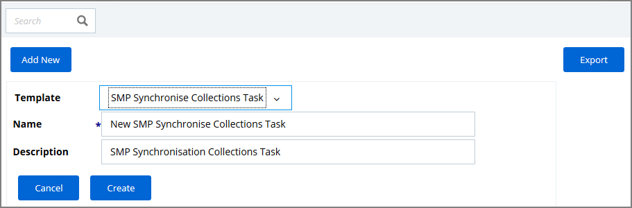
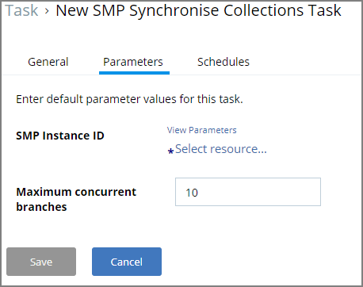
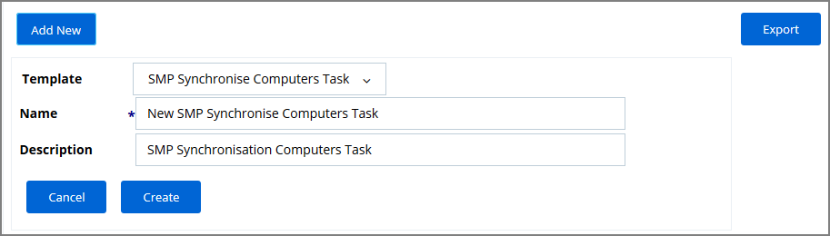
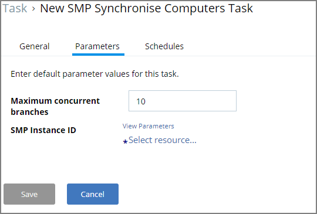

[title]: # (Set-up SMP Integration)
[tags]: # (integration)
[priority]: # (9101)
# Set-up Symantec Management Platform (SMP) Integration

Privilege Manger integrates with the Symantec Management Platform to allow the

* import of existing Resource Collections from SMP and use them for Privilege Manager policy targets.
* scan of SMP Software Packages to use the package contents in Privilege Manager Application Control Policy Whitelists.
* scan of Computers for the purpose of identifying systems that exist on the network, but don’t have an endpoint agent installed yet.

## Creating User Credentials and Adding the SMP Foreign System

For the mentioned purposes above, a user credential and foreign system needs to be set-up before any of the integration tasks can be done. To configure this prerequisite, follow these steps:

1. Navigate to __Admin | Configuration | User Credentials__.
1. Click __Add New__, to create user credentials to access the Symantec Management Platform Server.
1. After entering the user credentials information for SMP, click __Save Changes__.
1. Navigate to the __Foreign Software Systems__ tab.

   
1. Select __Symantec Management Platform__ from the list.
1. Click __Add New__.

   
1. __Name__ the Symantec Management Platform and provide the __URL of the Altiris console__.
1. Click __Create__.

## Create a Collection from SMP Resources

After the foreign system has been setup, create the SMP resources collection.

1. Navigate to Resources, open the __Resource Filters__ tab.
1. In the folder tree under __Resource Filters__ open __Collections | Thycotic__.
1. Click __Add New__
1. From the __Template__ drop-down select __SMP Collection__.

   
1. Enter a Name and Description, Parameters, and specify the SMP resources to access. 

   
1. Click __Create__.
1. Click __Edit__.
1. Select the Filter Definition tab and under __Foreign Collection__ select the Collection target.

   
1. Click __Save__.

## Setting Up SMP Synchronize Packages Task

Once the Foreign System has been created, an on-demand packages synchronization can be run and/or a regular synchronization schedule can be set-up via the following steps:

1. Navigate to __Admin | More__ and select __Tasks__ from the options.
1. Navigate to Jobs and Tasks.
1. Expand __Server Tasks | Foreign Systems__ and select Symantec Management Platform

   

   If the Symantec Management Platform is not listed under Foreign Systems, make sure it is correctly set-up as outline in the *Creating User Credentials and Adding the SMP Foreign System* procedure.
1. Click __Add New__.
1. Select the __SMP Synchronise Packages Task__ from the template drop-down list. 

   
1. Enter a __Name__ and description, click __Create__.
1. Once the task is created use __Edit__ to set up the

   1. Enter the Parameters details:  
      

      Once the parameters are set, the task can run on demand.
   1. Navigate Back and select the Schedule tab.

     
   1. Enter the Schedule details.
1. Click __Save__.

Privilege Manager will scan the packages on the SMP Server based on the specified parameters and set schedule.

After the Package Synchronization completes the SMP Packages can be used in Privilege Manager’s Application Control Package listing policies.

### Setting Up SMP Synchronise Collections Task

Follow these steps for an on-demand Collection synchronization or the setup of a regular Collection synchronization schedule:

1. Navigate to __Admin | More__ and select __Tasks__ from the options.
1. Navigate to Jobs and Tasks.
1. Expand __Server Tasks | Foreign Systems__ and select Symantec Management Platform

   

   If the Symantec Management Platform is not listed under Foreign Systems, make sure it is correctly set-up as outline in the *Creating User Credentials and Adding the SMP Foreign System* procedure.
1. Click __Add New__.
1. Select the __SMP Synchronise Collections Task__ from the template drop-down list. 

   
1. Enter a __Name__ and description, click __Create__.
1. Once the task is created use __Edit__ to set up the

   1. Enter the Parameters details:  
      

      Once the parameters are set, the task can run on demand.
   1. Navigate Back and select the Schedule tab.

     
   1. Enter the Schedule details.
1. Click __Save__.

### Setting Up SMP Synchronise Computers Task

Follow these steps for an on-demand Collection synchronization or the setup of a regular Collection synchronization schedule:

1. Navigate to __Admin | More__ and select __Tasks__ from the options.
1. Navigate to Jobs and Tasks.
1. Expand __Server Tasks | Foreign Systems__ and select Symantec Management Platform

   

   If the Symantec Management Platform is not listed under Foreign Systems, make sure it is correctly set-up as outline in the *Creating User Credentials and Adding the SMP Foreign System* procedure.
1. Click __Add New__.
1. Select the __SMP Synchronise Computers Task__ from the template drop-down list. 

   
1. Enter a __Name__ and description, click __Create__.
1. Once the task is created use __Edit__ to set up the

   1. Enter the Parameters details:  
      

      Once the parameters are set, the task can run on demand.
   1. Navigate Back and select the Schedule tab.

     
   1. Enter the Schedule details.
1. Click __Save__.
