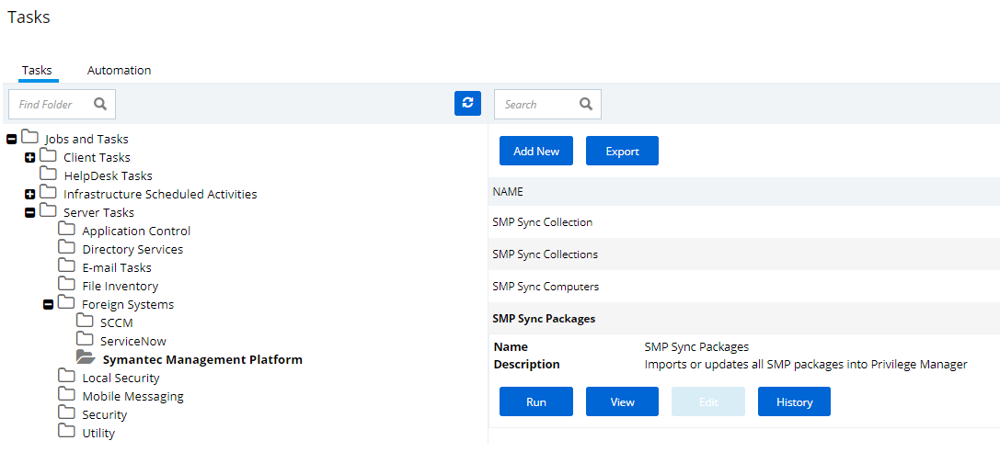

[title]: # (Set-up SMP Integration)
[tags]: # (integration)
[priority]: # (9101)
# Set-up Symantec Management Platform (SMP) Integration

Privilege Manger integrates with the Symantec Management Platform (SMP) to allow the

* [import of computers](#import-computers) for use in computer groups and identifying systems that exist on the network, but don’t have an endpoint agent installed yet.
* [import of existing Resource Collections](#create-a-collection) from SMP and use them for Privilege Manager policy targets.
* [inventory of SMP Software Packages](#inventory-software-packages) to use the package contents in Privilege Manager Application Control policies.

## Create a Credential

Privilege Manager needs a username and password to access SMP.  If you have not already created an appropriate user credential:

1. Navigate to __Admin | Configuration | User Credentials__.

1. Click __Add New__, to create user credentials to access SMP.

1. After entering the user credentials information for SMP, click __Save Changes__.

## Connecting to SMP

Before you can import data from SMP you need to setup a foreign systems connection in Privilege Manager for the SMP integration.

1. Navigate to __Admin | Configuration__ and select the __Foreign Systems__ tab.
1. Select __Symantec Management Platform__. If this is not listed, make sure the connector is installed by verifying via the Privilege Manager Add/Upgrade Features page.
1. Click __Add New__.

   
1. __Name__ the Symantec Management Platform and provide the __URL of the Altiris console__.
1. Click __Create__.
1. Select the newly created SMP foreign system and click __Edit__.
1. Under Settings select the SMP user credential that you created in the previous procedure.
1. Click Save.

## Import Computers

Before you can import collection data from SMP, Privilege Manager needs to know about computers in your SMP.

1. Navigate to __Admin | More__ and select __Tasks__.
1. On the Tasks tab open the folder tree and select __Server Tasks | Foreign Systems | Symantec Management Platform__.
1. Click __SMP Sync Computers__.

   
1. Click __Run__.
1. Select your SMP system via the __Select resource...__ option.

   
1. Click __Run Task__. 

### Verify the Computers have been Imported (optional)

1. Navigate to __Admin | More__ and select __Resources__.

1. Open the __Resources__ tab.
1. In the folder tree open __Organizational Views | Default | All Resources | Asset | Network Resource | Computer__.
1. Select a computer from that list.
1. Select the Known Data tab in the computer resource explorer view.
1. In the tree under __Foreign Systems__, you should have the Foreign System Id and SMP Platform Id data.

## Create a Collection

After computers have been imported, you can create a collection to mirror an SMP collection.

1. Navigate to Resources, open the __Resource Filters__ tab.
1. In the folder tree under __Resource Filters__ open __Collections | Symantec Management Platform__.
1. Click __Add New__
1. Enter a Name and Description, and specify the SMP instance to connect to. 

   
1. Click __Create__.
1. Click __Edit__.
1. Select the Filter Definition tab and under __Foreign Collection__ select the Collection target.

   
1. Click __Save__.
1. Click the __Sync Foreign Collection__ to update the membership immediately. The foreign collection update can also be scheduled by following the link in the help tip.

    
1. Select the Membership tab and then click the __Update Membership__ tab to see the current membership of this collection.

## Inventory Software Packages

Once the Foreign System has been created, an on-demand packages synchronization can be run and/or a regular synchronization schedule can be set-up via the following steps:

1. Navigate to __Admin | More__ and select __Tasks__.
1. On the Tasks tab open the folder tree and select __Server Tasks | Foreign Systems | Symantec Management Platform__.
1. Click __SMP Sync Packages__.

   
1. Click __Run__.
1. Select your SMP system via the __Select resource...__ option.

   
1. Click __Run Task__.

Alternatively the __SMP Sync Packages__ task can be scheduled to regularly repeat. When viewing the task, navigate to the Schedules tab and create a new schedule.

### Create a SMP Package Content Filter

After the Package Synchronization completes the SMP Packages can be used in application control policies via package content filters.

1. Navigate to __Admin | Filters__.
1. Click the __Add Filter__ button.
1. From the Platform drop-down select Windows.
1. From the Filter Type drop-down scroll to Inventory Filters and select the __Package Contents Filter__.
1. Set the Name and Description of the filter.
1. Click __Create__.
1. Click __Edit__.
1. Next to Package, click __Select resource...__.
1. Select the package from SMP that will be targeted.
1. Set the __Results will be__ to __Included__.

    
1. Navigate to the __Membership__ tab.
1. If no items are listed in the membership table, click the __Update Membership__ button.

    
1. Click __Save__.

This filter can then be referenced in Application Control policies.
