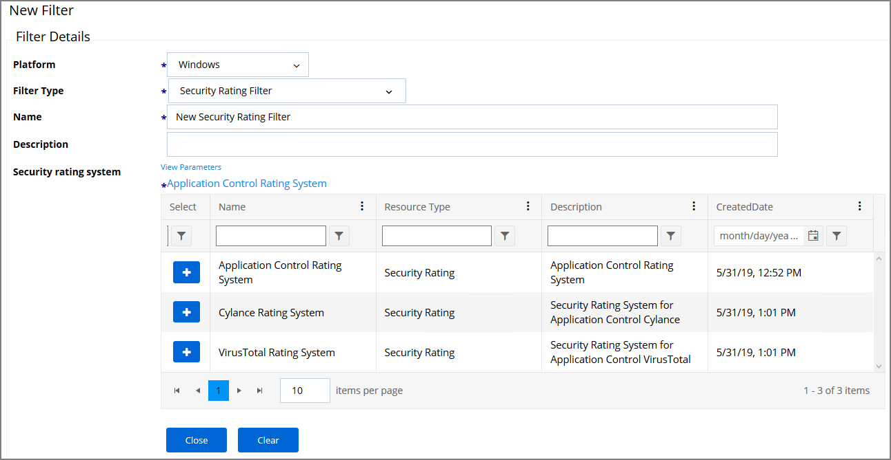
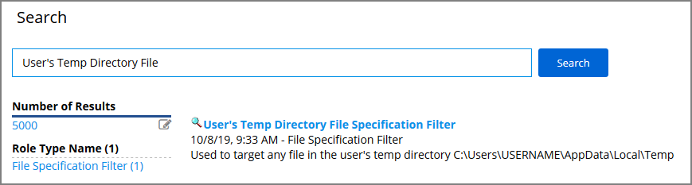
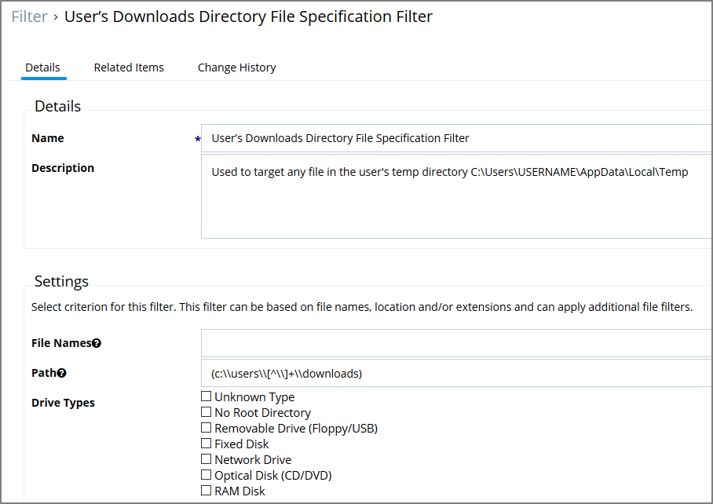
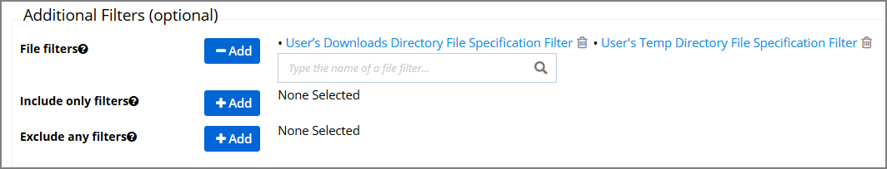
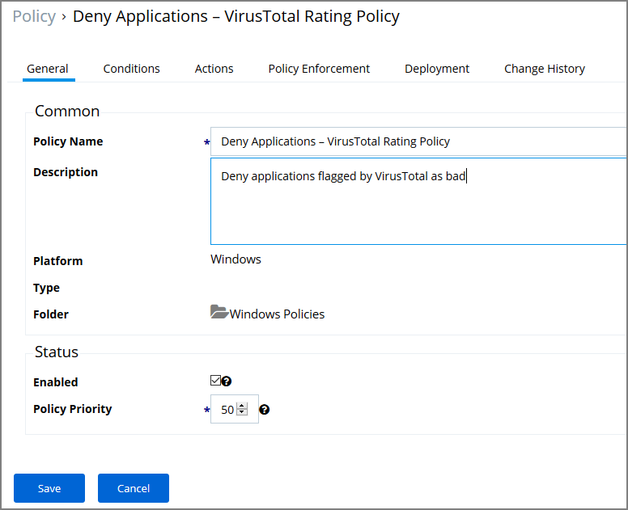
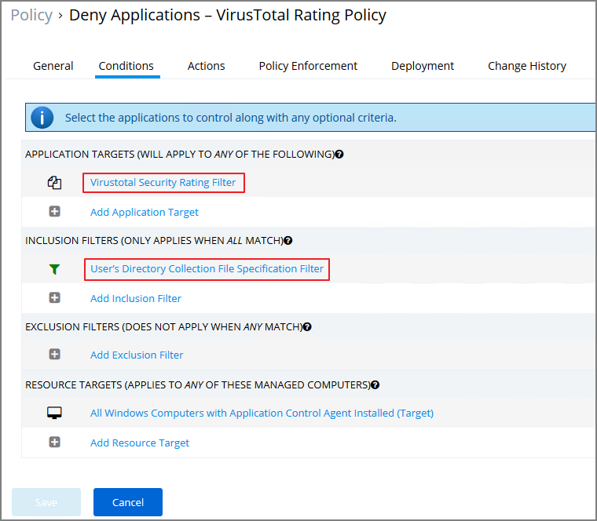

[title]: # (Set-up VirusTotal)
[tags]: # (integration)
[priority]: # (9105)
# Set-up VirusTotal Connection

Privilege Manager can perform real-time reputation checks for any unknown applications by integrating with analysis tools like VirusTotal. This article shows how to set up the integration between Privilege Manager and VirusTotal and then create a greylisting policy in Privilege Manager for reputation checking.

## VirusTotal API Key

As a first step the VirusTotal Ratings Provider has to be configured. For this,

1. Sign up for a Free VirusTotal account at https://www.virustotal.com/.
1. Sign in to VirusTotal and find your API key under your __Username | Settings | API Key__.  

## Install VirusTotal

As a second step VirusTotal needs to be installed in Privilege Manager. 

> **Note**: You need outbound access on your server for that installation.

1. Open a browser on your Privilege Manager Web Server.
1. Browse to https://YourInstanceName/TMS/Setup/.
1. On the Currently Installed Products screen, choose Install/Upgrade Products.
1. Check the Thycotic VirusTotal Reputation Connector, click __Install__. Then __Accept__ the End User License Agreement. You will see your Installation Progress.

   > **Note**: If the installation of VirusTotal initially fails, redirect to https://YourInstanceName/TMS/Setup/ and click the __Repair__ button next to the VirusTotal Product.

   

1. Navigate to __Thycotic Privilege Manager | Admin | Configuration | Reputation__ tab.
1. Select __VirusTotal Rating Provider__ from the Select Rating Provider drop down menu.

   
1. Click __Edit__ and enter the __VirusTotal API Key__, click Update.

   
1. Enter information under Details and specify settings for Suspect and Bad classifications.
1. Click __Save__.

>**Note**:
>VirusTotal can be used without API Key. If the free version is used, reputation checks are limited to 4 per Minute. Thycotic does not recommend this for a production environment.

For the implementation example below, we are creating two filters, using one default filter, and creating a policy. One filter is the standard Security Rating Filter the other filter controls, that we only send applications to VirusTotal for a reputation check that are in the user’s Downloads and Temp directories.

## Creating Security Rating Filter

Next you have to create a Security Rating Filter for VirusTotal. Follow these steps:

1. Navigate to __Home | Filters__, the click __Add Filter__.
1. Select a platform, then __Security Rating Filter__ as a Filter Type. Name the policy and add a description.
1. Next to Security Rating System, select __Application Control Rating System__.

   
1. Next to VirusTotal Rating System click __+__.
1. Click __Create__.

## Creating User's Downloads Location, Temp Dir, and Collection Filters

1. In the Privilege Manager Console search field, enter User’s Temp Directory File Specification Filter.

   
1. Select the filter __Users’ Temp Directory File Specifications Filter__, click __Create a Copy__.
1. Name the new filter _User's Download Directory File Specification Filter_, provide a description and click __Create__.
1. Click on __Edit__.
1. Change the regular expression in the Path filed to the following: (c:\\users\\[^\\]+\\downloads), save your changes.

   
1. Finally, combine the 2 filters into a single filter to target both directories:
   1. Click __Create a Copy__.
   1. Enter the name for the new filter _User’s Directory Collection File Specification Filter_, click __Create__.
   1. Click __Edit__.
   1. Clear the data in the Path field.
   1. Under Additional Filters, click the __Add__ button to the right of __File filters__.
   1. Type __User’s Download__ to search for the filter.
   1. Click __User’s Downloads Directory File Specification Filter__ from the list to add it.
   1. Type __User’s Temp Directory__ to search for the filter.
   1. Click __User’s Temp Directory File Specification Filter__ from the list to add it (this is a default filter).

      ]
   1. Click __Save__.

## Creating a Policy

Next you have to create a Policy and add the filters for VirusTotal:

1. Navigate to __Home | Policies__, then click on __Add New Policy__.
1. Select Windows as a Platform, __Show All Policies__ as a Policy Type, then __Other: Empty Policy__.
1. Name the policy __Allow Applications – VirusTotal Rating__, and add a description _Deny applications flagged by VirusTotal as bad_, click __Create__.

   
1. Click __Edit__.
1. Next, select the __Actions__ tab.
1. Select __Add Action__.
1. In the search field, type Application Denied, and locate the __Application Denied Message Action__.
1. Select the action and click __Add__.
1. On the Conditions tab, add the filters.
   1. Under __Application Targets__ add the _VirusTotal Security Rating Filter_.
   1. Under __Inclusion Filters__ add the _User’s Directory Collection File Specification Filter_.

      
1. Click __Save__.

If you want the policy to apply to specific users or endpoints, it can be adjusted by clicking on the Advanced Policy View in the policy’s General tab. Other edits can be done via the Conditions tab, to add Inclusion/Exclusion filters and Resource Targets.

>**Note**:
>This policy will send any application run from the user’s Downloads or Temp directory to VirusTotal for a reputation check in real-time. If the application is graded with Bad from VirusTotal, the application will be denied.

## Viewing a File Security Ratings Report

To view a File Security Ratings report, from the main page go to __REPORTS | File Security Rating Details Report__. To see details of the applications in the report, click on the file name in the File column.
