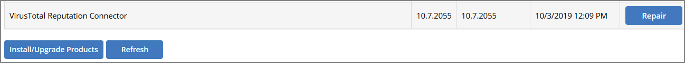
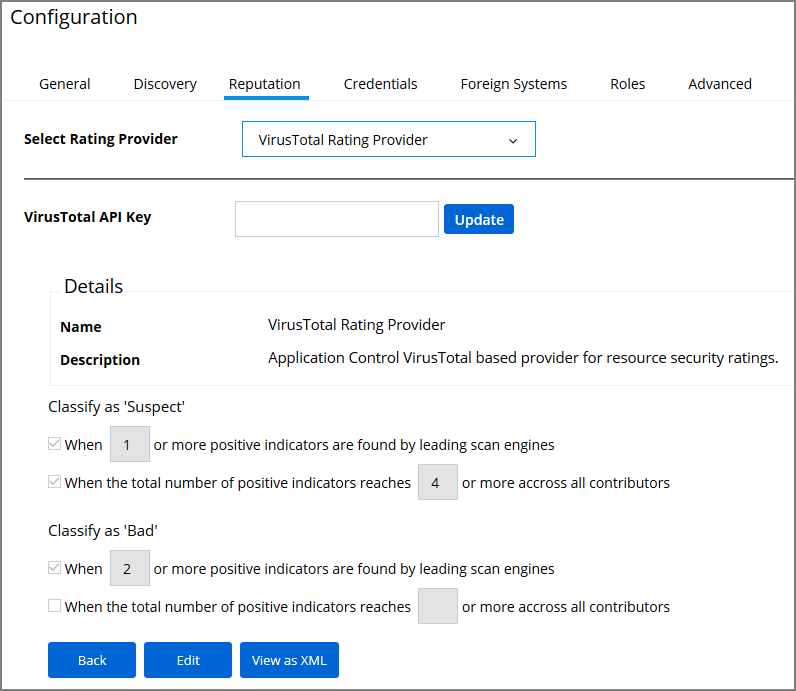
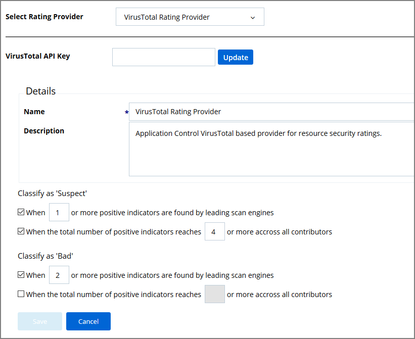

[title]: # (VirusTotal)
[tags]: # (integration)
[priority]: # (9105)
# Set-up VirusTotal Connection

Privilege Manager can perform real-time reputation checks for any unknown applications by integrating with analysis tools like VirusTotal. This article shows how to set up the integration between Privilege Manager and VirusTotal and then create a greylisting policy in Privilege Manager for reputation checking.

## VirusTotal API Key

As a first step the VirusTotal Ratings Provider has to be configured. For this,

1. Sign up for a Free VirusTotal account at https://www.virustotal.com/.
1. Sign in to VirusTotal and find your API key under your __Username | Settings | API Key__.  

## Install VirusTotal

As a second step VirusTotal needs to be installed in Privilege Manager. 

> **Note**: You need outbound access on your server for that installation.

1. Open a browser on your Privilege Manager Web Server.
1. Browse to https://YourInstanceName/TMS/Setup/.
1. On the Currently Installed Products screen, choose Install/Upgrade Products.
1. Check the Thycotic VirusTotal Reputation Connector, click __Install__. Then __Accept__ the End User License Agreement. You will see your Installation Progress.

   > **Note**: If the installation of VirusTotal initially fails, redirect to https://YourInstanceName/TMS/Setup/ and click the __Repair__ button next to the VirusTotal Product.

   

1. Navigate to __Thycotic Privilege Manager | Admin | Configuration | Reputation__ tab.
1. Select __VirusTotal Rating Provider__ from the Select Rating Provider drop down menu.

   
1. Click __Edit__ and enter the __VirusTotal API Key__, click Update.

   
1. Enter information under Details and specify settings for Suspect and Bad classifications.
1. Click __Save__.

>**Note**:
>VirusTotal can be used without API Key. If the free version is used, reputation checks are limited to 4 per Minute. Thycotic does not recommend this for a production environment.

For the implementation example below, we are creating two filters, using one default filter, and creating a policy. One filter is the standard Security Rating Filter the other filter controls, that we only send applications to VirusTotal for a reputation check that are in the user’s Downloads and Temp directories.

Further details about creating a Security Rating Filter and other needed filters to work with reputation checking policies refer to the [Reputation Checking](../../app-control/policies/examples/monitor/reputation.md) topic.
