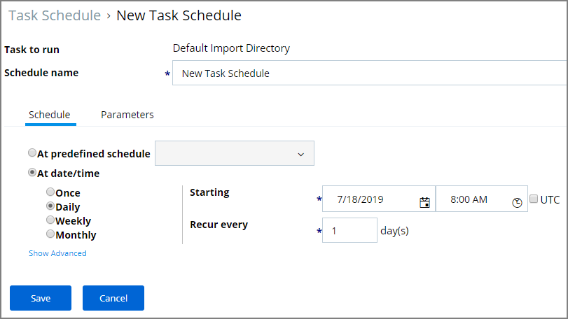

[title]: # (Active Directory Synchronization)
[tags]: # (setup)
[priority]: # (304)
# Active Directory Synchronization

The following procedures show the steps necessary to set-up Active Directory synchronization in Privilege Manager.

If you already configured the AD Default User Credential skip to the Foreign Systems set-up procedure.

## Set-up AD Default User Credential

1. Select **Admin | Configuration**.
1. Select the **User Credentials** tab.
1. Edit the Default User Credential or use Add New to create a new user. Set a domain credential with an Account Name and Password that has Administrative access of the Active Directory domain(s).

   
1. Click **Save** and continue with step 2 in the Foreign Systems set-up procedure.

## Setup Foreign Systems

1. Select **Admin | Configuration**.
2. Select the **Foreign Systems** tab.
3. Select Active Directory Domains.

   
4. Select the **Add New** button at the top.
5. Enter a fully qualified domain name and a friendly name. Click the **Create** button.

   
6. Select the newly created Active Directory Domain entry.
7. On the General tab click **Edit**.

   
8. Verify the **URL** is correct.

  
9. Type the name of the user credential to access the domain in the **Credential** field. If the domain uses LDAPS, select the checkbox to enable.
10. Click **Save**.
11. Once Active Directory is configured a Directory Synchronization task needs to run to import the appropriate data. Select the **Synchronization** tab.
12. From the drop-down select the task you want to perform:
    * Default Import Directory
    * Default Import Directory Computers
    * Default Import Directory Sites
13. Click **Synchronize Active Directory** for each task you select.

>**Note**:
>This is a one-time manually triggered synchronization task only.

These tasks can be scheduled and synchronization can be coordinated through one or multiple tasks as needed by each specific environment. As an example, one task may synchronize users once a week, another task could synchronize computers daily, and perhaps a third could synchronize a specific LDAP query for a specific group from Active Directory.

## Setting up Scheduled Synchronization Task

1. Select **Admin | More**.
1. Select the **Tasks** link.
1. Navigate the Jobs and Tasks tree and open **Server Tasks | Directory Services**.
1. Use the following three templates to run a task on demand and to customize schedules based on your company needs:
   * Default Import Directory
   * Default Import Directory Computers
   * Default Import Directory Sites

     
1. Click **View** on the template task.
1. Click **Create a Copy** and give it a name, click **Create**.
1. Click **Edit** on the newly created task.
   * On the **General** tab, you can change the task name and customize the Description.
   * On the **Parameters** tab,
     1. Click **Select Resource** to specify the Directory Id and Directory partner ID.
     1. You may provide a Full sync Query and specify Search Configuration.
   * On the **Schedules** tab,
     1. Click New Schedule to set-up a customized synchronization schedule.

        
   * Click **Save**.
1. You may manually run the task now or wait for the schedule to kick in.

## Viewing Imported Users and Groups

You may verify and browse the users and groups that are expected to be imported from Active Directory.

1. In Privilege Manager, navigate to **Admin | Resources**.
2. Expand **Organizational Views**.
3. Expand **Default**.
4. Expand **All Resources**.
5. Expand **Security Principal**.
6. Select **Domain Users**. You should see a list that contains imported Active Directory users.
7. Select **User Group**. You should see a list that contains imported Active Directory groups (other groups may exist in the list as well).
