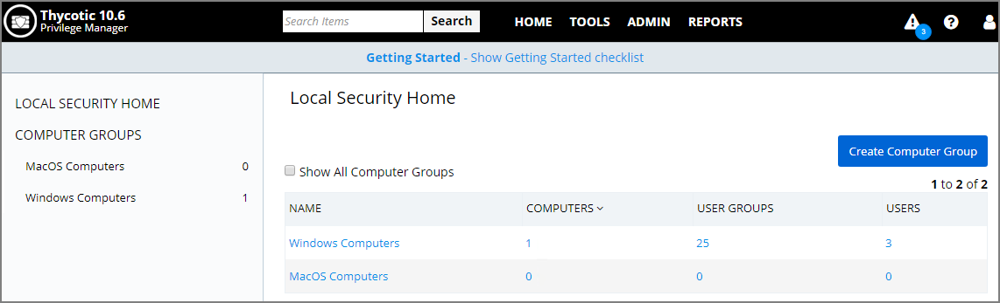

[title]: # (Local Security)
[tags]: # (Local Security,overview)
[priority]: # (300)
# Local Security Overview

Local Security in Privilege Manager allows customers to

* discover all local accounts and groups that exist on endpoints.
* provide membership control of those accounts on endpoints.
* allows to take complete ownership of the local credentials by enforcing password rotation for all accounts on those endpoints.
* use best practices when it comes to locking down the network from malicious endpoint attacks that exploit unsecured administrative access.

Local Security is made up of

* Computer Groups
* Local Groups
* Local Users

## Computer Groups

These so called resource targets (as configured in Application Control) are specified sets of computers that meet certain criteria, that are targeted by certain policies and scheduled tasks.

Each computer group contains all local groups and local users on endpoints with a local security agent installed. When the agent registers, Local Security automatically discovers the local groups that exist on each machine.

## Local Groups

Each local group has a list of local users that exist in that specific local group. From that list you can see

* how many groups each user account is a member of.
* whether the user account is built-in or user-defined.
* whether or not the account itself is managed.

## Local Users

Setting up a local user account with password rotation means that the account is a managed account within Privilege Manager.

## Local Security Home screen

From Privilege Manager’s Home page, click the left-hand section called Local Security to enter the Local Security Home.
From Local Security’s navigation panel you can click into existing Computer Groups to view all local groups and user accounts across these endpoint. The Local Security Home dashboard will give you a bird’s eye view of the Computer Groups that already exist in your system.

