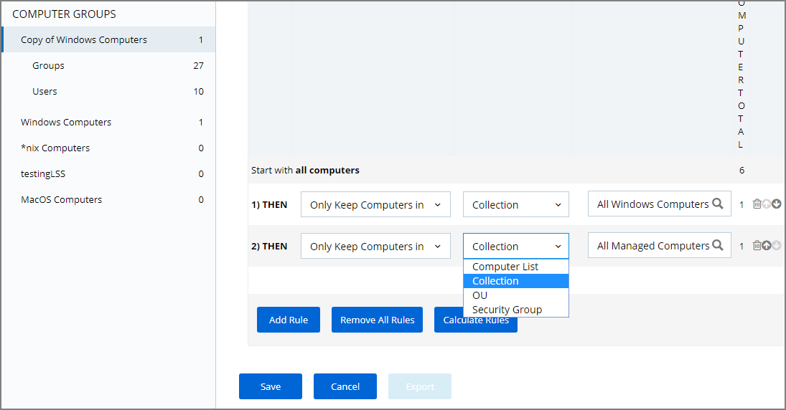
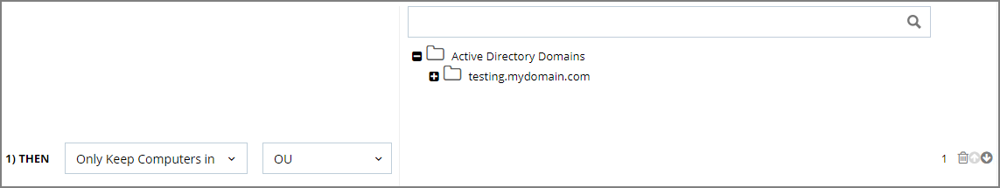

[title]: # (Computer Groups)
[tags]: # (Local Security,Computer Groups)
[priority]: # (3001)
# Computer Groups

If you have agents already installed and registered, you will see numbers automatically listed in Local Security Home, divided by Privilege Manager’s two out-of-the-box computer groups that are listed as:

* Windows Computers and
* MacOS Computers

For example, in the screenshot above only one agent is registered with Privilege Manager. Local Security tells us that the agent is installed on a Windows computer (thus categorized in the Windows Computers group), that there are 25 local User Groups, and 3 local Users on the machine. Local Security automatically discovers this information upon every agent’s registration with Privilege Manager.

If you have Computer Groups (also called Resource Targets) already configured for Application Control in Privilege Manager, keep in mind that those groups can also appear as Computer Groups in your Local Security navigation pane after selecting the “Show All Computer Groups” check box. Select the first column of any row to use the target endpoints as a Computer Group and display it in the left navigation panel.

## Create New Computer Group

To add new computer groups tailored to your organization’s environment, click the Create Computer Group button from the Local Security Home screen. Enter a Name for your new group, a Description, and from the drop-down list select the Operating System (Windows vs macOS) used by these computers.

To select the machines you want to include within this group, you must create a Filter that will target the appropriate machines on your organization’s network.

The default filter will begin with a rule that targets computers within the main OS Computer Group that was selected when you created the group, meaning it will target either all Windows or all Mac computers with registered agents.

To narrow your group, click __Add Rule__ then in the List Type column select from the following options:

* Computer List
* Collection
* OU (Organizational Unit)
* Security Group

Multiple rules can be added per computer group. To change already established Computer Groups use the Edit button to add more rules or change the resources targeted.

### Computer List

Click any specific computers from the provided list of registered machines, then click Save. You may collapse the computer list view by clicking the button that says Select Computers under the Selected Items column.

### Collection

Enter a collection name, for examples collections can be "All Windows Computers" or "All Managed Computers".

### OU (Organization Unit)

Select the OU from the populated domain tree.

### Security Group

Search for and select a security group filter.
