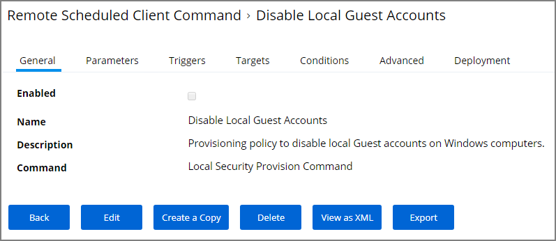
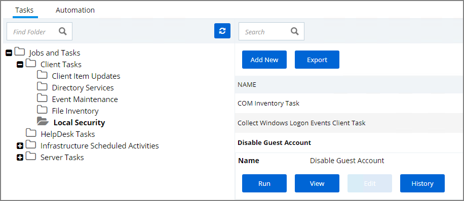

[title]: # (Disable Local Guest Account)
[tags]: # (local security)
[priority]: # (3004)
# Disable Local Guest Accounts

To disable the guest account on computers that have the Local Security Agent installed, enable the __Disable Local Guest Accounts__ remote scheduled client command. This is an out-of-the-box policy; you do not need to make any configuration changes to this policy.

To enable the policy:

1. Navigate to __ADMIN | Policies__ and select the __General__ tab.
1. Type Disable into the name column filter and select __Disable Local Guest Accounts__ from the list.

   
1. Click __Edit__.
1. Select the __Enabled__ checkbox.
1. Click __Save__.

If you wish to customize any aspects of the default behavior, create a copy and edit the copied policy.

The Disable Local Guest Accounts policy uses the Local Security task Disable Guest Accounts. If you wish to run the task on demand follow these steps:

1. Navigate to __ADMIN | More...__ and select __Tasks__.
1. On the Tasks tab open the folder tree to __Client Tasks | Local Security__.
1. Select the __Disable Guest Account__ task.

   
1. Click __Run__.
