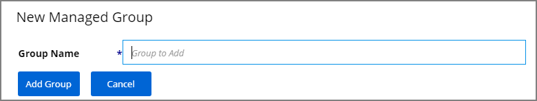
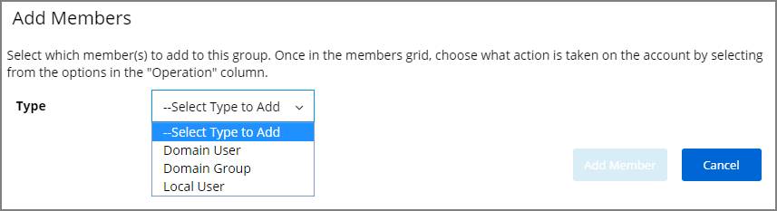
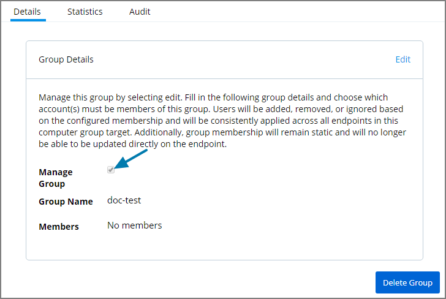
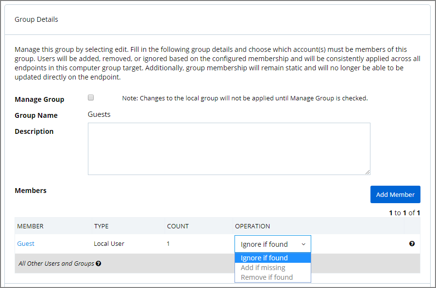
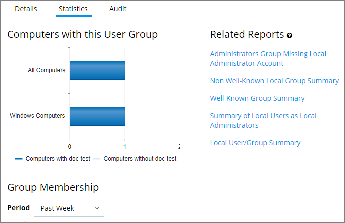

[title]: # (Local Groups)
[tags]: # (Local Security,Groups)
[priority]: # (3002)
# Local Groups

Every Computer Group is divided into Groups and Users. Both **Groups** and **Users** in this context refer to local accounts on the machines that are included in the Computer Group.

To see more details about the Windows Computers Group, either click on Windows Computers in the Local Security Home screen or in the left-hand navigation pane.

The Computer Group page gives you pointers on what can be done with the users and local groups within this set of computers, and provide a high-level overview of the selected computer group based on Local Users, Local Groups, and the number of computers in the group.

Remember: when an agent registers, Local Security will automatically discover the local groups that exist on each machine.

## Create New Local Group

To create a new Group, select the Groups line item listed under the name of the intended Computer Group. At the right side of the page, click the Create Group button.

Enter a Group Name, click __Add Group__.

The new group page opens on the Details tab. Here you can add a description and use Add Members to this group.

You can add members to the group by clicking the Add Member button. Choose the type to add from the drop-down (Domain User, Domain Group, Local User) and then select the available options from the local user account list or search for a Domain User Name or Domain Group Name. To finish click Add Member, then Save Changes.

## Manage Local Groups
Managing a local group means that you determine which accounts are in that group from the Local Security dashboard. In other words, if a group is being managed, the group membership will remain static and will no longer be able to be updated directly on the endpoint.

If a local group is not managed the Manage Group checkbox is not selected. To Manage the group, click Edit from the Details tab and then check the Manage Group box. Click Save Changes, and Yes to Confirm Navigation. Changes to these settings may take up to 15 minutes to update on your endpoints.

When managing a group, existing members and any that have been added to the policy will appear in the Members table. From the drop-down choose which operation to perform if an account (user) is found on the endpoint. The following options can be selected:

* Ignore if found
* Add if missing
* Remove if found

The last row defines what action to take on all other users and groups. This ensures exact membership can be defined and any other users or groups can be automatically removed.

Using __Remove if found__ for __All Other Users and Groups__ instates exact group membership and __Ignore if found__ cannot be used on individual accounts that are part of that group. If exact group membership is used, an account that is initially listed as __Ignore if found__ switches to __Remove if found__ as part of the group membership. Individually specified accounts can be set to Add if missing in those groups.  

>**Note**: Once saved, group membership is permanently defined. Updates made directly on the endpoint that break this policy will be immediately reverted.

The __Statistics tab__ for a local group highlights some quick visual statistics and links you to relevant reports based on key factors like how many computers from your network are included in this group and whether there have been changes made to the Group’s Membership within the specified period. Click on these graphs to drill down into more details.

>**Note**: The reports in the “Related Reports” sections are scoped to only include endpoints in the current computer group. To view reports across all computers, go to the Reports section of the product.

The __Audit tab__ is where you will find an audit record of all membership additions and deletions that have been made to your local groups.
