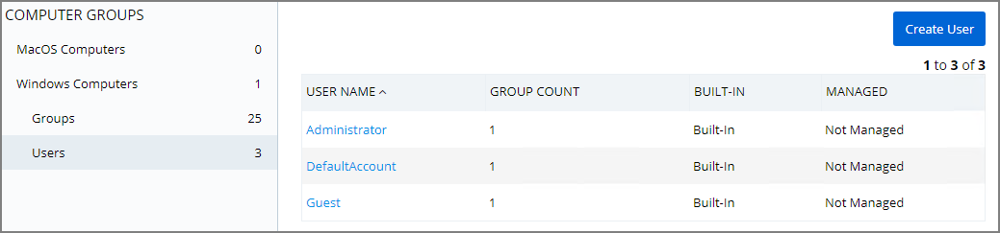
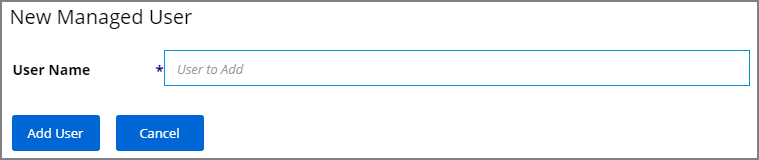
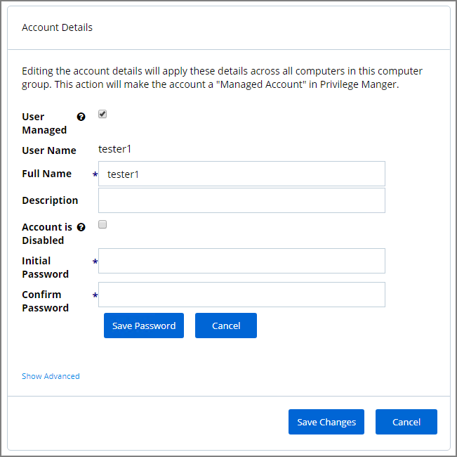
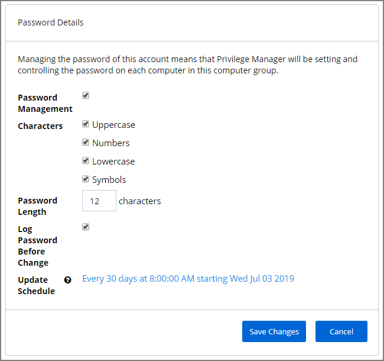

[title]: # (Local Users)
[tags]: # (Local Security,Users)
[priority]: # (3003)
# Local Users

The Users page listed under your Computer Group shows a list of local users that exist within this Computer Group. The information highlighted by this table includes

1. how many groups each user account is a member of,
1. whether the user account was built-in or user-defined, and
1. whether or not the account itself is managed.  

Managing local users in Local Security means that you are setting a password for the account and can rotate the password as desired.

## Create New Local User

To create a new local user, click the Create User button on the Users page, then give your user a name. Click Add User. This will take you to the Details tab for your new user account. To create a user through Local Security, it must be a managed user.

In Local Security, the most important thing to know about your user accounts is whether or not each is being managed. Managing a local user account means that you are able to rotate the account's password from Local Security's console in Privilege Manager.

## Manage Local Users

To begin managing a user, select Edit in the Account Details box under the Details tab.
Click the box next to User Managed to begin. While editing a user you can change the account User Name, add details like the full name of the user or details, you may disable the account or update the schedule that pushes out modifications to endpoints.

The most important part of managing a user is setting a one-time password for the account. This will mean that any user of this account will no longer be able to access this account with their former password, effectively locking a user out of the account unless they contact the Privilege Manager Local Security Helpdesk.

To set a password for this account, enter a new password twice to confirm, then click Save Password. For advanced options, click Show Advanced. To save your changes click Save Changes.

>**Note**:
>The following settings are all specific to Windows endpoints and will not be displayed for macOS based Computer Groups:
>
>* Account is Disabled
>* User Must Change Password At Next Logon
>* User Cannot Change Password
>* Password Never Expires

## Randomize Local Account Passwords

The second box under the User Details tab is called __Password Details__. This option is generally used for privileged accounts that you want fully managed by Privilege Manager. To manage your password this way, select Edit in the Password Details box, then check the Password Management box and edit password length and strength rules. The password on this account will be rotated based on the Update Schedule details (click on the details in blue to edit). Save Changes when complete. The password for the account on each endpoint in the Computer Group will be unique.

If the password is being managed, the Update Schedule will determine when the new password will be applied. Note, the Account Details of the user do NOT need to be managed in order to manage the password on a local account.

The __Groups tab__ for a Local Account tells you how many groups and computers the account is on. Clicking on a Group Name from this page will direct you back to the Details tab for that local group.

The __Statistics tab__ for a local user account highlights some quick visual statistics and links you to relevant reports based on key factors like how many computers from your network have this user account and whether there have been changes made to the User’s Membership within the specified period. Click on the graphs to drill down into more details.
