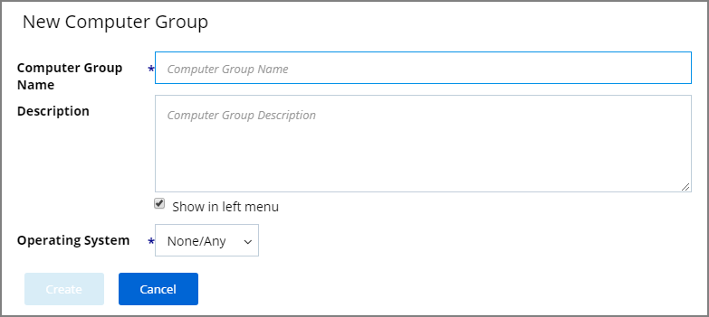
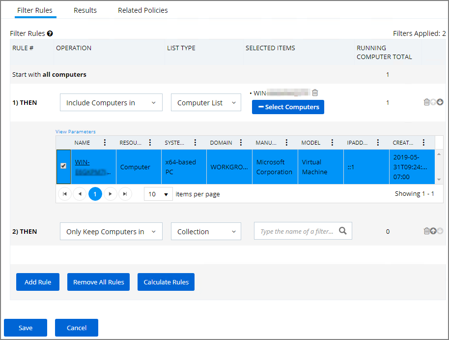

[title]: # (Setting Up Local Security)
[tags]: # (create, manage)
[priority]: # (304)
# Setting Up Local Security

From Privilege Manager’s Home screen, click Local Security to enter the Local Security page. From Local Security’s navigation panel you can click into existing Computer Groups to view all local groups and user accounts across these endpoint. The Local Security Home dashboard will give you a bird’s eye view of the Computer Groups that already exist in your system.

## Computer Groups

If you have agents already installed and registered, you will see numbers automatically listed in Local Security Home, divided by Privilege Manager’s two out-of-the-box computer groups that are listed as:

* Windows Computers and
* MacOS Computers

For example, in the screenshot above only one agent is registered with Privilege Manager. Local Security tells us that the agent is installed on a Windows computer (thus categorized in the Windows Computers group), that there are 25 local User Groups, and 3 local Users on the machine. Local Security automatically discovers this information upon every agent’s registration with Privilege Manager.

If you have “Computer Groups” (also called Resource Targets) already configured for Application Control in Privilege Manager, keep in mind that those groups can also appear as Computer Groups in your Local Security navigation pane after selecting the “Show All Computer Groups” check box. Select the first column of any row to use the target endpoints as a Computer Group and display it in the left navigation panel.

### Create New Computer Group

To add new computer groups tailored to your organization’s environment, click the Create Computer Group button from the Local Security Home screen. Enter a Name for your new group, a Description, and from the drop-down list select the Operating System (Windows vs macOS) used by these computers.

To select the machines you want to include within this group, you must create a Filter that will target the appropriate machines on your organization’s network.

The default filter will begin with a rule that targets computers within the main OS Computer Group that was selected when you created the group, meaning it will target either all Windows or all Mac computers with registered agents.

To narrow your group, click Add Rule then in the “List Type” column select Computer List. Click any specific computers from the provided list of registered machines, then click Save. You may collapse the computer list view by clicking the button that says Select Computers under the Selected Items column.

## Local Groups

Every Computer Group is divided into Groups and Users. Both “Groups” and “Users” in this context refer to local accounts on the machines that are included in the Computer Group.

To see more details about the Windows Computers Group, either click on Windows Computers in the Local Security Home screen or in the left-hand navigation pane.

The Computer Group’s page gives you pointers on what can be done with the users and local groups within this set of computers, and provide a high-level overview of the selected computer group based on Local Users, Local Groups, and the number of computers in the group.

Remember: when an agent registers, Local Security will automatically discover the local groups that exist on each machine.

### Create New Local Group

To create a new Group, select the Groups line item listed under the name of the intended Computer Group. At the right side of the page, click the Create Group button.

Enter a Group Name, click __Add Group__.

The new group page opens on the Details tab. Here you can add a description and use Add Members to this group.

You can add members to the group by clicking the Add Member button. Choose the type to add from the drop-down (Domain User, Domain Group, Local User) and then select the available options from the local user account list or search for a Domain User Name or Domain Group Name. To finish click Add Member, then Save Changes.

### Manage Local Groups
Managing a local group means that you determine which accounts are in that group from the Local Security dashboard. In other words, if a group is being “managed,” the group membership will remain static and will no longer be able to be updated directly on the endpoint.

If a local group is not managed the Manage Group checkbox is not selected. To Manage the group, click Edit from the Details tab and then check the Manage Group box. Click Save Changes, and Yes to Confirm Navigation. Changes to these settings may take up to 15 minutes to update on your endpoints.

When managing a group, existing members and any that have been added to the policy will appear in the Members table. From the drop-down choose which operation to perform if an account (user) is found on the endpoint. The following options can be selected:

* Ignore if found
* Add if missing
* Remove if found

The last row defines what action to take on all other users and groups. This ensures exact membership can be defined and any other users or groups can be automatically removed.

Using __Remove if found__ for __All Other Users and Groups__ instates exact group membership and __Ignore if found__ cannot be used on individual accounts that are part of that group. If exact group membership is used, an account that is initially listed as __Ignore if found__ switches to __Remove if found__ as part of the group membership. Individually specified accounts can be set to Add if missing in those groups.  

>**Note**: Once saved, group membership is permanently defined. Updates made directly on the endpoint that break this policy will be immediately reverted.

The __Statistics’ tab__ for a local group highlights some quick visual statistics and links you to relevant reports based on key factors like how many computers from your network are included in this group and whether there have been changes made to the Group’s Membership within the specified period. Click on these graphs to drill down into more details.

>**Note**: The reports in the “Related Reports” sections are scoped to only include endpoints in the current computer group. To view reports across all computers, go to the Reports section of the product.

The __Audit tab__ is where you will find an audit record of all membership additions and deletions that have been made to your local groups.

## Local Users

The Users’ page listed under your Computer Group shows a list of local users that exist within this Computer Group. The information highlighted by this table includes 

1. how many groups each user account is a member of, 
1. whether the user account was built-in or user-defined, and
1. whether or not the account itself is “Managed.”  

Managing local users in Local Security means that you are setting a password for the account and can rotate the password as desired.

### Create New Local User

To create a new local user, click the Create User button on the Users page, then give your user a name. Click Add User. This will take you to the Details tab for your new user account. To create a user through Local Security, it must be a managed user.

In Local Security, the most important thing to know about your user accounts is whether or not each is being managed. Managing a local user account means that you are able to rotate the account’s password from Local Security’s console in Privilege Manager.

### Manage Local Users

To begin managing a user, select Edit in the Account Details box under the Details tab.
Click the box next to User Managed to begin. While editing a user you can change the account User Name, add details like the full name of the user or details, you may disable the account or update the schedule that pushes out modifications to endpoints.

The most important part of managing a user is setting a one-time password for the account. This will mean that any user of this account will no longer be able to access this account with their former password, effectively locking a user out of the account unless they contact the Privilege Manager Local Security Helpdesk.

To set a password for this account, enter a new password twice to confirm, then click Save Password. For advanced options, click Show Advanced. To save your changes click Save Changes.

>**Note**: 
>The following settings are all specific to Windows endpoints and will not be displayed for macOS based Computer Groups:
>
>* Account is Disabled
>* User Must Change Password At Next Logon
>* User Cannot Change Password
>* Password Never Expires

### Randomize Local Account Passwords

The second box under the User Details tab is called __Password Details__. This option is generally used for privileged accounts that you want fully managed by Privilege Manager. To manage your password this way, select Edit in the Password Details box, then check the Password Management box and edit password length and strength rules. The password on this account will be rotated based on the Update Schedule details (click on the details in blue to edit). Save Changes when complete. The password for the account on each endpoint in the Computer Group will be unique.

If the password is being managed, the Update Schedule will determine when the new password will be applied. Note, the Account Details of the user do NOT need to be managed in order to manage the password on a local account.

The __Groups tab__ for a Local Account tells you how many groups and computers the account is on. Clicking on a Group Name from this page will direct you back to the Details tab for that local group.

The __Statistics’ tab__ for a local user account highlights some quick visual statistics and links you to relevant reports based on key factors like how many computers from your network have this user account and whether there have been changes made to the User’s Membership within the specified period. Click on these graphs to drill down into more details.
