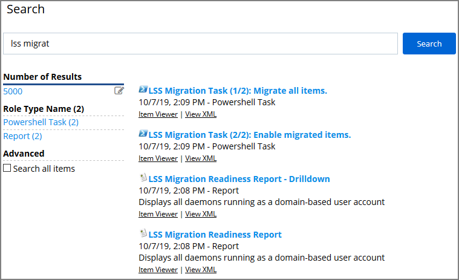
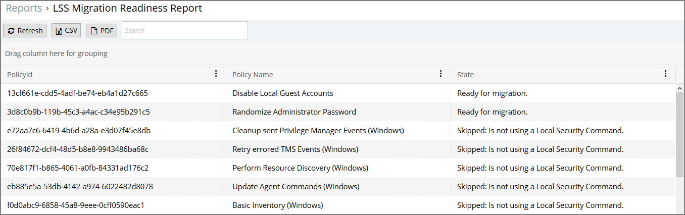
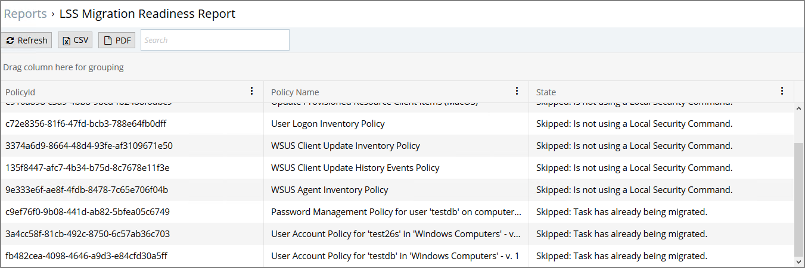
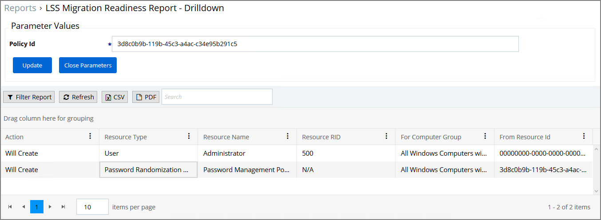
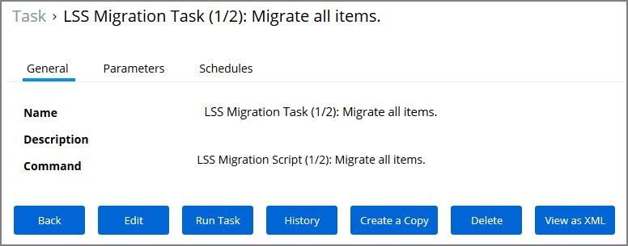
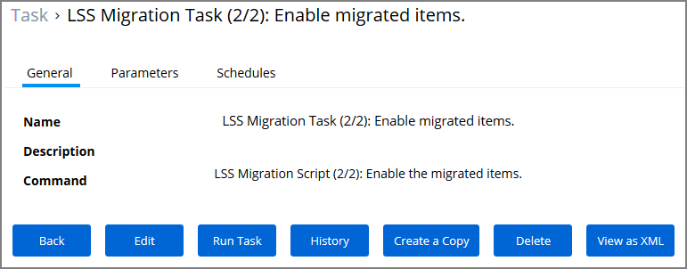

[title]: # (Migrate LSS Policies)
[tags]: # (silverlight end-of-life)
[priority]: # (3010)
# Migrate Local Security Policies

The migration path to the latest Local Security implementation provides an analysis report of issues like missing account credentials, or accounts that are not unique across targets, which can then be remediated before the migration.

>**Note**:
>Thycotic recommends to use a Professional Services engagement when migrating local security to Privilege Manager 10.7 or newer.

Before any migration is performed, make sure to backup your Privilege Manager database.

## Migration Steps

Starting with Privilege Manager 10.7 the LLS Migration Readiness Report is available. The report is generated after an upgrade to 10.7 or higher from any previous Privilege Manager version.

To access the LSS Migration Readiness Report, follow these steps:

1. From anywhere in the Privilege Manager console search for LSS Migration.

   

   The search does show all LSS Migration labeled results found in Privilege Manager. As the image shows, there are two related reports and tasks.
1. Select __LSS Migration Readiness Report__.
1. The report shows a table containing Policy IDs, their Name, and the current migration status.

   

   

   The migration state can be:

   * Ready for migration.
   * Skipped: Is not using a Local Security Command.
   * Skipped: Task has already been migrated.

1. To learn more about items that are listed as _Ready for migration_ click on the item in the table. This opens up the __LSS Migration Readiness Report - Drilldown__ report.

   

   The drilldown report shows the Action to be performed for that particular item during the migration.

   For example: The data shown in the image above indicates that two items will be created in Privilege Manager's Local Security. One item is a _User_ the other a _Password Randomization_ entry. For the user the item is created with __Resource Name__ of _Administrator_ and the __Resource RID__ will be _500_. It further shows that the action will be done __For Computer Group__ and __From ResourceID__ as indicated.

   During the report creating, Privilege Manager will find and resolve conflicts that might be caused by many policies targeting the same computer group with the same user/group, or multiple password rotation policies for the same user. The LSS migration script resolves these conflicts in a way that respects the logic of the initial policy set-up, and comply with the new model for the data.
1. If there aren't any conflicts and all items found can be migrated, use the LSS Migration tasks to migrate and then enable to items pertaining to Local Security. This is a two step process, first migrate then enable.

   1. Search for LSS Migration Task (1/2): Migrate all items.

      

   1. After all items are migrated, run the LSS Migration Task (2/2): Enable migrated items.

      

   Either of these tasks can be edited, to have parameters or schedules defined.
