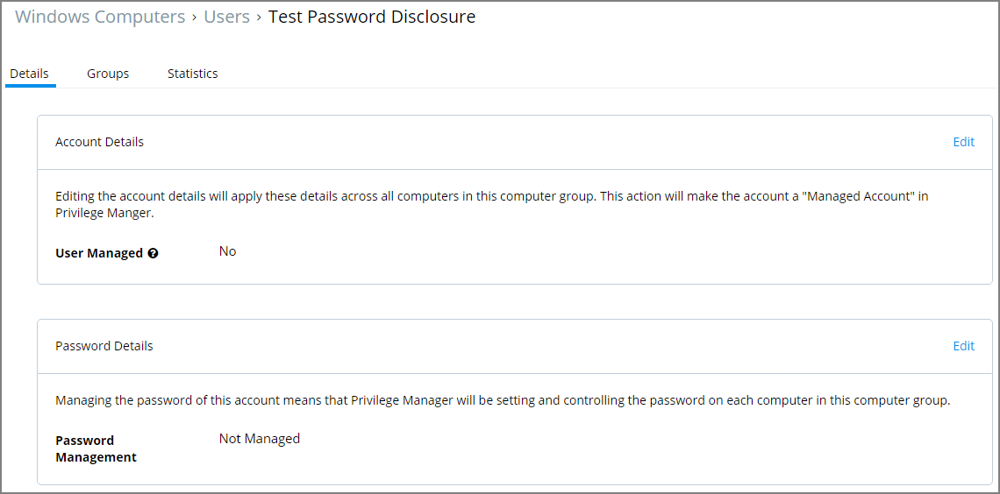
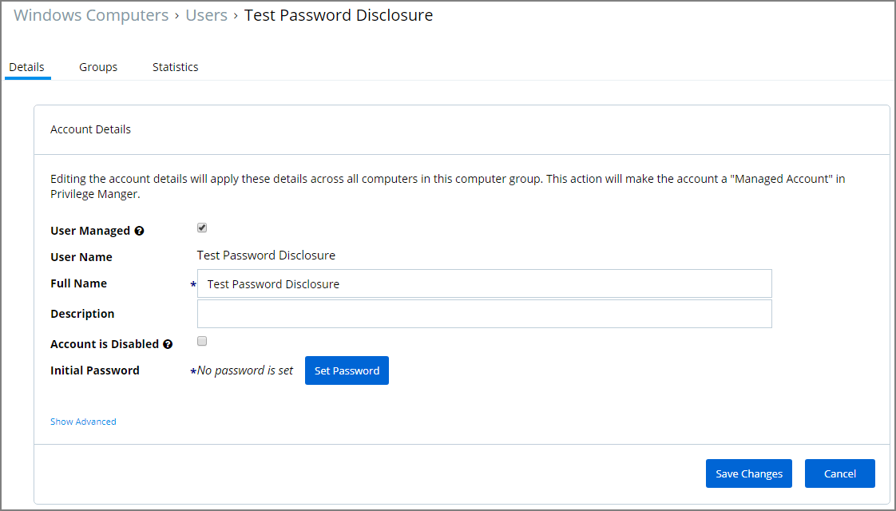
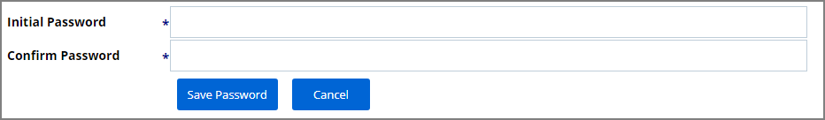
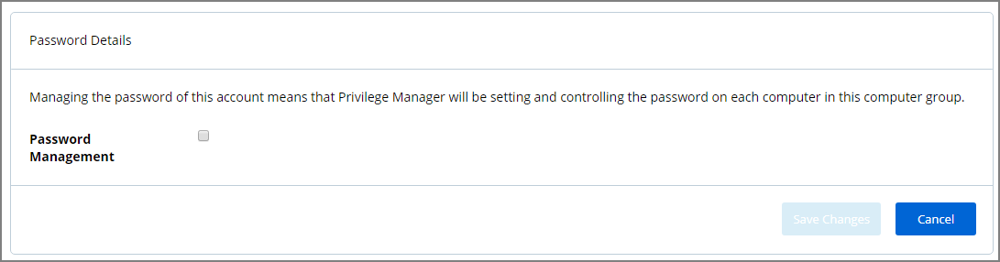
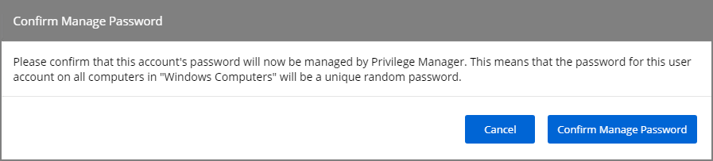
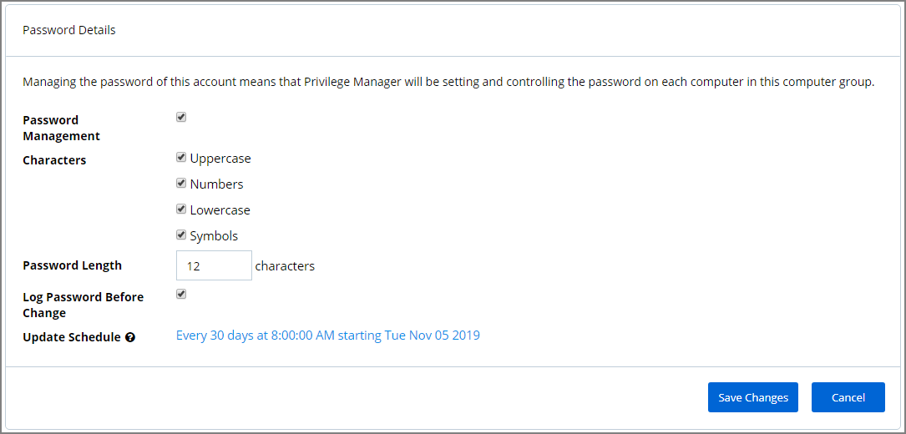
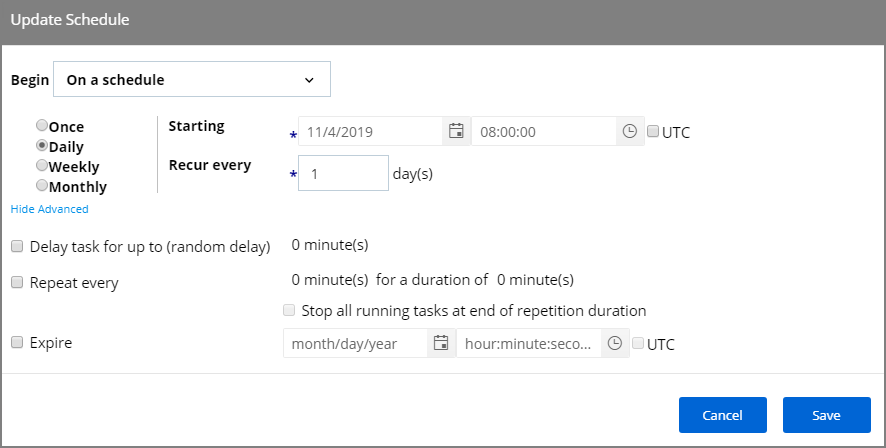
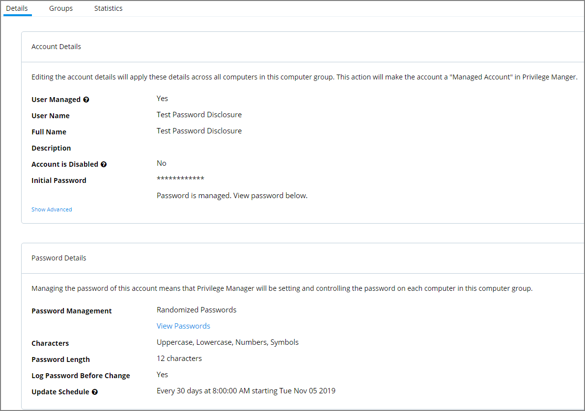

[title]: # (Password Management)
[tags]: # (managed users)
[priority]: # (3004)
# Password Management

Local Security allows administrators to manage users and also to manage passwords and password rotation. Managing users, passwords, and rotation scheduled often go hand-in-hand, but not every managed user account also requires password rotation. For example, service accounts are managed, but usually do not have password rotation setup.

Password rotation can also be setup for existing users without having to provision user accounts. The documentation procedure guides you through

* provisioning a local user account to be managed and
* randomizing local user account passwords (password rotation).

Not all steps are required if you just wish to provision a managed account or you already have provisioned users and wish to enable password rotation only.

>**Note**: Password rotation is an option that is not required for all accounts, especially not for service accounts.

1. Navigate to __HOME | Local Security__.
1. From the left navigation frame select __Windows Computers__.
1. Select __Users__.
1. Click __Create User__.
1. Enter a __User Name__ and click __Add User__.

   
1. For Account Details click __Edit__.
1. Select the __User Managed__ checkbox to set the user to be managed.

   
1. Verify information populated in the User Name and Full Name text fields.
1. Click the __Set Password__ button to setup the initial password.

   
1. Enter the __Initial Password__.
1. Confirm the Password.
1. Click __Save Password__.
1. Click __Save Changes__.
1. For Password Details click __Edit__.

   
1. Select the checkbox for Password Management.

   
1. Confirm that you want to enable password management for the user.

   
1. Specify the details for the password management and/or establish a password rotation schedule.

   
1. Click Save Changes.

The managed user and password management is now setup.

## Reports Relating to Managed Accounts

* __All Computers with Managed Passwords__: Lists all computers that have at least one local user with a managed password.
* __Password Disclosure History__: Lists all local and provisioned user's passwords that have been disclosed in a given time frame.
* __Disclosure Summary (Local User)__: List all local users whose managed password has been disclosed in the given timeframe.
