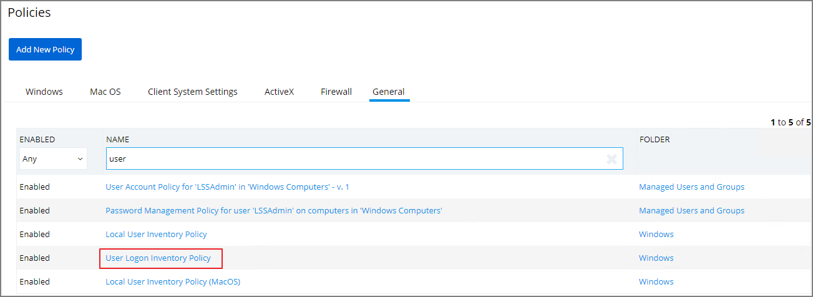
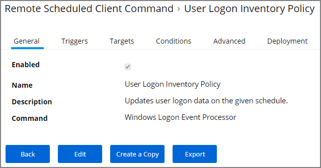
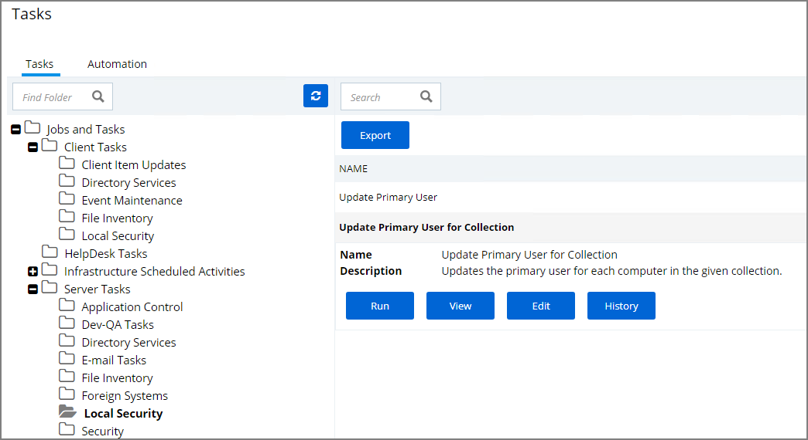
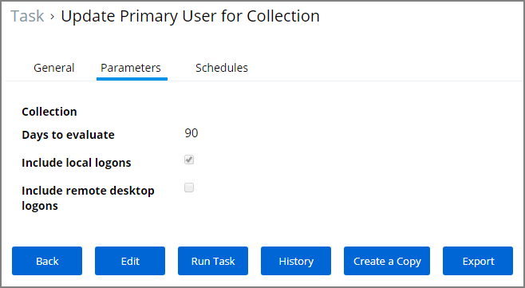
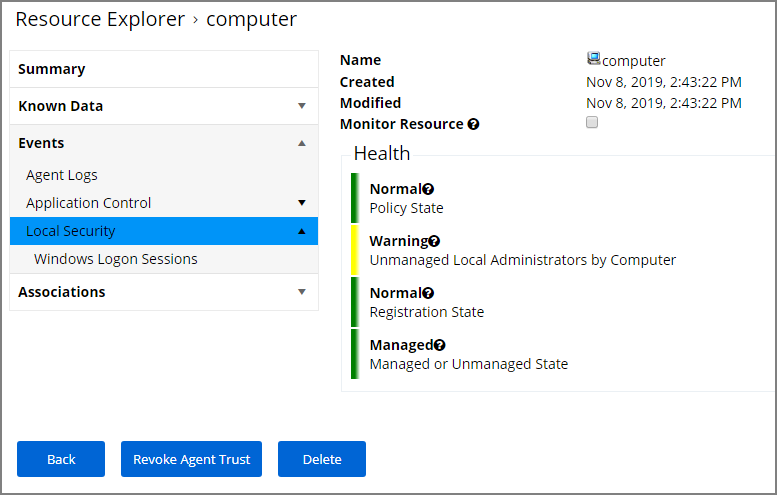
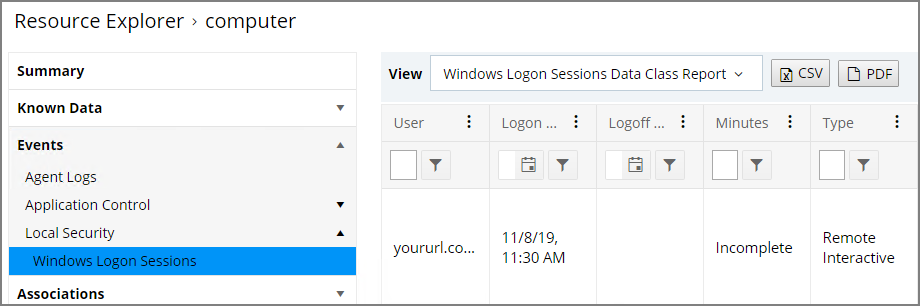

[title]: # (Logon User Tracking)
[tags]: # (local security)
[priority]: # (3004)
# Logon User Tracking

The Thycotic Local Security Agent collects logon and logoff events from Windows on a schedule configured via the User Logon Inventory policy. The Agent collects logon and logoff events and reports them as inventory data. The __Update Primary User for Collection__ task calculates the primary user and the primary user and associated inventory data can then be viewed in the Resource Explorer.

The User Logon Inventory Policy is by default enabled.

If you wish to customize the schedule or any other policy specification, create a copy of the default policy and edit the settings.

The default update primary user for collection task calculates the primary user on a schedule from inventory data.

1. Navigate to __ADMIN | More...__ and select __Tasks__.
1. In the folder tree open Server Tasks | Local Security and search for __Update Primary User for Collection__.

   
1. Customize the settings and schedule by editing the task.
1. Click __Save__.

You can run the __Update Primary User for Collection__ task at any time to immediately recalculate the primary user for all computers in the selected collection.

## Viewing the Resource

The Windows Logon Session events can be viewed by opening the Local User/Group Summary report and selecting a computer resource from the list.

Selecting Events | Local Security | Windows Logon Sessions.

