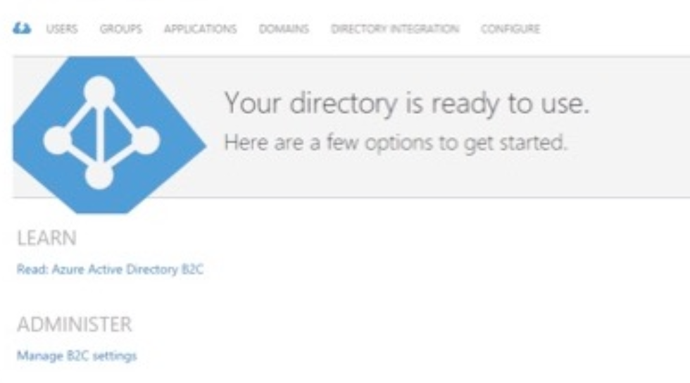
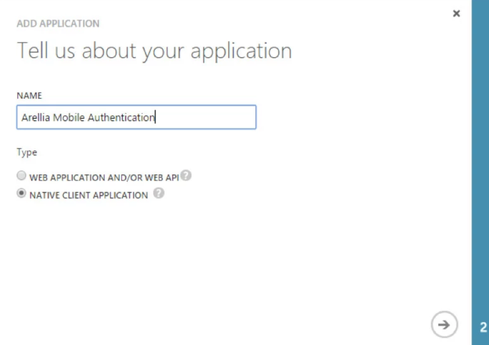

[title]: # (Configure Microsoft Azure)
[tags]: # (mobile)
[priority]: # (15002)
# Configure the Microsoft Azure Active Directory

As a prerequisite for running the Privilege Manager Mobile Console, you must configure the Microsoft Azure Active Directory by doing the following steps:

1. Open the Azure Management Console.
1. Navigate to your Active Directory instance.

   
1. Click the __Applications__ tab.
1. Click __Add__ at the bottom.
1. Name the Application “__Privilege Manager Mobile Authentication__.”
1. Choose the __Native Client Application__ option.

   
1. Set the Redirect URI to `http://PrivilegeManagerMobileClient`.
1. After you create the Application, click the __Configuration__ tab.
1. Make note of the __Client ID__.

To see the next set of steps needed to use the Mobile Console, go to [Configure the mobile console on the Thycotic Management Server](cfg-console.md)

