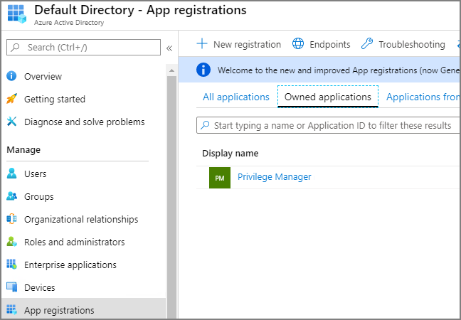
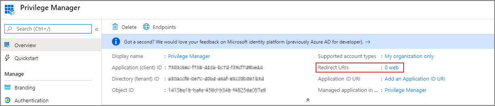
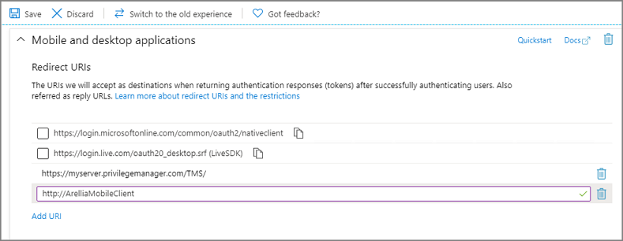
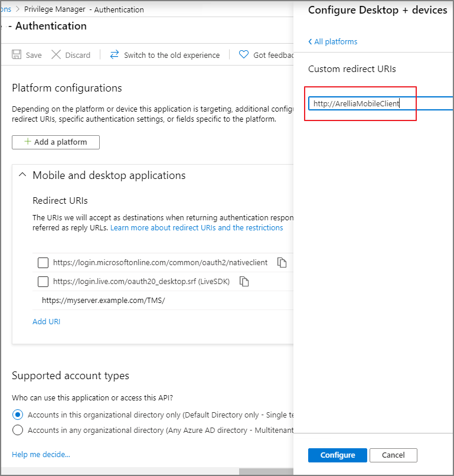
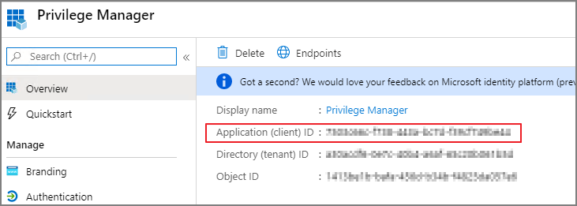

[title]: # (Configure Azure AD)
[tags]: # (mobile)
[priority]: # (15001)
# Configure Azure Active Directory

As a prerequisite for running the Privilege Manager Mobile Console, you must configure Azure Active Directory integration with Privilege Manager. Refer to [Setting Up Azure Active Directory Integration in Privilege Manager](../admin/config/foreign-systems/active-directory/set-up-privilege-manager-azure-ad-integration.md).

Once Azure AD integration for your Privilege Manager instance is configured, follow these steps to add an additional Redirect URI for the mobile application to the Azure AD application registration:

1. Open the __Azure Management Console__.
1. Navigate to your __Active Directory__ instance.
1. Select __App registrations__ from the menu.
1. Click the __Owned applications__ tab.
1. From the list under Display name select your Privilege Manager registration.

   
1. Either select the __Redirect URI__ links or the __Authentication__ menu.

   
1. Select __Add a platform__.
1. Select __Mobile and desktop applications__.
1. Set the Redirect URI to exactly `http://ArelliaMobileClient`. There are two access points to do this either via: 

   * Redirect URI or
   * Authentication menu.

   The following table shows the steps you will see for each option:

   | accessed via Redirect URI link | accessed via Authentication menu |
   | ----- | ----- |
   |  |  |
   | 1. Click Add URI. | 1. Enter `http://ArelliaMobileClient`.|
   | 2. Enter `http://ArelliaMobileClient`. | 2. Click __Configure__.|

   >**Important**: The URI value needs to exactly match `http://ArelliaMobileClient`.
1. Click __Save__.

On the __App registrations__ page under __Owned applications__, take note of the __Application (client) ID__. You will need to use the client ID when you [Configure the Mobile Console in Privilege Manager](cfg-console.md).

