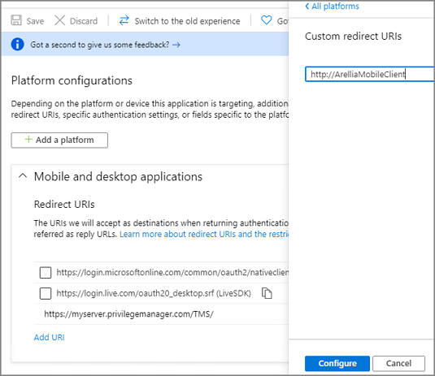

[title]: # (Configure Azure AD)
[tags]: # (mobile)
[priority]: # (15002)
# Configure Azure Active Directory

As a prerequisite for running the Privilege Manager Mobile Console, you must configure Azure Active Directory integration with Privilege Manager. Refer to [Setting Up Azure Active Directory Integration in Privilege Manager](../integration/active-directory/set-up-privilege-manager-azure-ad-integration.md). Once Azure AD integration for your Privilege Manager instance is configured, follow these steps to add the mobile application registration:

1. Open the __Azure Management Console__.
1. Navigate to your __Active Directory__ instance.

   
1. Select __App registrations__ from the menu.
1. Click the __Owned application__ tab.
1. From the list under Display name select your Privilege Manager registration.

   
1. Select the __Authentication__ menu.

   
1. Select __Add platform__.
1. Select __Mobile and desktop applications__.

   
1. Set the Redirect URI to `http://ArelliaMobileClient`.

   
1. Click __Configure__.

On the __App registrations__ page under __Owned applications__, take note of the __Client ID__. You will need to use the client ID when you [Configure the Mobile Console in Privilege Manager](cfg-console.md).

