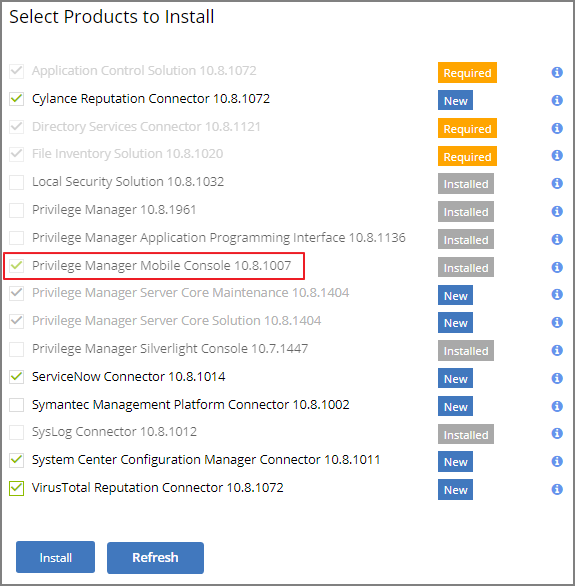
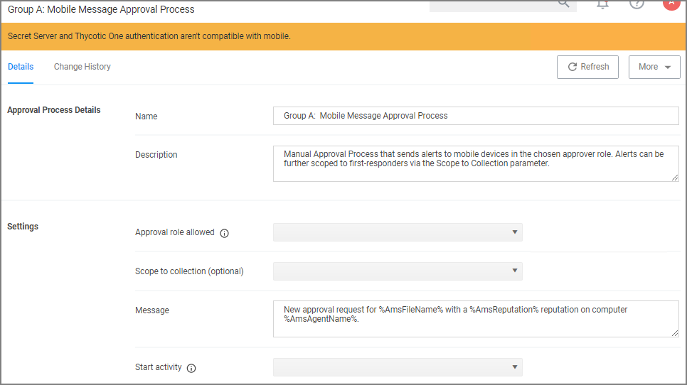
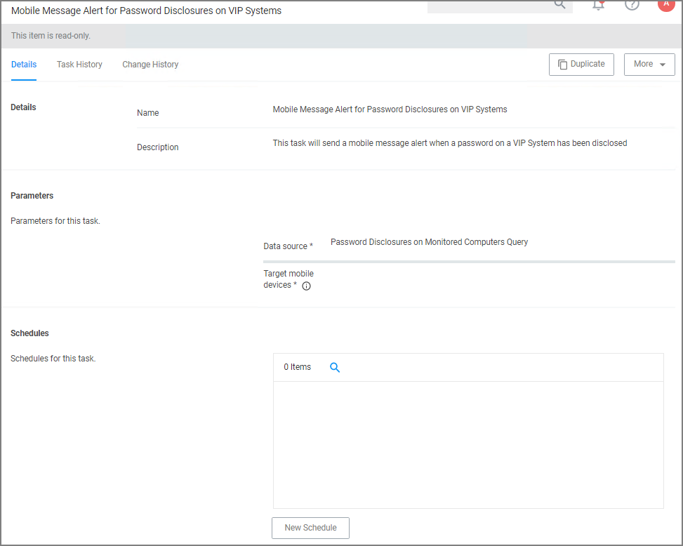
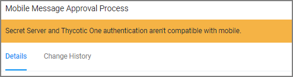

[title]: # (Configure the Console)
[tags]: # (mobile)
[priority]: # (15003)
# Install and Configure the Mobile Console in Privilege Manager

To configure the Mobile Console in Privilege Manager, you must:

1. Install the Privilege Manager Mobile Console.
1. Set the Client ID and Tenant ID.
1. Configure the notification settings.

## Install the Privilege Manager Mobile Console

The Privilege Manager Mobile Console needs to be installed on the same server that is running the Privilege Manager instance.

1. Navigate to your Privilege Manager setup page or select __ADMIN | More...__ and select the __Add / Update Program Features__.
1. Click __Select Products to Install__.

   
1. Select __Privilege Manager Mobile Console__ and click __Install__.

Once the installation completes click __Home__ to navigate back.

## Set the Client ID and Tenant ID

After you have installed the Privilege Manager Mobile Console, set the Client ID and Tenant ID.

1. Navigate to __ADMIN | Configuration__.
1. Select the __Advanced__ tab.
1. Scroll down and click __Edit__.
1. In the Thycotic Mobile Console Solution section under General enter values for:

   1. __Your client id__: In the __Your client id__ field, enter the Client Id that you generated when you configured the Microsoft Azure Active Directory. In the Azure AD portal, you find this under App Registration. Look for the __Application (client) ID__ value.

      
   1. __Your tenant id__, is the DNS name of the Azure Active Directory instance. You find it on the Azure AD Home page, between the friendly name and the Azure Tenant ID, for example __name.myinstance.com__ or __MyCompanyName.onmicrosoft.com__.

      

      Enter that DNS in the __Your tenant id__ field.

      
1. Click __Save__.

## Configure the Notification Settings

The notification settings for the mobile app are available via general configuration and task automation.

1. Navigate to __ADMIN | Configuration__.
1. Select the __General__ tab.

   
1. Under Approval Processes click __Mobile Message Approval Process__.

   
   This task can also be accessed via __ADMIN | More... | Tasks__, selecting the __Automation__ tab and the in the folder tree __Automation | Approvals | Approval Processes | Mobile Message Approval Process__.

   
1. For customization, create a copy of the default task. Give it a meaning full name for your purpose, save the copy and click __Edit__.

   
1. Under the Settings section, you specify in the

   * Approval role allowed field, which roles have approval permissions. By default the alerts for new approval requests will only be sent to mobile users in the Administrators role. You can change this setting by adding the approver role to a different role.
   * Scope to collection field, which is an optional setting, to scope these messages to a subset of users in that role.
   * Message field, what message will be displayed to the approver when a approval request was triggered.
   * Start activity field, which is an optional setting, any activity you wish to start as part of the approval.
1. Click __Save__.

To start sending notifications to phones, select the __Default Execute Application Request Type__ and change the __Approval Process__ from the __Default Manual Approval Process__ to the __Mobile Message Approval Process__ and save the changes.

>**Note**: The approval process change to Mobile Message Approval Process is only for the notification message that an approval was requested. The actual approval has to be followed through via HelpDesk interface. Currently approval requests cannot be approved via the Mobile app.

You can also send notifications based upon report data. These can be used to send alerts for suspicious activity, etc. An example of this can be found under __Tasks | Server Tasks | Mobile Messaging | Mobile Message Alert for Password Disclosures on VIP Systems__.

   
This message can be executed on a schedule to send alerts for any password disclosures on VIP Systems. VIP Systems are configured via the Monitored Computers parameter that allows you to choose a Collection of computers.

## Authentication Provider Warning

The Privilege Manager Mobile Console does currently not work with Secret Server as the authentication provider. If Secret Server is configured as the authentication provider in Privilege Manager, a warning message is shown on the Mobile Message Approval Process configuration page.

