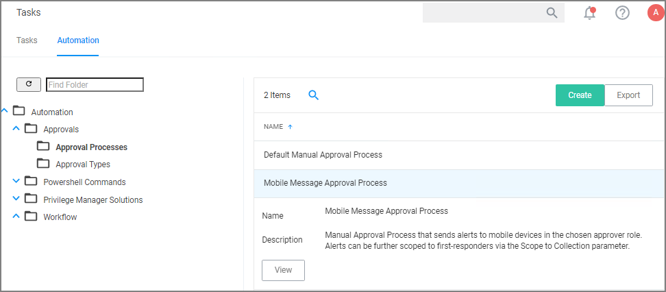

[title]: # (Configure the Mobile Console)
[tags]: # (mobile)
[priority]: # (15003)
# Configure the Mobile Console on the Thycotic Management Server

To configure the Mobile Console on the Thycotic Management Server, you must:

1. Set the Client ID and Tenant ID.
1. Configure the notification settings.

## Set the Client ID and Tenant ID
After you have installed the Mobile Console Solution, set the Client ID and Tenant ID by doing the following steps:

1. In the Security Manager Console, click the __Configuration__ tab.
1. In the file library in the left pane, navigate to __Configuration | Infrastructure__.
1. Right-click __Configuration Settings__ and click __Mobile Console Solution__.
1. Set the Client ID and Tenant ID.

   >**Note:** Use the Client ID generated when you configured the Microsoft Azure Active Directory.The Tenant id is your company name (for example, “CompanyName.com”). Typically you can find it by looking at the URL of the Azure Management page.

   
1. Save the configuration settings.

## Configure the notification settings

1. To configure the notifications for approval requests, click the __Tasks__ tab.
1. In the file library in the left pane, go to __Workflow | Automation | Approvals | Approval Processes__ and select the __Mobile Message Approval Process__.

   
1. Save the Approval Process if you made any changes.

   >**Note:** By default the alerts for new approval requests will only be sent to mobile users in the Administrators role. You can change this setting by allowing the approver role to a different role. You can also scope these messages to a subset of users in that role by specifying the “Scope to Collection (optional)” parameter. Messages can be localized and customized to meet your needs.

To start sending notifications to phones, select the __Default Execute Application Request Type__ and change the __Approval Process__ from the __Default Manual Approval Process__ to the __Mobile Message Approval Process__ and save the changes.

You can also send notifications based upon report data. These can be used to send alerts for suspicious activity, etc. An example of this can be found under __Tasks | Server Tasks | Mobile Messaging | Mobile Message Alert for Password Disclosures on VIP Systems__.

   
This message can be executed on a schedule to send alerts for any password disclosures on VIP Systems. VIP Systems are configured via the Monitored Computers parameter that allows you to choose a Collection of computers.
