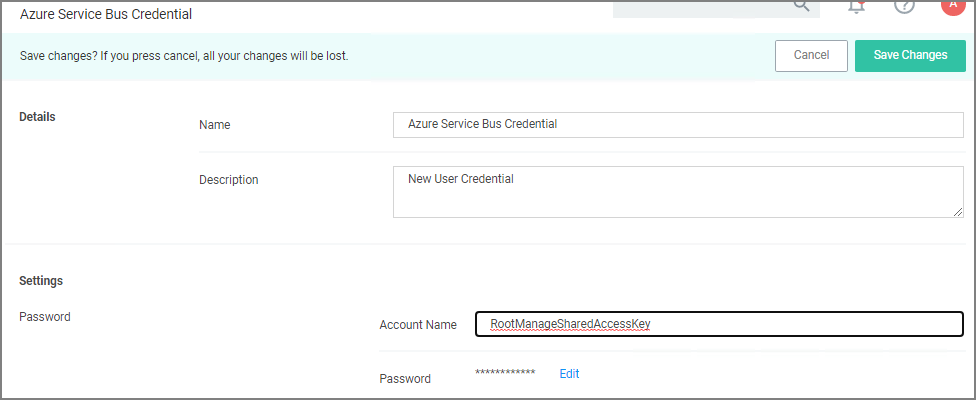
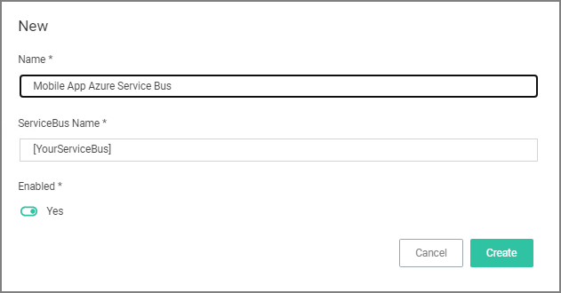
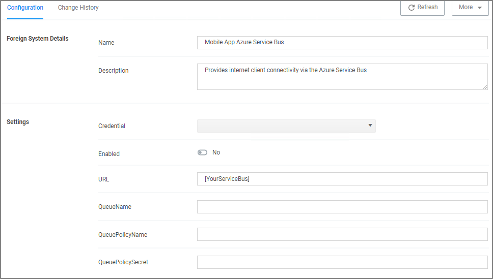

[title]: # (Configure Service Bus)
[tags]: # (mobile)
[priority]: # (15002)
# Configure the Service Bus for Mobile

For this a Service Bus Queue needs to be created, alway refer to the latest instructions as outlined by Microsoft [here in Quickstart: Use Azure portal to create a Service Bus queue](https://docs.microsoft.com/en-us/azure/service-bus-messaging/service-bus-quickstart-portal).

## Creating a Service Bus and Queue in the Azure Portal

For this a Service Bus Queue needs to be created, refer to the latest instructions as outlined by Microsoft [here in Quickstart: Use Azure portal to create a Service Bus queue](https://docs.microsoft.com/en-us/azure/service-bus-messaging/service-bus-quickstart-portal).

If you already have an existing Service Bus in Azure, you are welcome to use the existing setup. You just need to create a new queue within your existing Service Bus to be used by the Mobile App.

The following steps explain what is required for the Mobile App integration:

1. In the Azure Service Bus portal go to the __Shared access policies__ page.
1. Find the policy called __RootManageSharedAccessKey__. If you don't have one yet, create one by that name and select the __Manage__ option and save it.
1. On the __RootManageSharedAccessKey__ policy you can see the __Primary Key__ field. Make note of where this is. We have to use it in a step down below.
1. Next, navigate to the __Queues__ page and create a new queue.
1. Do not check any of the options, using the defaults is fine. Take note of the queue name you gave it.

Next you will need to follow the instructions below to create a credential for the Service Bus and add the Service Bus as a foreign system in Privilege Manager.

## Adding the Service Bus as a Foreign System

The Azure Service Bus requires a Foreign Systems configuration in Privilege Manager. To configure a Service Bus instance with a custom URL and credentials follow these steps:

1. In the Thycotic Privilege Manager Console, click __Admin | Configuration__.
1. Click the __User Credentials__ tab.
1. Click __Create__.

   
   1. Enter a __Name__, for example _Azure Service Bus Credential_.
   1. Set the Account name to __RootManageSharedAccessKey__.
   1. Set the Password to the value of the __Primary Key__ obtained during the Azure Service Bus configuration procedure __step 3__ under "Creating a Service Bus and Queue in the Azure Portal" above.
   1. Click __Save Changes__.
1. Navigate to __Admin | Configuration__ and select the __Foreign Systems__ tab.
1. Click the __Azure Service Bus__ option.
1. Click __Create__.

   
   1. Enter a __Name__, for example _Mobile App Azure Service Bus__.
   1. Set the __ServiceBus Name__ to the namespace of the Service Bus from the Azure Portal. To find this value, open the Azure Portal, locate the Service Bus that is being used for this integration (refer to the intro above). Go to the __Properties__ page and locate the Name property (generally, this is the same name as the instance you just located in the list of Service Bus instances).
   1. Set the __Enabled__ switch to __No__ for now.
   1. Click __Create__.

      
   1. Set the credential to the credential created in step 3 of this procedure (_Azure Service Bus Credential_).
   1. Leave the URL field as is (and ignore the fact that it's called URL – it's just the Service Bus name).
   1. Make sure the URI matches the first part of the namespace created in Azure.
   1. Set the QueueName to the same queue name created above in __step 4__ under "Creating a Service Bus and Queue in the Azure Portal".
   1. Set the Queue Policy Name to __RootManageSharedAccessKey__.
   1. Set the Queue Policy Secret to the __Primary Key__ as obtained in __step 3__ under "Creating a Service Bus and Queue in the Azure Portal" above.
   1. Click __Save Changes__.
   1. Enable the Service Bus, set Enabled switch to __Yes__.
<!--1. Recycle the App Pools on the Privilege Manager Instance following any changes for this integration. Without the recycle, the new settings won't be applied.

   __Cloud__ customers, please contact support for assistance to get these recycled. Unfortunately, this is a "must-contact" situation.-->
1. To verify everything is working correctly, open your browser and point it to the ServiceBus worker service:

   * __On-Premises__: `https://yourinstance.privilegemanager.com/Tms/ServiceBus/WorkerService.svc`
   * __Cloud__: `https://yourinstance.privilegemanagercloud.com/Tms/ServiceBus/WorkerService.svc`

   Wait for the page to respond.

You are now ready to install the Thycotic ACS application on your mobile devices.
