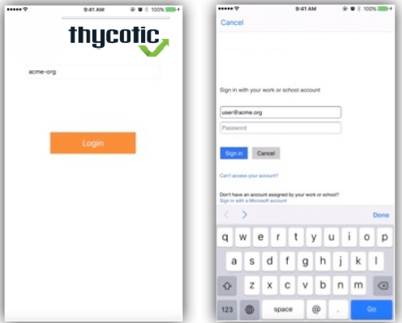

[title]: # (Install the Mobile App)
[tags]: # (mobile)
[priority]: # (15004)
# Install the Mobile App

After installing and configuring the server components, help desk users can download the Mobile app for their smartphone via the appropriate app store by searching for Mobile. After you install the app, do the following:

1. Set the Company ID to the Service Bus Namespace or “Service Bus Name” in AMS (for instructions, go to Microsoft Azure Service Bus).

    
1. They will then be presented with a login screen where they need to use their Active Directory credentials
1. After a successful login, they will then need to create a pin to secure the Mobile app.
