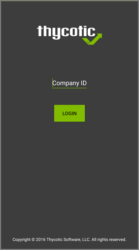

[title]: # (Install and Sign In)
[tags]: # (mobile,install,sign in)
[priority]: # (15004)
# Mobile App Install and Sign In

After installing and configuring the server components, help desk users can download the Mobile app for their smartphone via the appropriate app store by searching for __Thycotic ACS__. After you install the app, do the following:

1. Open the application on the mobile device.

   
1. When prompted for the __Company ID__, enter the name of your __Service Bus__. To find the name, open the Azure Portal, locate the Service Bus that is being used for this integration. Go to the __Properties__ page and locate the Name property (generally, this is the same name as the instance in the list of Service Bus instances).
1. Next enter the Azure Active Directory user credentials.
1. Create a pin to secure the Mobile app.

## Troubleshooting

If you experience any issues completing those steps, try the following to solve the problem:

1. Verify the you can reach the Service Bus worker service by pointing your browser at the ServiceBus worker service. Enter this URL into your browser navigation bar: https://yourinstance.privilegemanager.com/Tms/ServiceBus/WorkerService.svc and wait for the page to respond.
1. Verify the Redirect URL setting in your Azure AD application registration matches the configuration values in Privilege Manager.
1. __Recycle the the App Pools on the Privilege Manager Instance__ following any changes for this integration. Without the recycle, the new settings won't be applied.

   __Cloud__ environments require the Cloud Manager PIN, etc., and you might have to contact Cloud Support.
