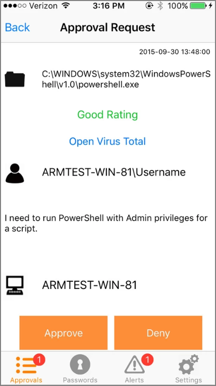
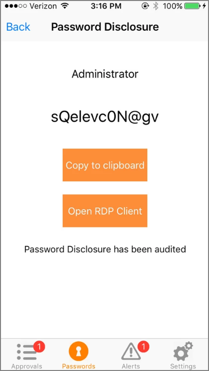
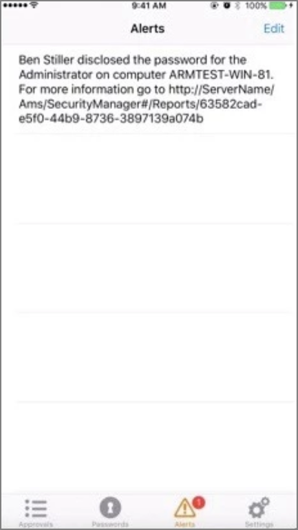

[title]: # (Use the Mobile App)
[tags]: # (mobile)
[priority]: # (15005)
# Use the Mobile Application

## Approval requests

Approval Requests area provides the ability to approve/deny pending approval requests and the ability to view recently approved requests.

   

## Password Disclosure

Password Disclosure area provides the ability to disclose managed user passwords that the mobile user has access to.

   

## Alerts

The Alerts area provides the ability to view non-approval request alerts, such as the Password Disclosures on VIP Systems. These alerts can be forwarded via e-mail or removed.

   