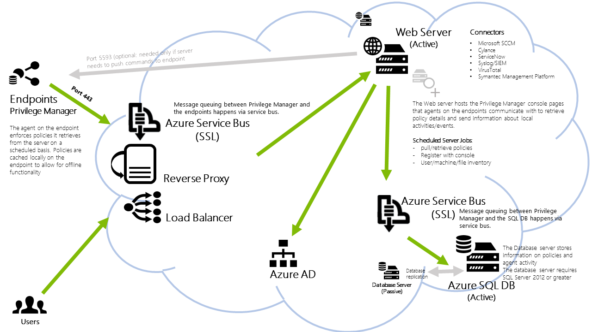
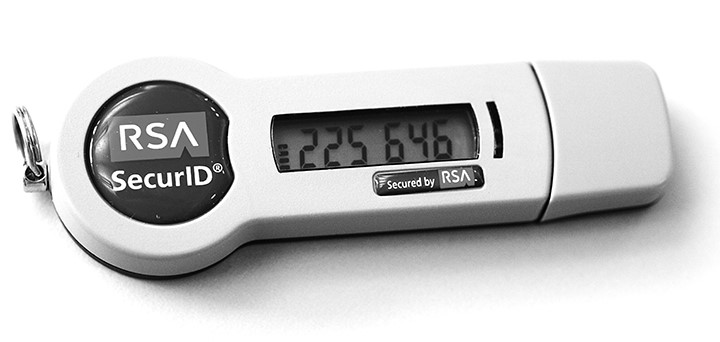

[title]: # (PM Cloud Security)
[tags]: # (read me)
[priority]: # (80001)
# Privilege Manager Cloud Security

## INTRODUCTION

Organizations across nearly every industry and product type are increasingly
adopting cloud-based services. From telephones and project management tools, to
file sharing and storage, the Cloud enables businesses to rapidly deploy new
services, processes, and structures at an affordable cost. Every day, businesses
are embracing powerful software and technologies that in the past would have
been either unaffordable or too difficult to install and manage on premise.

Solutions that help organizations protect their organization with application
control and local security measures from threats and meet compliance
requirements are no exception. As the most used Privileged Account Management
(PAM) security solution, with 7500 customers worldwide, Thycotic recognizes the
need for robust cloud-based least privilege management and threat intelligence
solutions. One that is easy to use, fast to implement, and helps companies
minimize upfront costs through a subscription based service.

Leveraging the global success of Privilege Manager, Thycotic has introduced
Privilege Manager Cloud. Privilege Manager Cloud makes it possible for large
enterprises and fast-growing organizations to easily scale and implement least
privilege management to protect their servers and endpoints with a minimum of
upfront expense and effort that delivers maximum security and compliance
capabilities.

While Privilege Manager is collecting threat intelligence information and
monitoring least privilege access management, we have built in security measures
to assure the confidentiality, integrity, and availability of data managed by
your instance of Privilege Manager. By deploying on the Microsoft Azure
platform, we are able to implement processes and methods that safeguard your
information used in Privilege Manager Cloud. This white paper helps to explain
in more detail the security measures surrounding your Privilege Manager Cloud
deployment.

## PRIVILEGE MANAGER CLOUD – A LEAST PRIVILEGE and APPLICATION CONTROL SOLUTION

Unlike other privileged account password products, Secret Server Cloud provides
you with a comprehensive PAM solution that goes beyond simply vaulting
passwords. This gives organizations of all sizes an easy to install and maintain
security solution that integrates seamlessly with their existing infrastructure
to discover, manage, and protect privileged accounts from hackers and malicious
insiders.

Privilege Manager Cloud provides several key advantages that enable you to:

* Discover, manage, and remove local administrative rights
* Discover applications with administrative rights
* Integrate with Azure Active Directory
* Determine trusted applications and processes
* Determine and deny execution of malicious applications and processes
* Allow users to automatically access applications and systems they need
* Report to demonstrate compliance with policies and mandates

*Figure 1: Privilege Manager Cloud architecture*

Privilege Manager Cloud, deployed on the Microsoft Azure platform, hosts the
Privilege Manager Console pages that agents on the endpoints communicate with
and retrieve policy details.

## A POWERFUL COMBINATION OF MICROSOFT AZURE AND THYCOTIC SECURITY PRACTICES

Thycotic has chosen to deploy Privilege Manager Cloud on the highly secure
Microsoft Azure platform. With years of experience developing enterprise
software and operating some of world’s largest online services, Microsoft
delivers a robust set of security technologies and practices around its
Azure platform. Microsoft’s technology helps protect the Azure
infrastructure from evolving attacks, secures user access to the Azure
environment, and safeguards customer data through encrypted communications.
Additionally, they also employ the latest in threat management and
mitigation practices, along with regular penetration testing.

### Encrypting communications and operation processes to secure data 

For data in transit, Azure & Thycotic rely on industry-standard transport
protocols between user devices and Microsoft datacenters, and within
datacenters themselves. Thycotic Privilege Manager Cloud uses these
protocols to protect data and ensures that all confidential data stays
encrypted at ALL times, including at-rest and during transmission.

### Securing networks to minimize risks

Each customer’s instance in Privilege Manager Cloud is completely isolated
on the Azure platform in order to minimize its attack surface and prevent
security breaches. We are provisioning a separate database, supporting cloud
infrastructure, and private encryption keys for each customer. Although the
cost to Thycotic is greater, it provides the most secure environment
possible for each and every customer.

### Preventing threats with the latest technologies 

To protect against online threats, Thycotic leverages Azures Microsoft
Anti-malware for cloud services and virtual machines. In addition, the
Microsoft Azure platform employs intrusion detection, denial-of-service
(DDoS) attack prevention, regular penetration testing, and data analytics
and machine learning tools to help mitigate threats.

Thycotic Privilege Manager Cloud also implements a Web Application Firewall
(WAF), capable of absorbing DDoS attacks well over 20 Gbps.

### Managing timely updates

Privilege Manager Cloud utilizes the Azure platform to manage and deploy all
operating system updates. The Azure Security Team, for example, meets regularly
with the Microsoft Security Response Center to prioritize and deploy Windows
updates without impacting tenant availability and performance.

### Demonstrating compliance with international security standards

Because of its comprehensive array of highly developed safeguards, the Azure
platform meets a broad set of international and industry-specific compliance
standards. Verification of Microsoft’s implementation of security controls
can be obtained by requesting audit reports from the certifying third
parties. Microsoft also provides numerous online resources describing the
security of its infrastructure in more detail. We encourage you to learn
more by accessing the following resources:

Azure Trust Center:
*https://www.microsoft.com/en-us/TrustCenter/CloudServices/Azure* Azure Trust
Center – SOC: <https://www.microsoft.com/en-us/TrustCenter/Compliance/SOC>

Thycotic Privilege Manager Cloud complements Azure best practice industry
standards by:

* Implementing NIST based Security Response policies to score, resolve, and
    communicate any necessary security advisories in response to reported
    vulnerabilities or bugs.

* Using standard Microsoft .NET cryptographic algorithms.

* Using the AES-256 standard encryption algorithm and PBKDF2-HMAC-SHA256
    hashing algorithm.

## ASSURING CONFIDENTIALITY, INTEGRITY, AND AVAILABILITY

The Azure platform is the optimum choice for Thycotic Privilege Manager
Cloud. The platform is based on Microsoft’s best practices and technology
for assuring the confidentiality, integrity, and availability of information
stored and managed on the platform.

## CONFIDENTIALITY

Confidentiality means ensuring that only the proper people have access to
your data, and they are limited only to what they are authorized to access.
With Thycotic Privilege Manager Cloud, each customer’s password data is
protected at rest in an isolated SQL database using AES-256 encryption with
a unique key per customer.

Secret Server Cloud comes with Two-Factor Authentication to prove that the
person accessing your secrets is the person you’ve authorized to do so.
Two-Factor Authentication is a combination of something you know (your
password to login to Secret Server) and something you have (Google Auth app,
RSA Token, etc.). Thycotic employees that work on Secret Server Cloud
undergo thorough background checks and extensive security training. In
addition, Thycotic subjects the application code for Secret Server Cloud to
continuous penetration testing to detect any vulnerabilities that could lead
to unauthorized access.

## INTEGRITY

Integrity of your data means only allowing authorized people to make changes
to the data they are authorized to access. Thycotic’s Privilege Manager
Cloud accomplishes this by protecting data at rest and in transit from
unauthorized changes.

With regards to the underlying system, Privilege Manager Cloud is COMPLETELY
isolated from all other software and computers. Access to this isolated
environment is limited to only a handful of people and is strictly enforced
and audited. Multiple users are required to oversee access to the production
system to monitor and maintain security best practices.

External connections (from the Cloud to your network) and Internal
Connections (from the Privilege Manager Cloud engine to the database in the
Cloud) are protected by TLS. Messages sent to the On Premise distributed
engine are further encrypted with AES-256.

## AVAILABILITY

Availability means that your data is accessible through Privilege Manager
Cloud to authorized personnel when needed.

Privilege Manager Cloud leverages the Azure platform for its High
Availability: All services for Privilege Manager Cloud within Azure are
auto-scaling so that during heavy usage, computing resources are
automatically increased to ensure uninterrupted service even during the most
heavily used times.

Customer databases are continuously backed up with a differential backup
every hour and a transaction log every 5 minutes. All data on the Azure
platform is geo-redundant in the event of an outage or interruption to
facilitate imimageste disaster failover and recovery.

In addition, Privilege Manager Cloud is protected by a Web Application
Firewall (WAF) as an extra layer of protection against malicious scripts and
potential Distributed Denial of Service (DDoS) attacks.

Privilege Manager Cloud also takes advantage of Azure’s built in redundancy
which generates three copies of each customer’s database that are maintained
across fault tolerant nodes to ensure continuous availability.

## SUMMARY

As more and more companies begin to explore and exploit the potential of
cloud-based services to help enhance business value with affordable and
efficient solutions, Thycotic Privilege Manager Cloud has adopted industry
best practices in making PAM services as secure and effective as possible.

By enabling organizations of all sizes to dramatically improve privilege
account security more cost-effectively and with rapid implementation,
Thycotic Privilege Manager leads the way in offering a powerful option for
protecting critical information assets from hackers and malicious insiders.

To learn more about Privilege Manager Cloud visit Thycotic’s web site at
[http://www.thycotic.com/privilege-manager-cloud](http://www.thycotic.com/privilege-manager-cloud-trial-thank-you)
or contact us a *sales\@thycotic.com*
