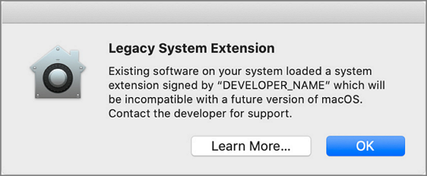
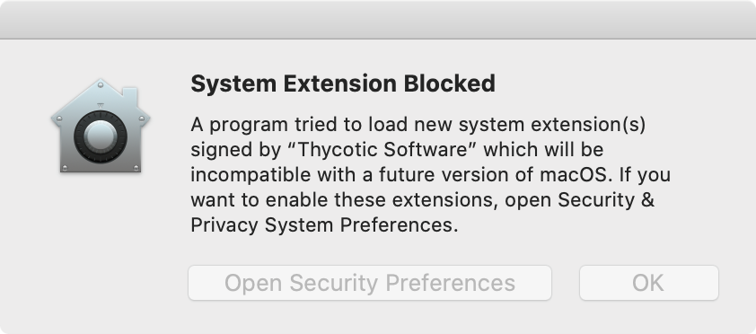
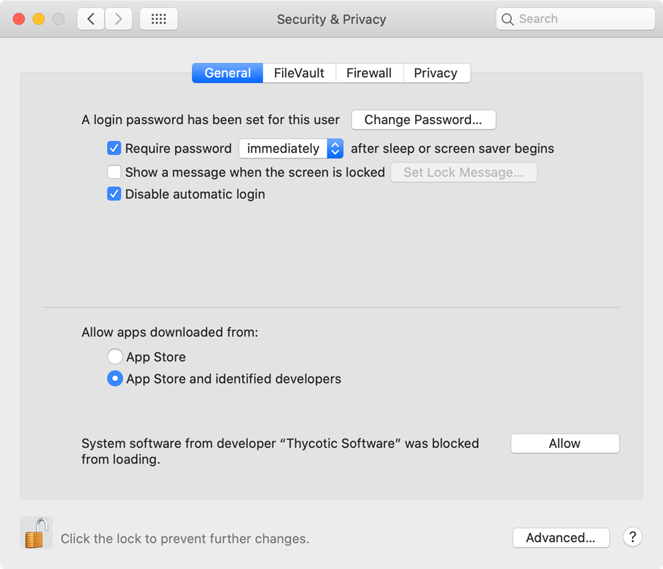
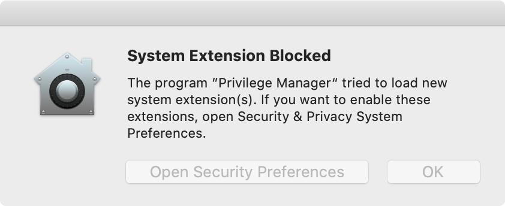
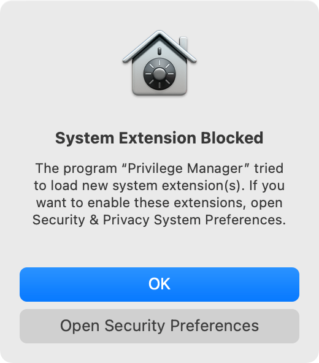
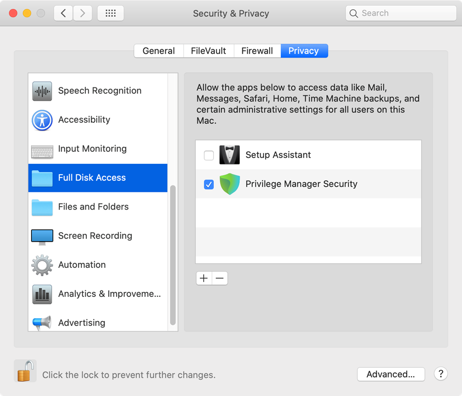
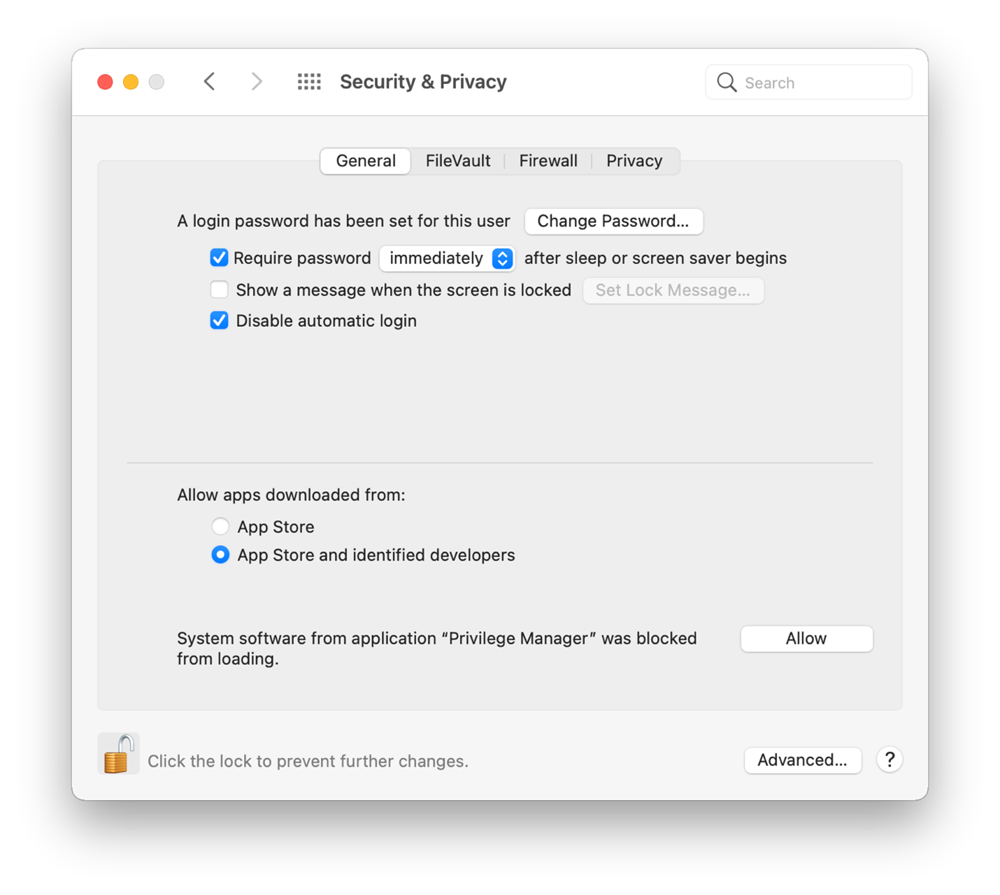
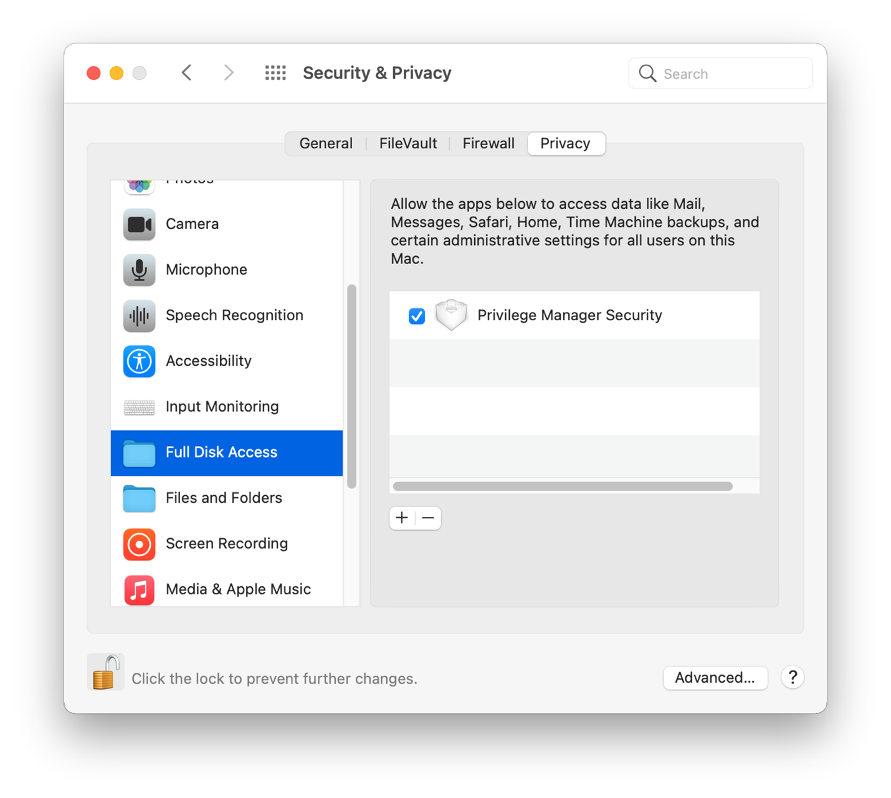

[title]: # (macOS Extensions)
[tags]: # (macOS,kext,sysex)
[priority]: # (26)
# macOS Extensions

Introduced with Catalina and fully implemented with Big Sur, Apple announced the deprecation of kernel extensions and pushed for system extensions instead.

## Kernel Extension (KEXT) vs. System Extension (SYSEX)

The Privilege Manager macOS agent is composed of several components and at the core of it are the KEXT and ThycoticACSvc daemon. These two work together to allow, deny, and elevate applications according to policy. With the deprecation of KEXTs in macOS Catalina, we are combining the functionality of these two components into the __com.thycotic.acsd__ system extension that is hosted by __Privilege Manager.app__. In the KEXT version of the macOS agent, we relied on the KEXT to adjust processes so that they could run elevated. With the SYSEX version, we are no longer able to do that. We now leverage a sudo plugin to provide similar functionality.

## Leveraging the AuthorizationDB

Many privileged operations are governed by rules in the authorizationdb and these rules determine what credentials are required to perform certain tasks depending on the right being authorized. To address restrictions placed on the macOS agent because we no longer have the fine-grained access and control provided by our KEXT, we’re extending how we leverage the authorizationdb to provide least privilege for users on macOS endpoints. In addition, we’ll be expanding upon this to provide coverage for more privileged operations.

## Using a Privacy Preference Policy Control Configuration Profile Payload

The concept of [TCC](tcc-access.md) introduces Privacy Preference Policy Control (PPPC) configuration profile payload, which allow for enterprises to manage and ease, through Mobile Device Management (MDM), the installation process of products that leverage KEXTs and SYSEXs for their end-users. When properly configured, this eliminates the need for the user to deal with all of the dialogs above.

Thycotic can provide the necessary configuration payloads that can be loaded into or leveraged with your MDM solution.

## Legacy Extensions (KEXT)

### Effect on Privilege Manager Customers by Apple Deprecating Kernel Extensions in macOS

In 2019, Apple announced the deprecation of kernel extensions (KEXTS) in a future OS upgrade and that System Extensions should be used instead. Beginning in macOS 10.15.4, the use of kernel extensions will trigger a notification that software using this type of extension includes a deprecated API and an alternative should be provided by the vendor.

You may see this popup:

### How is this Going to Affect Privilege Manager?

Thycotic plans to support Endpoint Security via system extension in Privilege Manager version 10.8.x to be delivered to support the Big Sur release. In the meantime, Privilege Manager will continue to function normally and no immediate action is required.

You can read more about legacy system extensions on [Apple's website](https://support.apple.com/en-us/HT210999).

Privilege Manager will continue to support kernel extensions for macOS versions that require them for the product to function.

### Catalina KEXT Warning

A user is informed that some product is trying to install a component that is trying to load a system extension and that their consent is required to allow it. Once Privilege Manager is installed, the user must allow it to satisfy this [Transparency, Consent, and Control (TCC) requirement](tcc-access.md). This means that an end-user approval is required for the product to be fully functional. 

This dialog and the need to grant Full Disk Access to the SYSEX on Catalina and Big Sur can be remediated by Privacy Preference Policy Control (PPPC) configuration profile payloads. The popup in not directly pointing to the fact that it was triggered by due to a KEXT.

Here the user opens the __Security & Privacy__ pane and clicks __Allow__ for the Thycotic Software to run. 

No further action is required by the user. [File and Folder access](tcc-access.md) my need to be enabled on the endpoint.

## System Extensions (SYSEX)

With system extensions the process is similar as outlined for the KEXT above, however with System Extensions the Privilege Manager utility is used.

| Catalina Blocked | Big Sur Blocked |
| ----- | ----- |
|  |  |

### Catalina

Here the user opens the __Security & Privacy__ pane and clicks __Allow__ for the Privilege Manager system extension to run. 

If you’re not delivering a PPPC configuration profile via MDM to manage this, users will need to give Privilege Manager Security Full Disk Access.

### Big Sur

Here the user opens the __Security & Privacy__ pane and clicks __Allow__ for the Privilege Manager system extension to run. 

If you’re not delivering a PPPC configuration profile via MDM to manage this, users will need to give Privilege Manager Security Full Disk Access.

