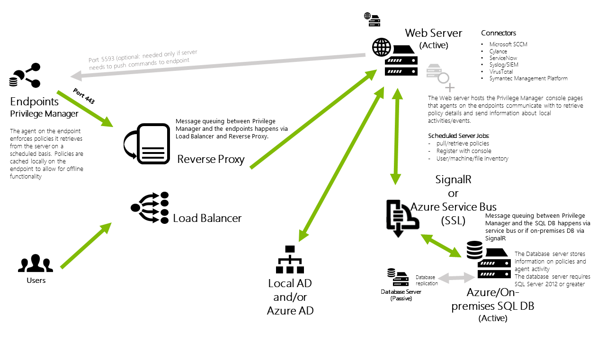

[title]: # (Product Overview)
[tags]: # (architecture)
[priority]: # (11)
# Product Overview

The following diagrams provide an architectural overview of Privilege Manager, its components, and available integrations.

Also refer to the [Reference Diagrams](pm-ss-integration.md) in the Secret Server Integration overview topic.

## Privilege Manager Cloud - Layered Diagram

### Network Diagram (Cloud)

## Privilege Manager On-premises - Layered Diagram

### Network Diagram (On-prem)

