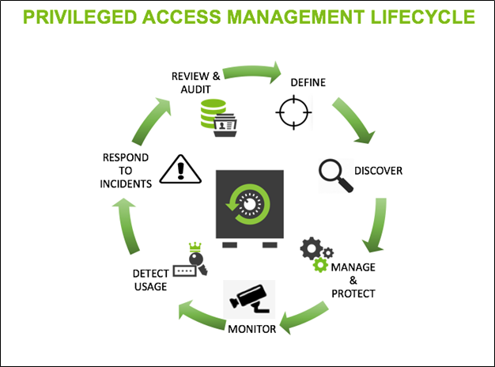

[title]: # (Privileged Access Management)
[tags]: # (PAM, Lifecycle)
[priority]: # (14)
# Privileged Access Management (PAM)

PAM prevents malware and ransomware from exploiting applications by removing local administrative rights from endpoints.

