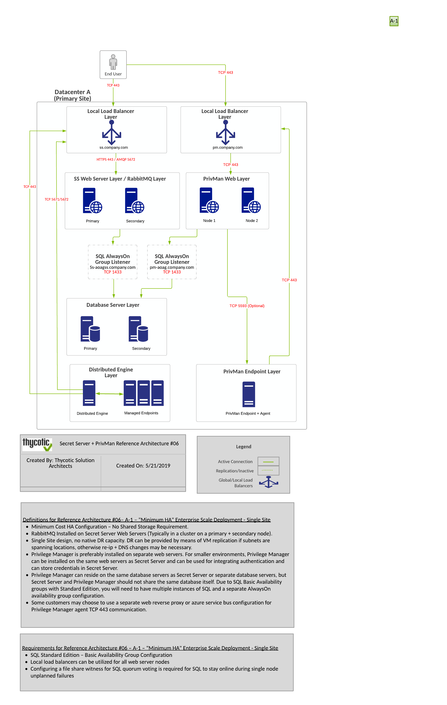
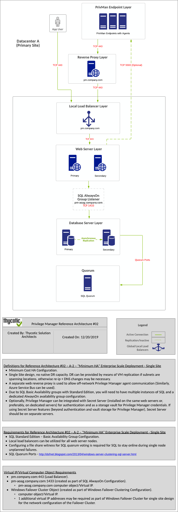
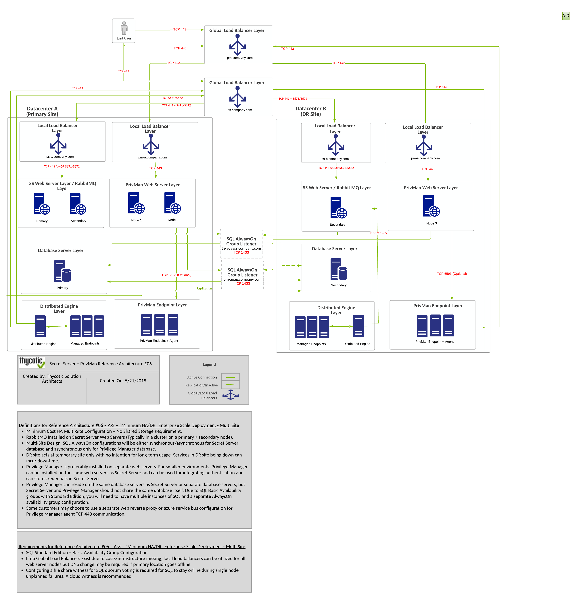
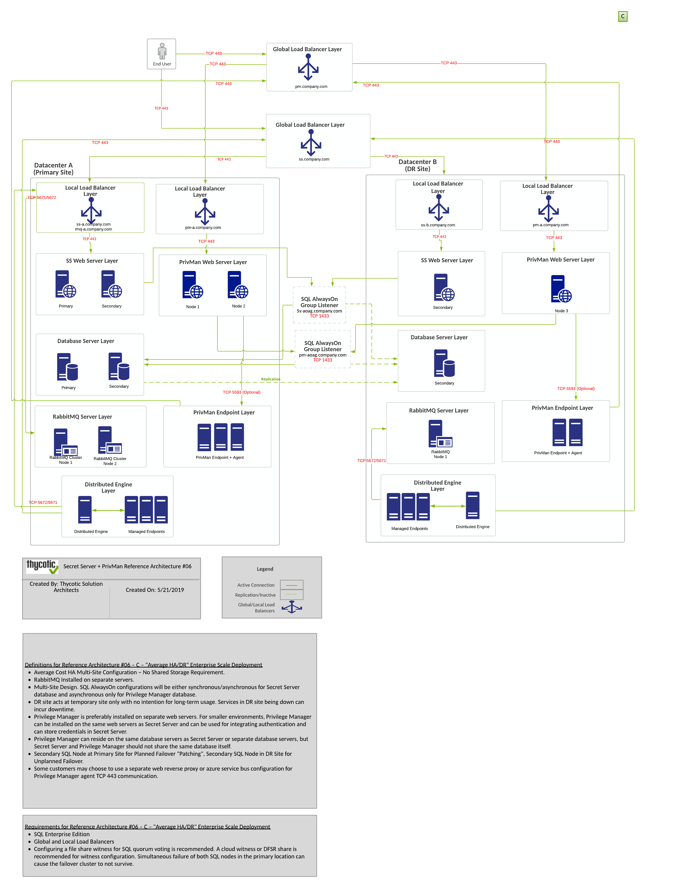
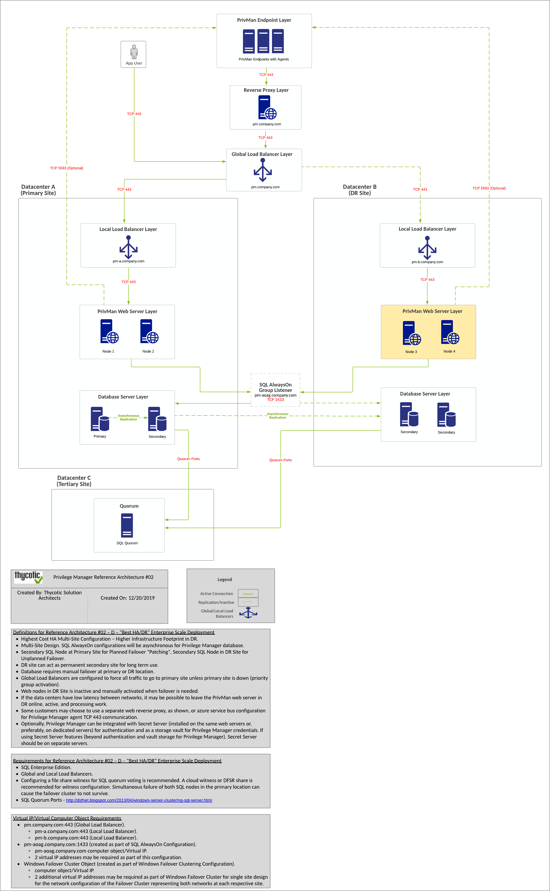
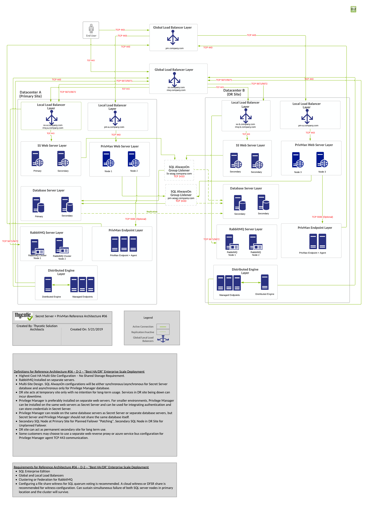

[title]: # (Integration with Secret Server)
[tags]: # (setup planning)
[priority]: # (20)
# Integration with Secret Server

Privilege Manager and Secret Server integration is supported in a co-hosted setting when installed on the same server or on separate servers. If integrated on separate servers, Privilege Manager communicates with Secret Server via Secret Server's REST API. 

The benefits of Privilege Manager's integration with Secret Server include:

* Secret Server can be the authentication source for Privilege Manager, which:

  * Adds Secret Server's MFA login options to Privilege Manager logins.
  * Gives one place for role assignments for both products.

* Allows Privilege Manager to use Secret Server as a storage container. If Secret Server is used as a storage container for Privilege Manager credentials, Privilege Manager

  * creates Secrets for each local credential managed by Privilege Manager.
  * creates Secrets for each Configuration Credential stored in Privilege Manager. This includes credentials used for Foreign Systems, such as AD Sync, ServiceNow, etc.
  * does not pull any changes for these Secrets. Privilege Manager only stores the credentials in Secret Server to utilize Secret Server's workflow options for other users to view.

When Secret Server is used as the authentication source for Privilege Manager, Role Permissions assigned in Secret Server are important and determine user access levels in Privilege Manager. Without Secret Server integration, Privilege Manager uses NTLM for WebServer and Azure AD as possible authentication sources.

## Component Definition

__End User__ - These are the users connecting to your Secret Server and Privilege Manager websites. These users may be performing administrative tasks (admins), or just using the solution.

__Load Balancers__ - Load Balancers are often involved in the solution to help distribute web traffic to more than one web server. Load balancers may also be involved for distributing traffic to a RabbitMQ cluster. Local and Global load balancers, if available, may be used in the solution to further lower potential application downtime during upgrades, patching, and single site failures.

__Web Server__ - This is a primary component of the solution. Our web servers use IIS 7 and newer and will only work on Windows Server 2008 R2 - Windows Server 2016. For multiple web server (clustered) solutions, The web application itself can be made cluster aware and does not require being built as part of an IIS farm. Each web server acts as its own stand alone web server.

__Database Server__ - This is a primary component of the solution. SQL Server hosts the Secret Server and Privilege Manager databases. We are compatible only with SQL Server 2012 or newer running on Windows Server 2008 R2 - Windows Server 2016. The Thycotic databases can be put on a stand alone server, a FCI, or preferably using an AlwaysOn AG for clustered environments. The databases can be added to an existing production SQL cluster or instance, but proper sizing of the environment should be done. Windows authentication only is advised.

__MemoryMQ__ - MemoryMQ is our built in message brokering solution for Secret Server. It is not as robust as RabbitMQ and cannot be made highly available. Web Servers themselves have a built in MemoryMQ function so that out of box Secret Server can do all work by just having a Web and Database server. Alternatively, MemoryMQ can be installed on its own dedicated system. It is used by Secret Server, but not Privilege Manager.

__RabbitMQ__ - This is an optional but often recommended component of the solution for any Secret Server environment involving multiple Web Servers or Distributed Engines. RabbitMQ is the most robust and widely used message brokering solution. Secret Server can utilize RabbitMQ for offloading work to Distributed Engines within the environment. This allows the solution to be more robust and efficient by making work done within the environment more distributed. You will see recommendations to use RabbitMQ in many web pages within our product. It is used by Secret Server, but not Privilege Manager. - https://www.rabbitmg.com/

__Distributed Engines__ - Distributed Engines are used by Secret Server for two primarily reasons. The first reason is to do work on behalf of the web servers and allow the architecture to be more distributed. You can consider distributed engines your "workers" within a Secret Server environment. Out of box without Distributed Engines, the Web Servers are doing all of the work. Distributed Engines are also useful for when you have systems in isolated network segments within your environment that you would like to manage with Secret Server. Distributed Engines are used by Secret Server, but not Privilege Manager.

__Privilege Manager Agents__ - This is used for application control and local user/group management for our Privilege Manager solution. Privilege Manager Agents are used by Privilege Manager, but not Secret Server.

>**Note**:
>Every component of Secret Server and Privilege Manager can be made highly available to ensure a redundant architecture and to scale for future growth.

## Single Site

### Minimum High Availability

### Minimum High Availability (RabbitMQ Separation)

### Minimum High Availability/DR - Lowest Cost

## Multi Site

### Average High Availability/DR (RabbitMQ Separation)

### Best High Availability/DR (RabbitMQ Separation)

### Best High Availability/DR (RabbitMQ Separation) - Highest Cost

