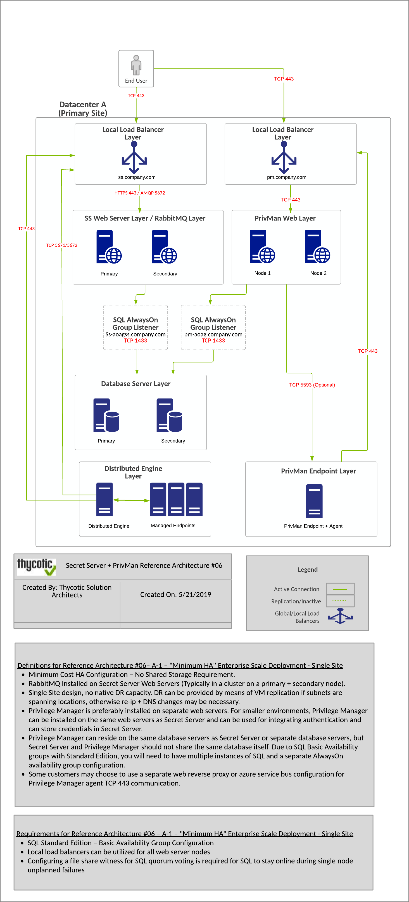

[title]: # (Integration with Secret Server)
[tags]: # (setup planning)
[priority]: # (20)
# Integration with Secret Server

Privilege Manager and Secret Server integration is supported in a co-hosted setting when installed on the same server or on separate servers. If integrated on separate servers, Privilege Manager communicates with Secret Server via Secret Server's REST API. 

The benefits of Privilege Manager's integration with Secret Server include:

* Secret Server can be the authentication source for Privilege Manager, which:

  * Adds Secret Server's MFA login options to Privilege Manager logins.
  * Gives one place for role assignments for both products.

* Allows Privilege Manager to use Secret Server as a storage container. If Secret Server is used as a storage container for Privilege Manager credentials, Privilege Manager

  * creates Secrets for each local credential managed by Privilege Manager.
  * creates Secrets for each Configuration Credential stored in Privilege Manager. This includes credentials used for Foreign Systems, such as AD Sync, ServiceNow, etc.
  * does not pull any changes for these Secrets. Privilege Manager only stores the credentials in Secret Server to utilize Secret Server's workflow options for other users to view.

When Secret Server is used as the authentication source for Privilege Manager, Role Permissions assigned in Secret Server are important and determine user access levels in Privilege Manager. Without Secret Server integration, Privilege Manager uses NTLM for WebServer and Azure AD as possible authentication sources.

## Single Site - Implementation Diagrams

### Minimum High Availability

### Minimum High Availability (Reverse Proxy/Azure Bus)

")

## Multi Site - Implementation Diagrams

### Minimum High Availability (with Multi Site DR) - Lower Cost/Manual Failover

 - Lower Cost/Manual Failover")

### Average High Availability (with Multi Site DR) - Average Cost/Manual Failover

 - Average Cost/Manual Failover")

### Best High Availability (with Multi Site DR)

")

### Best High Availability (with Multi Site DR) - Highest Cost

 - Highest Cost/Manual Failover")
