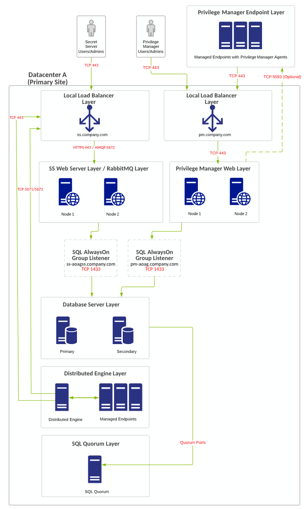
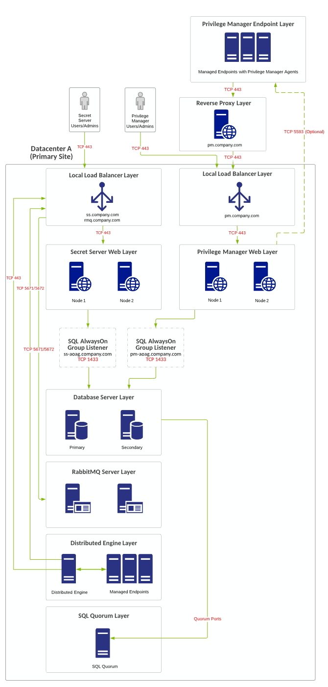
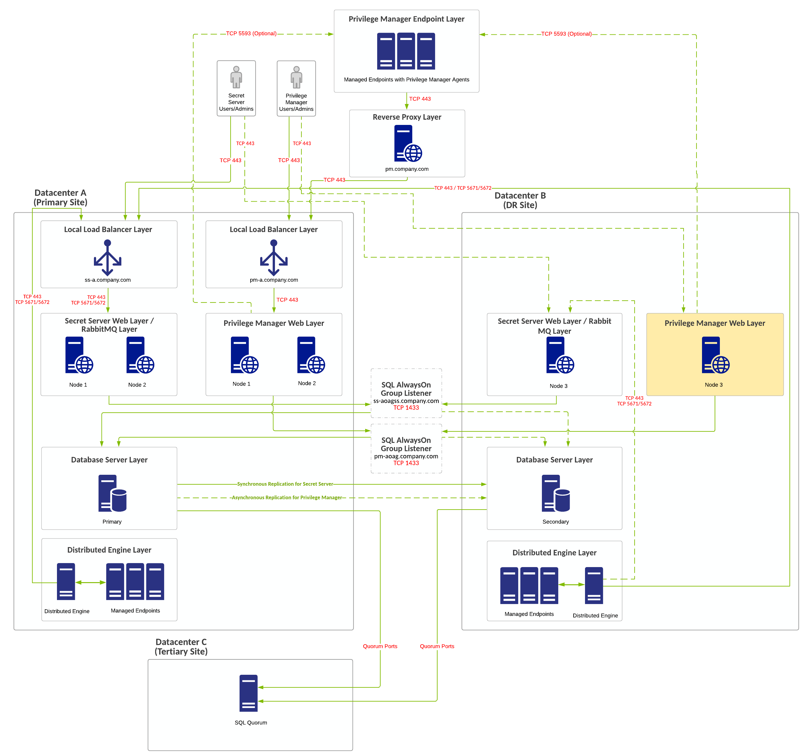
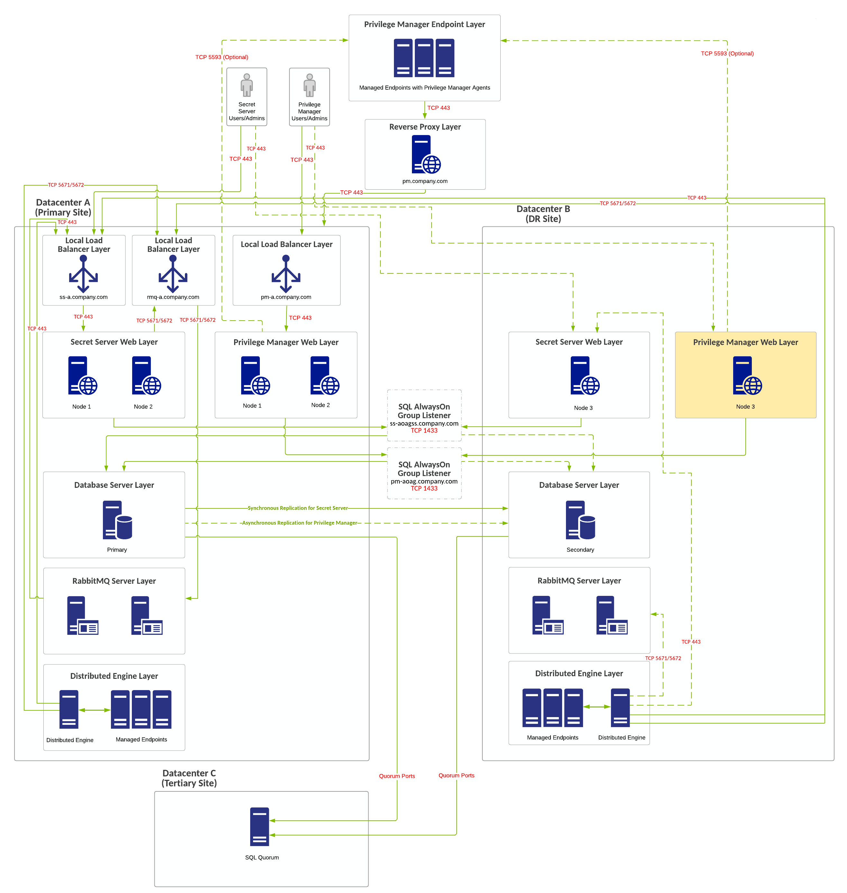
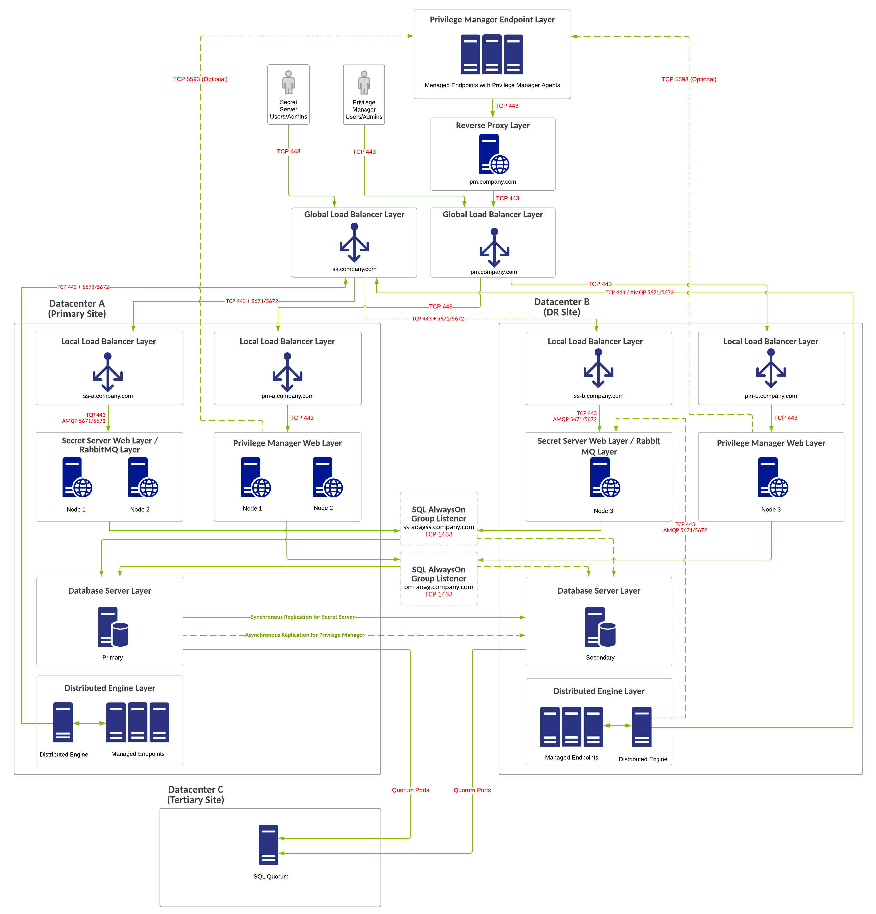
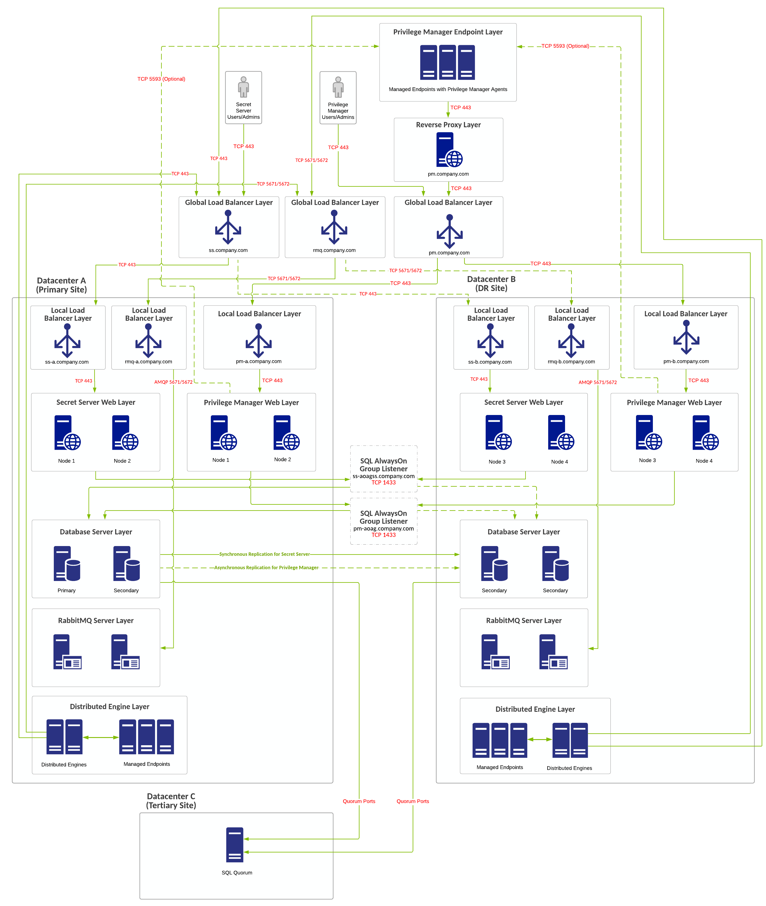
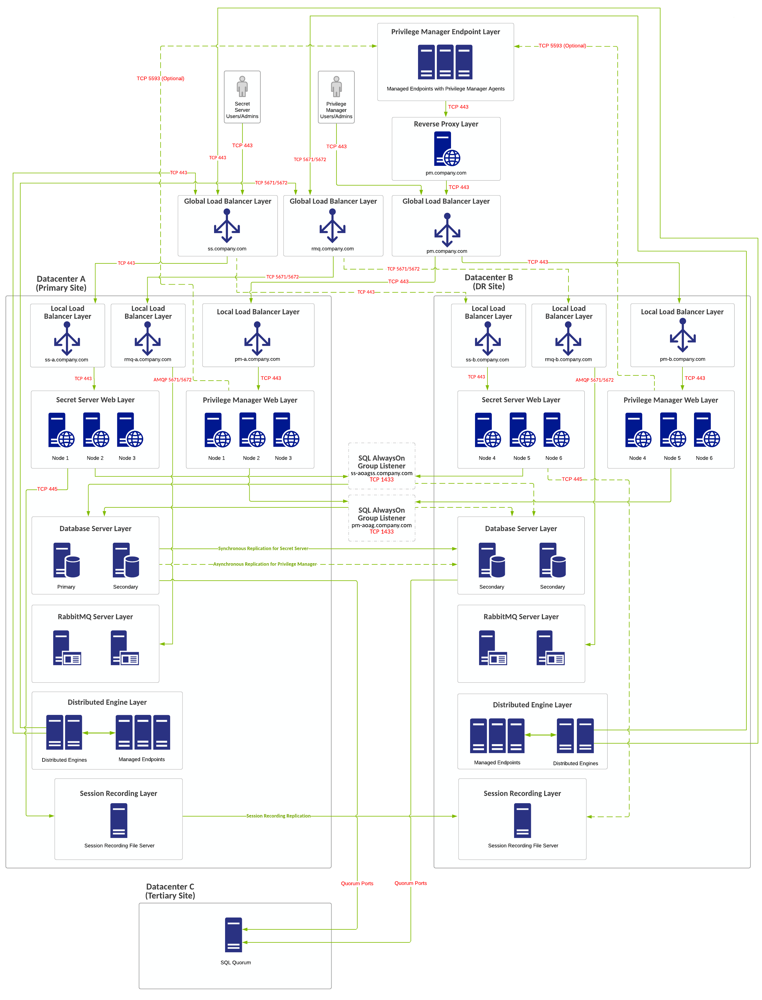

[title]: # (Integration with Secret Server)
[tags]: # (setup planning)
[priority]: # (20)
# Integration with Secret Server

Privilege Manager and Secret Server integration is supported in a co-hosted setting when installed on the same server or on separate servers. If integrated on separate servers, Privilege Manager communicates with Secret Server via Secret Server's REST API. 

The benefits of Privilege Manager's integration with Secret Server include:

* Secret Server can be the authentication source for Privilege Manager, which:

  * Adds Secret Server's MFA login options to Privilege Manager logins.
  * Gives one place for role assignments for both products.

* Allows Privilege Manager to use Secret Server as a storage container. If Secret Server is used as a storage container for Privilege Manager credentials, Privilege Manager

  * creates Secrets for each local credential managed by Privilege Manager.
  * creates Secrets for each Configuration Credential stored in Privilege Manager. This includes credentials used for Foreign Systems, such as AD Sync, ServiceNow, etc.
  * does not pull any changes for these Secrets. Privilege Manager only stores the credentials in Secret Server to utilize Secret Server's workflow options for other users to view.

When Secret Server is used as the authentication source for Privilege Manager, Role Permissions assigned in Secret Server are important and determine user access levels in Privilege Manager. Without Secret Server integration, Privilege Manager uses NTLM for WebServer and Azure AD as possible authentication sources.

> **Note:** If you are a current customer with support hours for Thycotic Professional Services, you can discuss any of these diagrams in detail with one of our Professional Services Solutions Architects.

## Single Site with Minimum HA

### Overview

- Minimum-cost configuration with no shared storage requirement. 

- RabbitMQ (for SS) is installed on the SS Web servers (typically in a cluster). 

- Single-site design with no native DR capacity. DR can be provided by VM replication if subnets are spanning locations. Otherwise Re-IP + DNS changes may be necessary. 

- PM is installed on separate Web servers. 

- PM can integrate with SS for authentication and credential storage. 

- PM can reside on the same database servers as SS or on separate ones, but SS and PM should not share the same database. 

  > **Note:** Due to SQL basic availability groups with the Standard Edition, you need to have multiple SQL instances and a separate AlwaysOn availability group configuration.

### Requirements

- SQL Standard Edition with a basic availability group configuration.

- You can use local load balancers for all Web server nodes.

- For SQL to stay online during single-node unplanned failures, you must configure a file-share witness for SQL quorum voting.

### Diagram

> **Note:** The reference for this diagram is A-1.

**Figure:** Single Site with Minimum HA

## Single Site with Minimum HA and Separate RabbitMQ

### Overview

- Minimum-cost HA configuration with no shared storage requirement. 

- RabbitMQ (for SS) is installed on the SS Web servers (typically in a cluster). 

- Single-site design with no native DR capacity. DR can be provided by VM replication if subnets are spanning locations. Otherwise Re-IP + DNS changes may be necessary. 

- PM is installed on separate Web servers. 

- PM can integrate with SS for authentication and credential storage. 

- PM can reside on the same database servers as SS or on separate ones, but SS and PM should not share the same database. 

  > **Note:** Due to SQL basic availability groups with the Standard Edition, you need to have multiple SQL instances and a separate AlwaysOn availability group configuration.

- You can use a separate Web reverse proxy or Azure service bus configuration for Privilege Manager agent TCP 443 communication.

### Requirements

- SQL Standard Edition with a basic availability group configuration.

- You can use local load balancers for all Web server nodes.

- For SQL to stay online during single-node unplanned failures, you must configure a file-share witness for SQL quorum voting.

### Diagram

> **Note:** The reference for this diagram is A-2.

**Figure:**  Single Site with Minimum HA and Separate RabbitMQ

## Multiple Site with Manual Failover

### Overview

- Minimum-cost HA configuration with no shared storage requirement. 

- RabbitMQ (for SS) is installed on the SS Web servers (typically in a cluster). 

- SQL AlwaysOn configurations are either synchronous or asynchronous for the SS database and asynchronous only for the PM database. 

- DR site acts as a temporary site only with no long-term use. Services in DR site being down can incur downtime.

- PM is installed on separate Web servers. 

- PM can integrate with SS for authentication and credential storage. 

- PM can reside on the same database servers as SS or on separate ones, but SS and PM should not share the same database. 

  > **Note:** Due to SQL basic availability groups with the Standard Edition, you need to have multiple SQL instances and a separate AlwaysOn availability group configuration.

- You can use a separate Web reverse proxy or Azure service bus configuration for Privilege Manager agent TCP 443 communication.

### Requirements

- SQL Standard Edition with a basic availability group configuration.
- If global load balancers are not available due to cost or limited infrastructure, you can use local load balancers for all Web server nodes, but DNS change may be required if primary location goes offline.

- For SQL to stay online during single-node unplanned failures, you must configure a file-share witness for SQL quorum voting.

### Diagram

> **Note:** The reference for this diagram is B-1.

**Figure:**  Multiple Site with Manual Failover

### 

## Multiple Site with Manual Failover and Separate RabbitMQ

### Overview

- Minimum-cost HA configuration with no shared storage requirement. 

- RabbitMQ (for SS) is installed on the SS Web servers (typically in a cluster). 

- SQL AlwaysOn configurations are either synchronous or asynchronous for the SS database and asynchronous only for the PM database. 

- DR site acts as a temporary site only with no long-term use. Services in DR site being down can incur downtime.

- PM is installed on separate Web servers. 

- PM can integrate with SS for authentication and credential storage. 

- PM can reside on the same database servers as SS or on separate ones, but SS and PM should not share the same database. 

  > **Note:** Due to SQL basic availability groups with the Standard Edition, you need to have multiple SQL instances and a separate AlwaysOn availability group configuration.

- You can use a separate Web reverse proxy or Azure service bus configuration for Privilege Manager agent TCP 443 communication.

### Requirements

- SQL Standard Edition with a basic availability group configuration.

- If global load balancers are not available due to cost or limited infrastructure, you can use local load balancers for all Web server nodes, but DNS change may be required if primary location goes offline.

- For SQL to stay online during single-node unplanned failures, you must configure a file-share witness for SQL quorum voting. We recommend a cloud witness.

### Diagram

> **Note:** The reference for this diagram is B-2.

**Figure:**  Multiple Site with Manual Failover and Separate RabbitMQ

## Multiple Site with Automatic Failover

###  Overview

- Improved HA configuration with no shared storage requirement. 

- RabbitMQ (for SS) is installed on the SS Web servers (typically in a cluster). 

- SQL AlwaysOn configurations are either synchronous or asynchronous for the SS database and asynchronous only for the PM database. 

- DR site acts as a temporary site only with no long-term use. Services in DR site being down can incur downtime.

- PM is installed on separate Web servers. 

- PM can integrate with SS for authentication and credential storage. 

- PM can reside on the same database servers as SS or on separate ones, but SS and PM should not share the same database. 

  > **Note:** Due to SQL basic availability groups with the Standard Edition, you need to have multiple SQL instances and a separate AlwaysOn availability group configuration.

- You can use a separate Web reverse proxy or Azure service bus configuration for Privilege Manager agent TCP 443 communication.

### Requirements

- SQL Standard Edition with a basic availability group configuration.

- If global load balancers are not available due to cost or limited infrastructure, you can use local load balancers for all Web server nodes, but DNS change may be required if primary location goes offline.

- For SQL to stay online during single-node unplanned failures, you must configure a file-share witness for SQL quorum voting. We recommend a cloud witness.

### Diagram

> **Note:** The reference for this diagram is C-1.

**Figure:** Multiple Site with Automatic Failover

## Multiple Site with Automatic Failover and Separate RabbitMQ

###  Overview

- Improved HA configuration with no shared storage requirement. 

- RabbitMQ (for SS) is installed on dedicated servers (typically in a cluster). 

- SQL AlwaysOn configurations are either synchronous or asynchronous for the SS database and asynchronous only for the PM database. 

- DR site acts as a temporary site only with no long-term use. Services in DR site being down can incur downtime.

- PM is installed on separate Web servers. 

- PM can integrate with SS for authentication and credential storage. 

- PM can reside on the same database servers as SS or on separate ones, but SS and PM should not share the same database. 

  > **Note:** Due to SQL basic availability groups with the Standard Edition, you need to have multiple SQL instances and a separate AlwaysOn availability group configuration.

- You can use a separate Web reverse proxy or Azure service bus configuration for Privilege Manager agent TCP 443 communication.

### Requirements

- SQL Enterprise Edition.

- Global and local load balancers.

- If global load balancers are not available due to cost or limited infrastructure, you can use local load balancers for all Web server nodes, but DNS change may be required if primary location goes offline.

- For SQL to stay online during single-node unplanned failures, you must configure a file-share witness for SQL quorum voting. We recommend a cloud witness.

- [Distributed Engine Ports](https://thycotic.force.com/support/s/article/Ports-used-by-Secret-Server).

- [SQL Quorum Ports](http://dsfnet.blogspot.com/2013/04/windows-server-clustering-sql-server.html).

### Diagram

> **Note:** The reference for this diagram is C-2.

**Figure:**  Multiple Site with Automatic Failover and Separate RabbitMQ

## Best Multiple Site with Automatic Failover and Separate RabbitMQ

###  Overview

- Best HA configuration with no shared storage requirement. 

- RabbitMQ (for SS) is installed on dedicated servers (typically in a cluster). 

- SQL AlwaysOn configurations are either synchronous or asynchronous for the SS database and asynchronous only for the PM database. 

- DR site acts as a temporary site only with no long-term use. Services in DR site being down can incur downtime.

- PM is installed on separate Web servers. 

- PM can integrate with SS for authentication and credential storage. 

- PM can reside on the same database servers as SS or on separate ones, but SS and PM should not share the same database. 

  > **Note:** Due to SQL basic availability groups with the Standard Edition, you need to have multiple SQL instances and a separate AlwaysOn availability group configuration.

- You can use a separate Web reverse proxy or Azure service bus configuration for Privilege Manager agent TCP 443 communication.

### Requirements

- SQL Enterprise Edition.

- Global and local load balancers.

- If global load balancers are not available due to cost or limited infrastructure, you can use local load balancers for all Web server nodes, but DNS change may be required if primary location goes offline.

- For SQL to stay online during single-node unplanned failures, you must configure a file-share witness for SQL quorum voting. We recommend a cloud witness.

- [Distributed Engine Ports](https://thycotic.force.com/support/s/article/Ports-used-by-Secret-Server).

- [SQL Quorum Ports](http://dsfnet.blogspot.com/2013/04/windows-server-clustering-sql-server.html).

### Diagram

> **Note:** The reference for this diagram is C-3.

**Figure:** Best Multiple Site with Automatic Failover and Separate RabbitMQ

