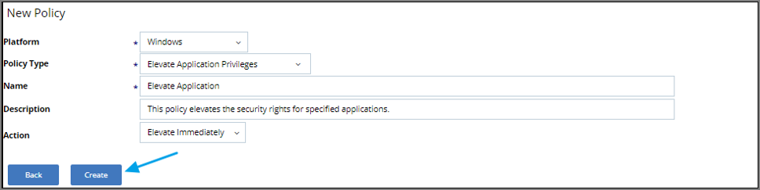
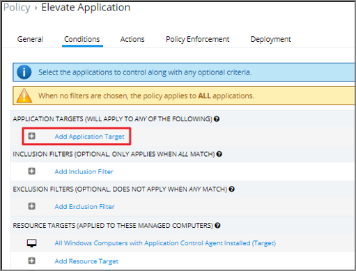
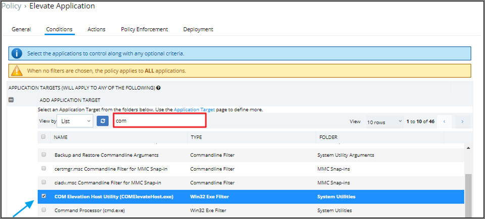
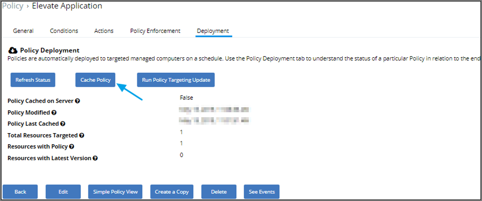

[title]: # (- Enable Shortcut Delete)
[tags]: # (elevate)
[priority]: # (4404)
# Enable User to Delete Desktop Shortcuts

This article describes how to enable users to delete shortcuts created when applications are installed from the public desktop.

>**Note**:
>Please be aware that when elevated, the COMElevationHost utility does not only grant the user the ability to delete shortcuts from the desktop, but also potentially uninstall some applications from the control panel and perform actions such as changing network adapter settings.

## Create the Policy

1. In Privilege Manager navigate to __Admin | Policies__, click __Add New Policy__.
1. From the Platform drop-down select Windows.
1. From the Policy Type drop-down select Elevate Application Privileges.
1. Enter a Name and Description for the policy.
1. From the Action drop-down select Elevate immediately.
1. Click Create.

   
1. Click Edit and under Status select the Enabled checkbox.
1. Navigate to the Conditions tab.
1. Under __Application Targets__ click __+ Add Application Target__.

   
1. Search for the COM Elevation Host utility and select it from the list.

   
1. Click __Add__.
1. Click __Save__.
1. Navigate to the Deployment tab and then select __Cache Policy__.
1. Click __Cache Policy__.

   
1. Click __Run Policy Targeting Update__.
