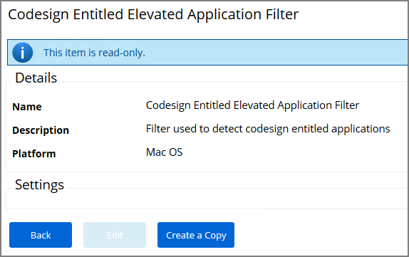
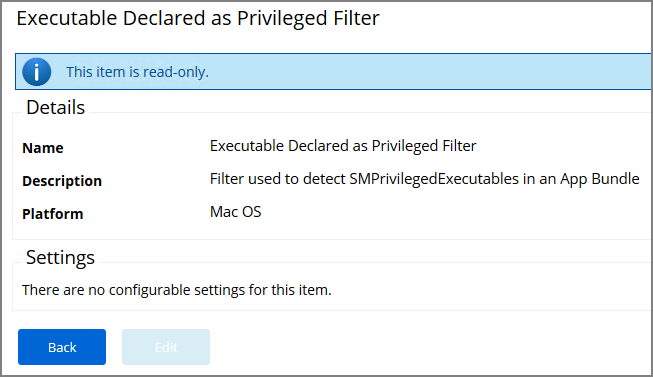
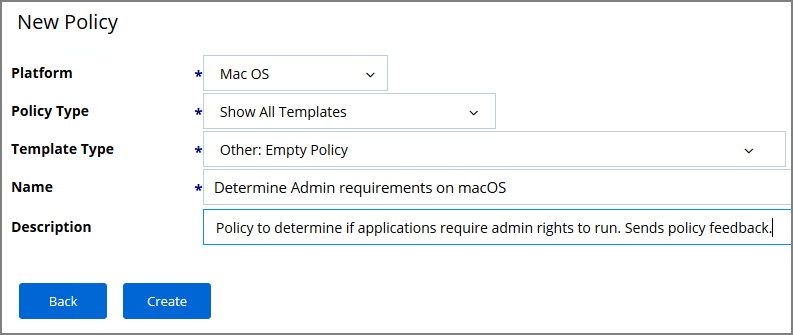
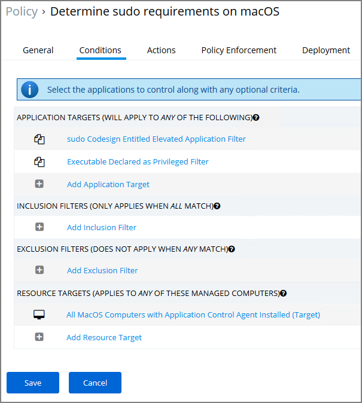
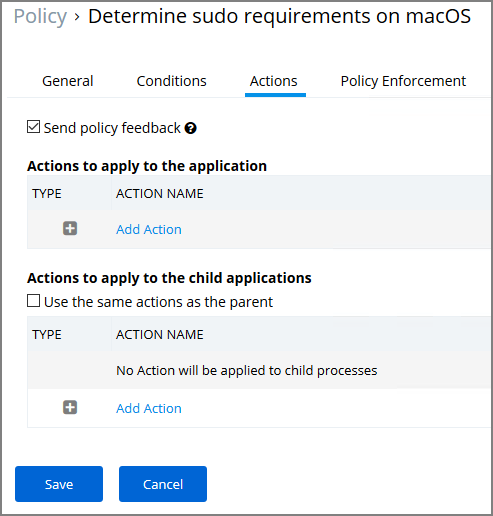

[title]: # (- Determine sudo Requirement)
[tags]: # (macOS, admin, policy)
[priority]: # (4810)
# Determine sudo Requirement

Use discovery with event notification to determine if an application requires administrative privileges to run on a macOS endpoint.

1. Use/Create a __Codesign Entitled Elevated Application Filter__. This filter creates events for application bundles that have a specific entitlement that might prompt for administrative permissions if launched.
   1. Create a copy of Codesign Entitle Elevated Application Filter:

      

1. Use/Create a __Executable Declared as Privileged Filter__. This filter creates events for application bundles that list a privileged helper in their info.plist files.

   

   This is a read-only filter, no customization via Create a Copy available.
1. Add both filters as the application target to a new policy and enable the __Send Policy Feedback__ action for that policy.
   1. Navigate to __Admin | Policies__ click __Add New__.
   1. As the Platform Type select Mac OS.
   1. From the Templates drop-down select Other: Empty Policy Template.
   1. Name your policy and add a description.

      

   1. Click Create.
   1. Click Edit on the newly created policy page.
   1. Under status select __Enabled__.
   1. Select the __Conditions__ tab.
   1. Under __Application Targets__, add the two filters:
      * The copy of the codesign filter you created
      * The default of the Executable Declared as Privileged Filter

      

   1. Navigate to the Action tab.
   1. Select the Send Policy Feedback option.

      

   1. Click __Save__.
1. Navigate to the Deployment tab.
1. Click the __Run Policy Targeting Update__.

>**Note**:
>There is currently no option to determine if command-line tools require sudo.
