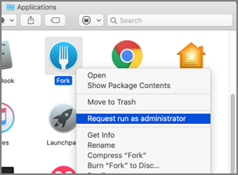

[title]: # (Application Self-elevation)
[tags]: # (macOS, standard user, policy)
[priority]: # (4803)
# Application Self-elevation

Finder Sync Extensions allow application control on macOS endpoints. Just as on Windows endpoints, users can request application self-elevation via right-click mouse action. The application control is policy based and the macOS system with the endpoint agent must have been online at least once to request its policies from the Privilege Manager server.

## Configuring Application Self-elevation

Your Privilege Manager needs to be configured to allow self-elevation of applications on an endpoint. Follow these server configuration steps:

1. Navigate to __Admin | Agents__ and select the __MacOS Agent Configuration__ tab.
2. Click __Edit__.
3. Under the General section enable Allow users to request privilege elevation of applications.
4. In the Menu text entry field enter something like Request run as Administrator.
   
5. Click __Save__.

>**Note**:
>When Self-Elevation options are modified in the __MacOS Agent Configuration__, client items on a macOS system must be updated and on older versions of macOS the user must logout and login for the changes to take effect.

After enabling the Allow users to request privilege elevation of applications in the __MacOS Agent Configuration__, you can create policies to target the User Requested Run As Administrator Filter (macOS) and specify which action you want taken. If you choose Approval Request, users will have to request and gain approval before having the application elevated.

1. Navigate to __Admin | Policies__.
2. Click __Add New Policy__.
3. Navigate to the Conditions tab and Inclusion Filters section.
4. Click __+ Add Filter__ and select the User Requested Run As Administrator Filter (macOS) filter.
   
5. Click __Save__.

## How to Request an Application Run as Administrator

To request to run an application as Administrator, the user at the macOS endpoint navigates to and selects the applications in Finder and uses either right-click or Control+Click to invoke Finder’s context menu:

Here the user selects the Request run as administrator menu option.

Depending on the policy in place, this will either be granted immediately or trigger an approval request.

## Troubleshooting: Verify the Finder Extension is Installed

The Finder Privilege Manager extension installs by default during an agent install or upgrade. The extension is enabled/disabled based on the __MacOS Agent Configuration__ policy on the Privilege Manager Server. If the extension is not enabled, check with your system administrator.

1. Open __System Preferences | Extensions__.
2. Select __Finder Extensions__.
3. Verify that Privilege Manager Extension is listed and enabled for customizing Finder.

Once the Privilege Manager Extension is enabled, the extension icon is visible in Finder.

The extension is also present as a menu item when you right-click or control+click an application in Finder.

