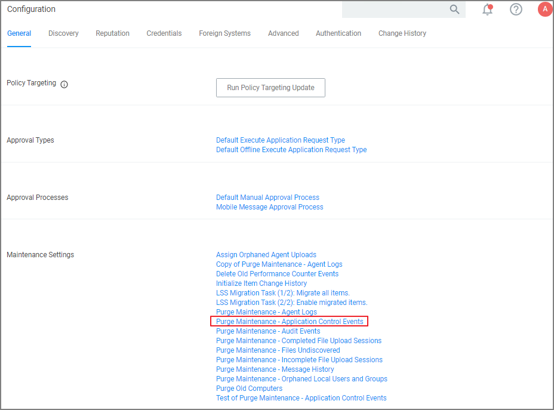
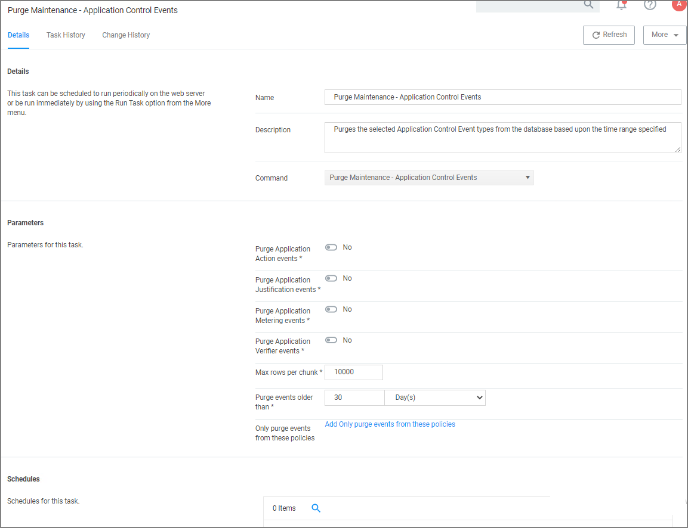
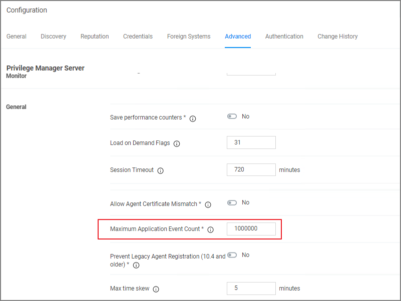

[title]: # (Events Maintenance)
[tags]: # (event discovery, notifications)
[priority]: # (5002)
# Events Maintenance

In Privilege Manager versions prior to 10.6, all events are stored unless __manually purged__. Event storage uses database space and can impact performance of dashboard queries so it is sometimes desirable to purge the stored events.

Privilege Manager version 10.6 and up, includes an option to specify the __maximum number of events__ to be stored (rather than let the system continue to add events to be stored until manually purged). 

## Manually Purge Events

1. Navigate to __Admin | Configuration__ and select the __General__ tab

   
1. In the "Maintenance Settings" section of this page, click on "Purge Maintenance - Application Control Events".

   

   The Description text explains what this feature does: "Purges the selected Application Control Event types from the database based upon the time range specified".
1. Under __Parameters__, set the switches and edit values based on how you want the maintenance to be performed for your instance.
1. Click __Save Changes__.

## Maximum Event Count: Basics

1. Navigate to __Admin | Configuration__ and select the __Advanced__ tab.

  

The "Privilege Manager Server" section of the page shows the option "Maximum Application Event Count" and its default value, which is 1,000,000.

You can change the value, but storing a large number of events could cause database issues and slow down dashboard queries. Save your changes, if you edit the number.

>**Note**:
>In the Cloud version of Privilege Manager, the Maximum Event Count cannot be changed by the user; it is fixed at its default value.

### Maximum Event Count: Additional Information

The points below provide additional information about the Maximum Event Count:

* The count value is a total for all policies; it is not a per policy setting.
* The count is treated as a rolling window; if a new event would cause the count to exceed the maximum limit, the oldest event is removed.
* The manual purge, as described in a previous section, is still available.
* As mentioned in the previous section, the Maximum Event Count cannot be changed by the user in the Cloud version of Privilege Manager; there it is fixed at its default value.
