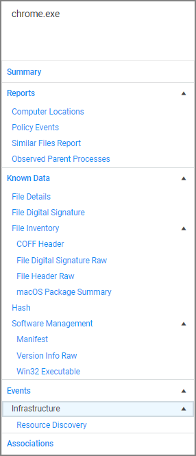
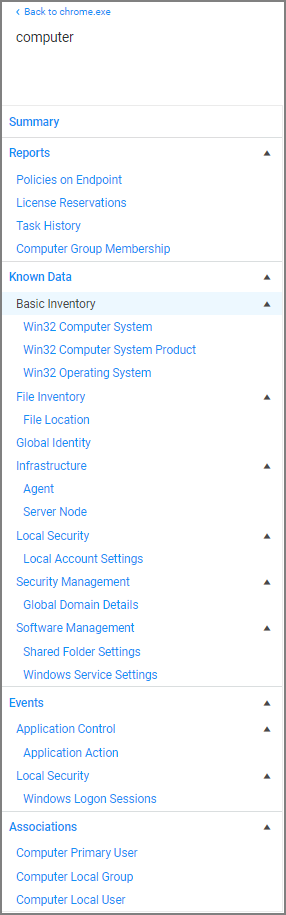

[title]: # (Events Drilldown)
[tags]: # (server)
[priority]: # (5001)

# Events Drilldown

After selecting __View File__ the Summary page is displayed for the process that triggered the application policy event.
The summary page lists details, such as the File Name, Original File Name, Product Name, Version, Internal Name, Company Name, Copyright, File Hashes, and provides to view reputation if reputation checking is enabled.

When drilling down into this information the context determines the information that is provided:

| Event/Application Context | Resource Context |
| ----- | ----- |
| top level | drilldown options |
|  |  |

## Reports

### Computer Locations

The __Computer Locations__ report lists the computer name, domain, operating system, and file path information for the recorded policy event. Clicking on a computer name listed, opens that computer's (end point's) summary page, with the options to further drilldown into details contextual to that specific computer.

### Policy Events

The __Policy Events__ report lists all event policies that were triggered by the event. Clicking on items in this list drills into the process details.

### Similar Files Report

The __Similar Files Report__ lists all files that are similar to the recorded policy event.

### Observed Parent Processes

The __Observed Parent Processes__ report lists all parent processes for the recorded policy events. This report allows to view all parent, and grant parent processes as recorded.

## Known Data

Known Data Provides all the discovered details about the application triggering the event.

### File Details

File details lists information like extension, size and if the file is protected or not.

### File Digital Signatures

File digital signatures provides information about the signer, countersigner, and timestamp of the file signature.

### File Inventory

File inventory provides information about the following details:

* Coff Header
* File Digital Signature Raw
* File Header Raw
* macOS Package Summary

### Hash

Hash lists the hash names in use and provides the hash and hex hash values.

### Software Management

Software management provides information about the following details:

* Manifest
* Version Info Raw
* Win32 Executable

## Events

### Infrastructure

Infrastructure provides information about the following details:

* Resource Discovery

## Associations

Associations are usually only available on a resource context level.

## Details as they Pertain to the Selected Resource Context Level

The summary page provides the computer name, created and modified dates, offers a switch to turn on monitoring of the resource to generate alert notifications about certain actions performed by the resource, and it provides a Health status for the endpoint, like the policy and registration states, and if the resource is managed.

### Reports

* Policies on Endpoints: Lists the policy names of all the policies on the endpoint. Information provided:
  * Has a Version of the Policy: True/False indicator
  * Has Current Version of the Policy: True/False indicator
  * Policy Last Modified: Date of last policy change.
  * Policy Applied to Agent: The date when the policy was first applied to the agent.
  * Agent Last Received Policies: The date the agent last received policy updates.
* License Reservations: Lists all the licenses that apply to the endpoint including the reservation date.
* Task History: Lists all the tasks run and completed including status details for the endpoint.
* Computer Group Membership: Lists all the computer groups this computer is a member of.

### Known Data

* Basic Inventory: Provides information pertaining to the local system data, including OS.
* File Inventory: Provided information about the application/process names and their file path as well as discovery date.
* Global Identity: List the domain and user id information.
* Infrastructure:
  * Agent: Lists the agents on the endpoint and provides version details.
  * Server Node: Provides information about the server heartbeat and version.
* Local Security: Provides local account setting information.
* Security Management: Provides Global Domain Details.
* Software Management:
  * Shared Folder Settings: Lists the shared folders, their path, maximum users, if they are secured or not, provides remarks about the type of share.
  * Windows Service Settings: Lists all Windows services, the primary and secondary file names, user account, start and service types.

### Events

* Application Control
  * Application Action: Lists all application file names, the policy names, the user, file path, event received details, and information about the command line executed to trigger the event.
* Local Security
  * Windows Logon Sessions: Lists all the user logon/logoff events with details about duration, type, ID User SID to just name a few.

### Associations

* Computer Primary User: Provides the name of the primary user on the managed endpoint.
* Computer Local Group: Lists the names of the local user groups on the endpoint.
* Computer Local User: List the name of the local user.
