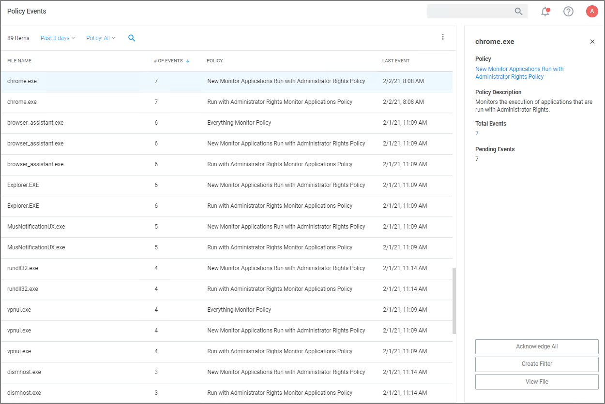

[title]: # (Policy Events)
[tags]: # (admin,configuration)
[priority]: # (5000)
# Policy Events

Application control events or __Policy Events__ are created if you choose to have one or more policies send feedback (from the endpoint to the server) each time the policy is triggered.

Under __Policy Events__ Privilege Manager provides access to all information collected and events discovered due to using monitoring policies with the __Audit Policy Events__ switch set to active.

All events are shown independent of an executed file being target by a policy or being unknown. The policy events are listed in a table grid and if you select an event, you can find discovered details on the right.

The details provided are the application or process name that triggered the event and based on which policy the event was recorded, including a short policy description. You can also see how often this event has occurred.

Use the details view to either create a filter or view the file. If you choose to create a filter, you can also select to immediately add that filter to an existing policy.

If you choose __View File__, you can drill into the event details further. Refer to [Events Drilldown](drilldown.md).

If you enabled the __Show Acknowledge Events__ switch, the Acknowledge Events button is visible. Refer to [Privilege Manger Solution](../admin/config/advanced/pm-solution.md) for details.
