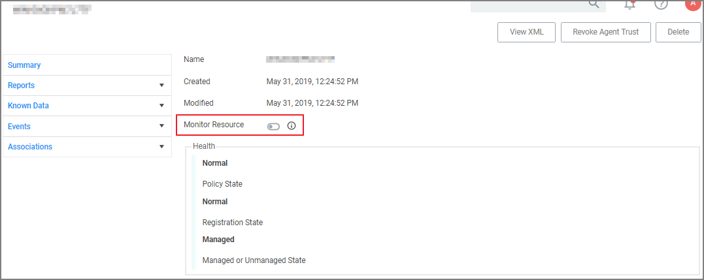

[title]: # (10.8 Release)
[tags]: # (on-premises,cloud)
[priority]: # (30095)
# 10.8.0 Release Notes

## Enhancements

Enhancements available with the 10.8 release of Privilege Manager. Enhancements are for both versions, On-premises and Cloud, unless otherwise outlined under a specific On-prem or Cloud subtopic.

* New User Interface and User Experience. Refer to [Privilege Manager 10.8 User Interface](../pm-intro/10.8-ui.md).
  * New [Policy Wizard](../computer-groups/app-control/policies/policy-wizard.md) driven Application Policy creation.
  * Resource Targets are now organized via [Computer Groups](../computer-groups/index.md).
  * Activation of Policies and Policy Priority changes available from the [Application Policies](../computer-groups/app-control/index.md) overview page.
  * [Dark theme](../ui/navigation#search__notification__help__user_menus) support.
* Enhanced upgrade process for on-premises instances. Privilege Manager now checks if updates are available and downloads details prior to proceeding. Refer to [Updating Privilege Manager - Primary Node](../install/upgrades/index.md#primary_node).
* The Application User Activity report provides audit details for user activities like logins and logouts. Refer to [Application User Activity](../reports/app-user-activity.md).
* The __Specific Installer Detection Filter__ and __Generic Installer Detection Filter__ are now labeled as legacy filters. These filters are only to be used to detect legacy installers that require the Windows Application Compatibility flag to be set.
* Support for [multiple authentication providers](../admin/config/authentication/index.md), including multiple Active Directory domains, multiple Azure Active Directory domains, NTLM (on-premise), Secret Server, and Thycotic One authentication providers.
* [Standard Privilege Manager](../admin/users/index.md) users can be created to log into Privilege Manager in case a connected authentication provider is unavailable
* Additional metadata is included in Privilege Manager’s approval workflow: SHA1 hash and commandline arguments
* Additional metadata is sent to ServiceNow for approval workflows: SHA1 hash, commandline arguments, company name, version
* User context filter supports local user and local group names match by text
* Integration with Thycotic’s now SaaS based behavior analysis product, [Privilege Behavior Analytics (PBA)](../admin/config/foreign-systems/thycotic/set-up-pba.md), provides visibility into all processes interactively executed by end users.

### macOS Specific Features

* Added macOS Agent Utility preference pane accessible via system preferences. Refer to [MacOS Agent Utility Preference Pane](../agents/macOS/utility.md).
* Extended the __Agent Summary by OS__ report to also contain macOS system serial number information.

### Public API

Thycotic introduces [Privilege Manager's public API](https://docs.thycotic.com/privman-api/10.8.0/index.md).

### Cloud Specific Features

Support Import of On-Prem Active Directory Users and Groups into Privilege Manager Cloud instances via [Directory Services Agent (AD)](../install/agents/agent-inst-win-dsa.md). Also refer to [Bundled Install](../install/agents/agent-inst-win-dsa-bundle.md) and [Agent System Requirements](../install/agents/agent-sysreq.md).

## Bugs Fixed

* Users in nested groups are not shown as child items when importing specific Azure AD users and groups.
* Adding a New AD Domain Uses the Wrong User Object (Not the One Selected).
* Hyperlink from approval email notification redirected URL from browser is not working in cloud environment.
* The task Import Specific Azure AD Users and Groups creates errors.
* Parent and child actions are processing messages wrong.
* SQL Lite Agent Errors with, 'Database is locked' on client item update.
* When the Dacpac triggers a change in the schema of the itemstate table, locking errors can occur.
* Resource Data Class Data will not be imported, if Data Class was just added during install.
* AD Domain Controller Resource synchronization issues.
* Missing Trigger after importing a Remote Scheduled Client Command.
* Cloning an Active Directory Foreign system configuration and creating a new AD does not remove previous settings (SID, DC, etc).
* Executable not being caught when using just the file hash for the filter.
* Agent registration fails due to foreign key constraint error pointing to missing target.
* The Resource Explorer does not honor an OU name update for Active Directory Foreign Systems.
* An URL specified with "http" only does not apply strict transport security for communication.
* Users in Privilege Manager Cloud are unable to configure tasks to send email reports.
* Domain user groups cannot be added to the User Context Filter.
* Secondary file filter pre-filtering performance is lacking.
* Errors when clicking on bar graphs for Local Security statistics about Users.
* Customer accounts with an ampersand (&) in the company name or license cannot activate their license.
* An error is thrown when attempting to add a managed user to a resource target.
* The Report Summary of Application Action report only contains the first 3 to 5 records when exported to CSV.
* When exporting a report with many records, the __Select All__ option for CSV exports does not export all records.
* Upgrade banners are not displayed for the latest version.
* When creating or cloning an action, the user is unable to reference built-in or well-known local groups.
* CSV Report export adds apostrophe before - and + symbols
* When an endpoint is using Azure Service Bus to communicate with a Privilege Manager On-Prem instance, policies with a message, approval, or justification action do not appear and the application does not launch.
* An exception is thrown when attempting to sync after creating an SCCM connection.
* The subject line certificate filter does not match the certificate on file.
* No details available for the Codesign Entitled Elevated Application Filter.

### macOS Specific

* System calculated due time for scheduled task as negative, causing an exception.
* macOS agents with a comma or equal sign in their name are not successfully registering.
* The approval/justification prompt appears twice for a policy elevating sudo commands.
* Slack's DMG application bundle is not correctly recognized as a finder copy candidate.

### Agent Updates

* The agent is sending SHA1 and not SHA256 for Cylance integration.

## Known Issues

* Upgrading to Privilege Manager 10.8 causes a task to run to merge computer groups and remove unused system computer groups. This primarily affects the Application Control policies that are using resource targets/computer groups named __All Windows Computers with Application Control Agent Installed__.  With 10.8, those policies will use the __Windows Computers__ computer group and macOS will use __MacOS Computers__.

  If you want to prevent this automatic merge, modify the XML of this item:

  `PrivilegeManager/#/item/xml/b2e02684-d154-48ca-9987-12b1759df822`

  Add on line 2 `<adc:Attributes>NoModify</adc:Attributes>`.
* When upgrading from 10.5 (and potentially other prior Privilege Manager versions), you may encounter an `Item Not Found` exception when first navigating to the console. The workaround for this is to recycle your app pools and then reload the console in your browser.
* When upgrading from 10.4 to the latest Privilege Manager version, the Admin menu might not load. The workaround for this is to recycle your app pools and then reload the console in your browser.
* When setting the __Monitor Resource__ switch to active on a computer resource, an error is thrown.

  
* Offline upgrades on __multiple__ servers will need to be done manually.

### macOS Specific

* On endpoints using OneDrive, GoogleDrive, DropBox, or similar extensions, the endpoint will take about 2 min to correctly initialize the [Finder Extension](../computer-groups/macOS/examples/self-elevation.md#troubleshooting__verify_the_finder_extension_is_installed) functionality after enabling the extension or after the upgrade to 10.8 with an enabled extension.
