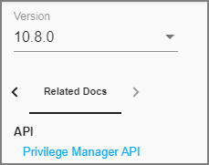

[title]: # (Changelog)
[tags]: # (doc changes)
[priority]: # (30200)
# Documentation Changelog

This topic provides a chronological list of documentation changes. Minor content alterations are not tracked.

## December 2020

* Added [10.8.2 Release Notes](10.8.2-combined.md).
* Added [Platforms](../platforms/index.md) section.
  * Moved [macOS Secure Token](../platforms/macOS/secure-token.md) to the [Platforms | macOS](../platforms/macOS/index.md) section.
  * Moved [Best Practices](../platforms/macOS/bp/index.md) to the [Platforms | macOS](../platforms/macOS/index.md) section.
  * Moved and edited [macOS Legacy Extensions](../platforms/macOS/mac-kexts.md) to reflect behavior and best practices for kernel and system extensions on Catalina and Big Sur.
  * Moved [File/Folder Access](../platforms/macOS/tcc-access.md) to [Platforms | macOS](../platforms/macOS/index.md) section.
  * Added topic on [Sudo Plugin](../platforms/macOS/sudo-plugin.md).
* Added [Just-in-Time Group Membership Action](../admin/actions/macOS/jit-group-member.md) topic.
* Edits to [Server Logs](../admin/log-viewer/index.md) topic.
* Edits to [CorrelationID support to Server Logs](../admin/log-viewer/index.md).
* New subtopic [Complex Password Policy enforcement for Privilege Manager users](../admin/users/pw-complexity.md).
* Added [MDM Profiles for macOS Agents](../agents/macOS/mdm-profiles.md) topic.
* Added [Visual Studio Installer Elevation](../admin/config-feeds/index.md) example policy and filters to configuration feeds. Removed topic [MS Visual Studio Installations](../computer-groups/app-control/examples/elevate/ms-visual-studio.md).

## October 2020

Added [10.8.1 Release Notes](10.8.1-combined.md).

### Group Member Based Approvals

* Added [Group Member Approval Action](../admin/actions/windows/group-member-approvals.md) topic.
* Added [Endpoint Group Member Approval Action](../admin/actions/windows/endpoint-group-member-approvals.md) topic.
* Updates to the [ServiceNow Integration Setup](../admin/config/foreign-systems/third-party/set-up-servicenow.md) topic to include _over-the-shoulder_ approvals at the endpoint.

## August 2020

* New 10.8 UI introduction with changed user workflow and major documentation reorganization to accommodate the new UI layout.

### New Related Docs

The Privilege Manager Public API documentation can be accessed via Related Docs.

| Access Related Docs | Click Link | Navigate Back |
| ----- | ----- | ----- |
|  |  |  |

### Restructure of Contents

| Old TOC | New TOC |
| ----- | ----- |
|  |  |

The contents is aligned with the new Privilege Manager navigation flow for users. The following references where the contents moved to for all major topics.

| Previous | Current Release |
| ----- | ----- |
| Application Control | Now under [Computer Groups](../computer-groups/index.md) |
| Application Control > Policies | Now under [Computer Groups](../computer-groups/app-control/index.md) |
| Application Control > Filters | Now under [Admin Menu](../admin/filters/index.md) |
| Application Control > Actions | Now under [Admin Menu](../admin/actions/index.md) |
| Local Security | Now under [Computer Groups](../computer-groups/index.md) |
| The Privilege Manager UI | Now under [User Interface](../ui/index.md) and only pertains to navigation and controls of the new UI. |
| The Privilege Manager UI > Configuration | Now under [Admin Menu](../admin/config/index.md) |
| The Privilege Manager UI > Diagnostics | Now under [Admin Menu](../admin/diagnostics/index.md) |
| The Privilege Manager UI > MacOS Specifics | Now under [Computer Groups](../computer-groups/macOS/index.md) |
| The Privilege Manager UI > Resource Explorer | Now under [Admin Menu](../admin/resources/index.md) |
| The Privilege Manager UI > Configuration | Now under [Admin Menu](../admin/tools/index.md) |
| Tasks | Now under [Admin Menu](../admin/tasks/index.md) |
| Configuration Feeds | Now under [Admin Menu](../admin/config-feeds/index.md) |
| Foreign Systems | Now under [Admin Menu](../admin/config/foreign-systems/index.md) |

Refer to the [Admin Menu](../admin/index.md) topic for everything that was accessed via __ADMIN | More...__ in the old UI.

Information about installing and upgrading Agents is available under [Installation and Upgrades > Agents](../install/agents/index.md). Information pertaining to the use, features, configuration, and troubleshooting of Agents is available under [Privilege Manager Agents](../agents/index.md).
Agent topics are for the most part OS specific, with the exception of information under [Pertaining to All Agents](../agents/all/index.md).

If you have trouble finding a topic that you frequently consult, use the documentation platform's search option to find and bookmark accordingly. For example:

## July 2020

* Added mid_server role to [ServiceNow integration](../admin/config/foreign-systems/third-party/set-up-servicenow.md) topic.

## June 2020

* Added [Legacy System Extensions](../platforms/macOS/mac-kexts.md) topic.
* Updated [10.7.1 Release Notes](10.7.1-combined.md) to reflect Agent software version updates and associated bug fixes.
